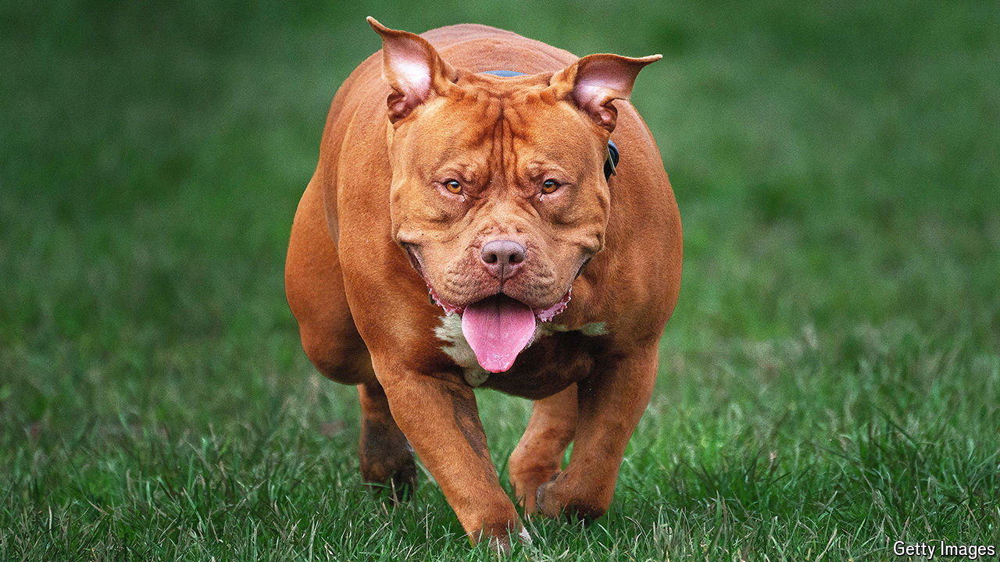
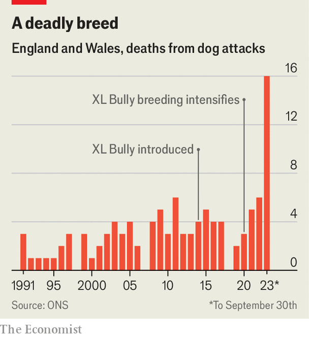

###### Aggressive dogs

# How XL Bullies became such dangerous dogs 

##### Generations of breeding are to blame 

 

> Mar 20th 2024 

IN 2021, WHILE visiting a friend’s house in the Welsh town of Caerphilly, ten-year-old Jack Lis was fatally attacked by a dog called Beast. It mauled him so severely that Jack’s mother could identify her son’s body only from his shoe.

According to British government statistics, such fatal attacks are on the rise. After decades with an average annual dog-attack fatality rate below three, the number rose to six in 2022 and 16 in 2023 (see chart). Bully Watch UK, a group set up in June 2023 to gather evidence on the problem, attributes most deaths since that of Jack Lis to attacks by suspected Extra Large or ‘XL’ American Bully dogs, or crosses with them. 

 


These dogs look like pit-bulls, but are two to three times their size. They have a broad head, powerful jaws, and a highly muscled physique, the result of inbreeding between large American pit-bulls. This difference in appearance meant that British breeders were able to start importing the XL Bully dog in 2014, despite a long-standing ban on pit-bulls. For a few years their numbers remained modest. Then the pandemic hit and the allure of dog ownership surged, catapulting the value of some XL Bullies. It sparked a breeding frenzy, and as their population exploded, so did the number of attacks. 

This is not a problem unique to Britain. Fatalities from suspected XL Bullies have also been seen in America, Canada, Germany and elsewhere, though as many countries do not distinguish between pit-bulls, good data are hard to come by. 

The victims are mostly adults, attacked suddenly and often without provocation. Only a small number of injuries are fatal, but many are life-changing. In 2023 XL Bullies made up less than 1% of Britain’s dog population and yet, according to Bully Watch UK, the dogs were responsible for 44% of dog attacks on people. They estimate the breed is 270 times more deadly than all other dog breeds combined.

Their ancestry helps explain their aggression. Pit-bull terriers were bred to win dog fights, contests which begin with two animals and end with one. Though illegal in Britain since 1835 and in America since 1976, the fights’ popularity as a forum for betting means many continue underground. With money to be made by breeding the best fighters, handlers selected those with tenacity and “gameness”—the ability to keep fighting despite serious injuries. Over decades, the pit-bull terrier developed the ability to attack suddenly, and sustain grave injuries without retreating. This genetic history is present in the XL Bully. “These dogs, being bred for aggression, are likely to inherit aggression,” says David Sargan, a geneticist at Cambridge Veterinary School. “However well you treat them, a proportion of them may explode.”

Britain has restricted four breeds of fighting dog since the Dangerous Dogs Act of 1991, but it was not until the end of 2023 that XL Bullies were banned. Those that are unregistered will now be destroyed. But existing registered dogs can be kept if they wear a muzzle and lead in public. That is positive, but still leaves owners at risk. According to Bully Watch UK, three professional handlers have been killed since 2021. And for now at least, in other countries where these dogs are popular, owners have even less protection. ■


