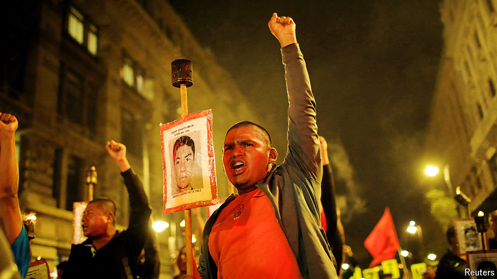

###### Fiddling the figures

# AMLO is trying to bury the tragedy of Mexico’s missing people 

##### Relatives say the president is disappearing the disappeared 

 

> Mar 21st 2024 

The body was found in scrubland next to a fancy golf club outside Culiacán, the capital of the north-western state of Sinaloa. It was discovered by a local “collective” of mothers, wives and sisters, who band together to search for their missing family members. In theory, the authorities will identify the body and search Mexico’s register of disappeared people for a match. In practice, says María Isabel Cruz, who has been searching for her son since 2017, that is unlikely.

As elections loom, President Andrés Manuel López Obrador seems to be burying the issue of Mexico’s missing people. In June last year he announced a new “census” of the disappeared, so as to be “completely certain of how many missing people there really are”. In December the government declared that just 12,377 of the 110,964 people in the register are definitely missing. “We expected the number to go down, but not by this much,” says Ms Cruz, wearing a T-shirt emblazoned with  (Until we find them). “They are disappearing the disappeared.”

The census is not the only disappointment that relatives of the missing have suffered recently (sadly, few other Mexicans pay attention to the problem). The National Search Commission (NSC), a government agency, has been embattled since Karla Quintana, its former boss, resigned in protest at the census. Its staff have been fired and its budget, already measly, kept flat. The new boss is widely thought to be unqualified. The government has gutted the National Centre for Human Identification (nchi), which is tasked with identifying bodies, including more than 52,000 already in its records. Of a total of 59 forensics specialists, 40 have been laid off.

The tragedy of Mexico’s missing people did not start with Mr López Obrador’s government, but it has worsened during his time in office. The register’s oldest entry is from 1962, but the vast majority of records are since 2006. Disappearances (and murders) shot up after Felipe Calderón’s government launched a so-called war on drugs. Gangs splintered and fought among themselves, resulting in horrific violence. During Mr Calderón’s six-year term an average of eight people went missing every day. Since Mr López Obrador took power in 2018, that has risen to one an hour.

 


Some of the increase may be down to an improved reporting system. The most recent version of the register was set up only in 2019. But security has definitely deteriorated under Mr López Obrador, whose passive approach has empowered gangs. They are probably responsible for most missing people, through kidnapping members of rival gangs and press-ganging recruits. Fully 96% of all criminal cases reported to the authorities go unsolved. Most of the missing are probably dead, weakening Mr López Obrador’s claim that murders have fallen during his presidency. Since 2018 at least 2,710 clandestine graves have been found in Mexico.

Mr López Obrador’s softening stance on missing people represents a change in both rhetoric and policy. On the campaign trail he promised a “truth commission” that would solve the emblematic Ayotzinapa case, in which 43 trainee teachers were abducted from a town close to Mexico City in 2014 with the involvement of state security forces. His government set up the nchi and started a database to match DNA from the bodies of missing people with that of their relatives. He increased the budget for the NSC by more than 40% between 2022 and 2023.

But the president was irked when it became clear that the number of people disappearing on his watch outstripped that of his predecessors, says Marcela Turati, a journalist who runs a website dedicated to missing people. In July international experts working on the Ayotzinapa case left Mexico, condemning the government’s secrecy. Mr López Obrador’s fondness for the army has obstructed investigations. Lately he has refused to meet relatives of the disappeared. On March 6th a protest took place at the National Palace against Mr López Obrador’s lack of response to the Ayotzinapa case. 

Neither analysts nor family members objected to updating the register (which previous governments did too). But Mr López Obrador’s methods were “so crude, so stupid, with so many errors that it has caused more damage and more pain,” says Ms Turati. The methodology has been opaque, notes Francisco Rivas of the National Citizen Observatory, an NGO, with some details announced only after the process had started. Presidential loyalists known as “servants of the nation”, who are not specially trained, were recruited to visit people and make calls.

Counting with Kafka

The new figure is unlikely to be more accurate than the previous one. There were certainly instances of duplicated records, says Eduardo Guerrero, a security analyst. A relative of his was a case in point. But under-reporting, not over-reporting, is the likely scenario, says Mr Rivas. Many missing persons are not recorded at all. Authorities often refuse to accept reports of disappearances. Some relatives fail to report missing relatives out of fear, or so they can continue claiming their social-security payments. As one leader of a collective points out, the number of unidentified bodies on the nchi‘s books is much higher than the new official figure for missing persons.

Numerical quibbles risk drawing attention away from the main issue: tens of thousands of people are missing and the authorities are not looking for them. It falls to the collectives to search. Mr López Obrador is undoing what little progress he made. He is right that accurate information is needed, but he is bending that goal to suit political ends.■


