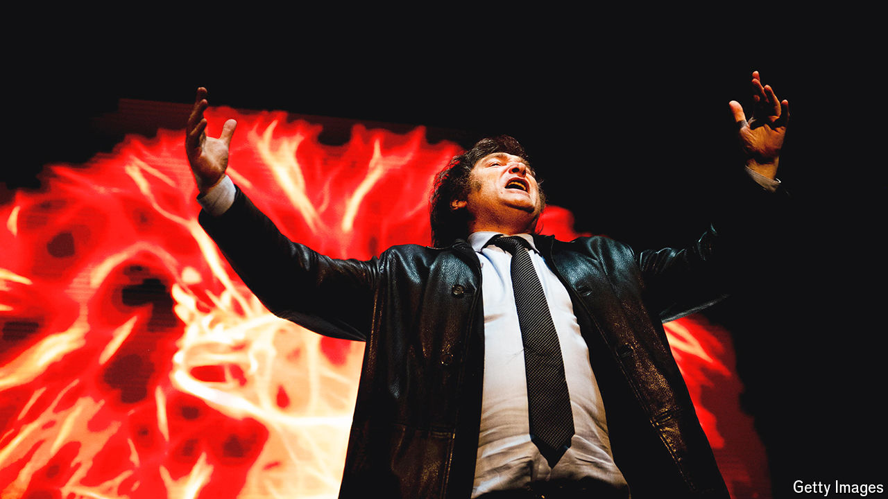
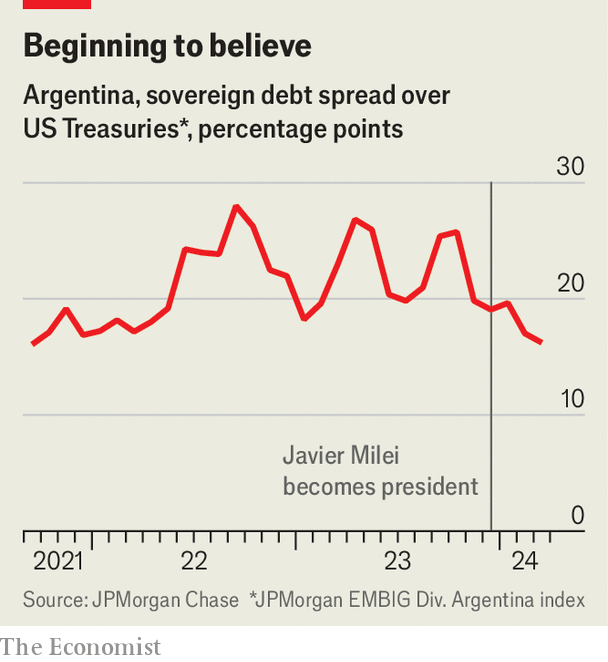

###### The chainsaw and the blender

# After 100 brutal days, Javier Milei has markets believing 

##### Argentines have not given up on him either 

 

> Mar 19th 2024 

“We are genuinely very satisfied,” declared President Javier Milei of Argentina on local radio, after inflation in February fell by more than expected, to 13%. That, however, is the monthly figure. Over the past year it has amounted to 276%—the highest in the world. Inflation of just 8% annually has rattled politics in richer countries. That Mr Milei had cause to celebrate 13% monthly inflation shows the scale of the economic mess he inherited, and how much he has left to do to fix it. 

Mr Milei, an irascible outsider and a self-described “anarcho-capitalist”, campaigned while brandishing a chainsaw and promising to slash spending. On December 10th he took over a bloated state running vast budget deficits financed by printing money. Inflation was rampant, the peso’s value in the drain. The government owed $263bn to foreign creditors, including $43bn to the IMF, but had no dollars at all. Like many Argentine governments, the previous one spent far beyond its means trying to buy popularity, while inventing increasingly absurd temporary macroeconomic fixes (such as heavy price controls) to keep the economy wobbling along. 

Mr Milei is trying to steer the country down a dangerously narrow path, discarding those dodgy fixes as he goes. His basic political problem is that stridently attacking the establishment and regular politicians, a group he calls “the caste”, is crucial to his popularity. However, he needs some support from it to enact deep reform, as its members dominate Congress. But if he makes too many deals, he risks losing his outsider status and thus some popular backing—his only solid political asset.

After 100 days he can boast of real economic successes. His popularity is holding up, even though he lacks support in Congress. If he can keep the public onside until midterm elections late next year, he could bolster his influence and thereby his ability to remake the economy. But Argentines are already suffering deeply. They could abandon him long before then. That would be a blow to radical reformers worldwide.

Start with his economic successes. To show there will be no more money-printing, Mr Milei is obsessed with achieving a budget surplus, meaning the government taxes more than it spends. He says he will achieve a surplus (before interest payments) this year of 2% of GDP, a huge change from a 3% deficit last year. In both January and February the government achieved monthly surpluses, the first in over a decade. It did so partly by using Mr Milei’s chainsaw, chopping down energy and transport subsidies, transfers to the provinces and capital expenditure. It also relied on another tool, the blender. Raising spending by less than inflation is a reduction in real terms, known in Argentina as . Spending on contributory pensions, the single biggest budget item, fell by almost 40% in real terms compared with the first two months of last year.

 


The government made two other big moves. In December it devalued the peso by over 50% to partially close the chasm between the official exchange rate and the black-market one. Yet that pushed up inflation. So did interest-rate cuts in December. Normally central banks raise rates to fight inflation. The bank’s rationale was that cutting rates would reduce interest payments on its own bonds, shrinking the amount of money circulating. Inflation initially shot up to a monthly rate of 26% in December. That hurt Argentines, but supercharged Mr Milei’s blender. 

The government says its results vindicate its tough choices. On top of monthly fiscal surpluses and falling inflation, the gap between the official and black-market exchange rates is now only about 20%. Foreign reserves have grown by over $7bn. And the government successfully extended the maturity of stacks of peso debt, reducing pressure on the treasury. The IMF is pleased; markets are starting to believe. Argentina’s country-risk index, a measure of the chance of default, has dropped reassuringly (see chart). On the economy, Mr Milei deserves an eight or nine out of ten, enthuses Andrés Borenstein of Econviews, a consultancy in Buenos Aires, the capital.

Means matter

The costs, however, are brutal. Battered by inflation, an estimated 50% of Argentines are in poverty, up from 38% in September. In real terms salaries have been set back 20 years, calculates Invecq, another consultancy. Purchases of prescription medicines have fallen by 7%. Total pharmacy sales are down by 46%. Sales volumes at small and mid-sized firms fell by almost 30% in January, year on year. The economy will shrink by 4% this year, reckons Barclays, a bank. 

Such hardship can become dangerous for presidents, literally. In 2001 one fled the Casa Rosada, the presidential workplace, in a helicopter for fear of violent protesters. Yet Mr Milei’s approval ratings remain remarkably high, at around 50%, despite the economic pain. This is mostly because he has succeeded in blaming the caste for putting Argentina in this mess. 

Still, Mr Milei’s first 100 days have revealed serious problems. Beyond the pain, the economic plan is riddled with uncertainties. One risk is the exchange rate. Trying to slow inflation, the government is devaluing the peso by 2% each month. Yet with monthly inflation much higher than 2% that is probably less than is necessary. Alas, a faster crawl or sudden sharp devaluation would cause more inflation. 

Argentina will inevitably soon have to switch to a new monetary and foreign-exchange regime. The question is when—and to what regime. Mr Milei’s plan is to eliminate capital controls and unify the exchange rates. But will the government introduce an orthodox peso monetary programme or will it try to dollarise the economy? Mr Milei’s campaign promise to dollarise has become vague since he took office. The government now talks more about “currency competition” (allowing transactions in either dollars or pesos). Yet when asked if dollarisation is off the table, Pablo Quirno, the secretary of finance, equivocates. Dollarisation is “one way to basically bury the [money] printing machine”, he says. It is “more a moral discussion”. The uncertainty is already causing jitters among investors. The government has also hinted that it will seek a new IMF programme, perhaps worth $15bn, but that too may be difficult without clearer plans. 

Reducing inflation by forcing a recession will cause other problems. “It’s not attractive to invest in a country where the recession is a key ingredient of its monetary policy,” says Eduardo Levy Yeyati of Torcuato Di Tella University in Buenos Aires. What’s more, he adds, when growth returns inflation could accelerate. 

Last, these fiscal surpluses may prove hard to sustain. February’s surplus was already smaller than January’s and the recession is hitting tax revenues hard. One big saving was on energy subsidies, but much of that was only deferred, not cancelled. Provincial governors protested angrily, including in the courts, at the cuts to their transfers. Although the current pension formula is helping the government reduce spending, as inflation falls it will eventually have the opposite effect.

The politics have been rocky. Mr Milei is still popular, but his coalition has no governors and just 15% of seats in the lower house. A gargantuan omnibus bill with 664 articles that he sent to Congress in late December was picked apart. Eventually he withdrew it, a striking defeat. Lack of prioritisation also hurt. Deregulating fishing permits and closing the national theatre institute are irrelevant next to pension reform. Yet all these and more were bundled together, slowing the bill down and providing countless reasons to vote against it. 

An earlier, sprawling presidential decree had the same problem. It stretched from the important (labour-market deregulation) to the minor (allowing banks to charge more interest on credit-card debt). On March 14th the decree was voted down in the Senate. That deepened worries that Mr Milei is politically vulnerable, though the decree will remain in force unless the lower chamber also votes against it. His labour reforms and attempts to defang unions are also tied up in the courts. 

Mr Milei has made simple errors, too. This month the opposition highlighted a decree, bearing Mr Milei’s signature, that among other things gave him a 48% pay rise—a terrible look for the wielder of a fiscal chainsaw. He said the pay rise was the result of a past president’s decree, rapidly reversed it and fired his labour secretary.

In the next 100 days the politics and economics will entwine. The government wants at least one percentage point of fiscal consolidation to come from reinstating income taxes and other tax reforms. The pension formula also urgently needs updating. All this requires congressional approval. Mr Milei also needs successes in Congress to reassure investors that he has enough allies to subdue, or at least survive, future protests and political chaos. He is far from impeachment-proof. “There are so many bombs ticking,” says Sebastián Mazzuca of Johns Hopkins University.

Mr Milei seems to understand this. On March 1st he opened a window for negotiations on a “May Pact”, a set of free-market principles. His interior minister then met the powerful provincial governors, who influence Congress. Many of them seemed mollified. A deal might involve restoring some transfers to the provinces, and reinstating income taxes (which both parties want, but neither wants to be responsible for). In exchange, the president would get some emergency economic powers, pension reform, and mining and energy deregulation. Much else will be parked.

Aesthetics of obstinance

Yet it is unclear if that will be enough for Mr Milei, who still boasts he “will not cede a millimetre” on fiscal plans, and who called the senators who voted against his decree “enemies of society”. The government will reach its fiscal target “no matter what”, claims Mr Quirno. If tax reforms are blocked in Congress, the government could continue to withhold transfers to the provinces to make up the difference, he threatens. That would be explosive. 

Mr Milei’s fate depends on two unknowns. How much economic pain can Argentines take before they turn on him? And can he garner the political support needed to make economic progress quickly enough to stop the whole thing falling apart? For now the signs are moderately positive. Success could see him dominate next year’s midterm elections. Yet if his poll numbers fall first, his rivals will surely wield their own chainsaw against his plans. Then they will try to throw his whole presidency into the blender.■


