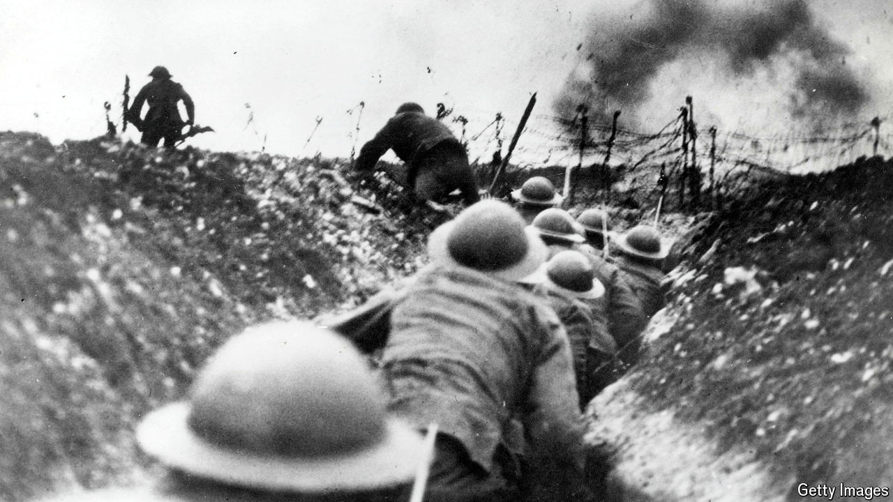

###### The Economist reads

# Seven of the best war novels 

##### For a fuller understanding of war, read fiction as well as history and journalism 

 

> Mar 21st 2024 

THE MOTHER of all war novels, to adapt a phrase from Saddam Hussein, must be “War and Peace”. But, just as the BBC’s “Desert Island Discs” gives every castaway a Bible and the complete works of Shakespeare, so we will plonk on your bookshelves  epic, assuming they are not already sagging under its weight, and move on. Here are seven of the best non-Tolstoyan war novels, arranged in the chronological order of the conflicts they are about. Four (“All Quiet on the Western Front”, “Stalingrad”, “The Bridge over the River Kwai” and “The Sorrow of War”) were written in languages other than English. We chose books whose subject matter spans a range of wars around the world—from the trenches of Flanders to the jungles of Vietnam. They also express the full ambit of conflict, from the terror of hand-to-hand combat to the emotional scars that never heal, which can lead to post-traumatic stress disorder (PTSD). “War is a crucial, deeply ingrained part of human history,” wrote Magaret MacMillan, a historian. Novelists have been as perceptive about it as practitioners of her profession.

By Erich Maria RemarqueTranslated by Arthur Wesley Wheen. 

Unflinching fictional writing about war begins with Erich Maria Remarque’s masterpiece of 1929. For the first time a writer gave a raw, pitiless account of men killing each other, by any means possible. “All Quiet on the Western Front”, written in German by a veteran of the first world war, marked the definitive end of the Victorian ripping-yarn tradition of writing about war. Stripping away remnants of old notions of nobility and idealism, Remarque’s account of life in the German trenches on the western front, which includes a graphic description of hand-to-hand fighting, revealed the full barbarism of that conflict, as well as the dehumanising effects it had on the shockingly young men who fought in it. Its first readers were unprepared for this sort of detail. It caused a sensation when it was published, quickly selling hundreds of thousands of copies. It still has the power to shock, even after countless film adaptations. “All Quiet” is not explicitly an anti-war book, but its unrelenting honesty makes it hard to read it as anything else.

 By Pat Barker. 

“Regeneration” is the first book of a trilogy. Its sequels are “The Eye in the Door” and “The Ghost Road”. All were published in the 1990s, a decade of renewed interest in the horrors of the first world war prompted by the knowledge that the last veterans of that conflict would soon be gone. Such memorialising contributed to the extraordinary success of Sebastian Faulks’s magnificent “Birdsong”, about British miners operating under the German lines on the Somme. “Regeneration” weaves fact with fiction to tell the story of William Rivers, a British doctor who developed treatments of what he diagnosed as shell shock. At the time, most soldiers invalided out of the trenches with symptoms of extreme emotional stress were dismissed as cowards or as insane. Rivers’s most famous patient was the poet Siegfried Sassoon. This intensely moving and compassionate novel focuses on their relationship.

By Pierre Boulle. Translated by Xan Fielding. 

Pierre Boulle’s novel, first published in French in 1952, should be read as a prelude to the much better film version that David Lean directed five years later. It won an armful of Oscars and remains the best war film ever made. Neither the book nor the film seeks to convey the true awfulness of the conditions for Allied prisoners of war on the Burma-Siam railway during the second world war. “As nobody should ever have needed telling, the picture is a load of high-toned codswallop,” said one survivor. Boulle’s theme was not the brutality of war but the codes of honour and duty that could result in such brutality. Thus, his story is primarily a forensic dissection of human dispositions, particularly pride—in the regiment, and in the military discipline that will sustain fighting units even in the most horrendous circumstances. At the core of the novel is the battle of wills between two equally brave but stubborn men, the commanding officer of the British POWs, Lieutenant Colonel Nicolson, and Colonel Saito, the Japanese commander of the camp. Both have an overdeveloped sense of duty. Boulle shows how this can lead to both glory and disaster.

 By Vasily Grossman. Translated by Robert and Elizabeth Chandler. 

When Nazi Germany invaded the Soviet Union in 1941, Vasily Grossman signed up to write for the Red Army’s newspaper. He produced propagandistic reports about Soviet soldiers at the front. Yet the author, born to a Jewish family in Soviet Ukraine, was no Stalinist lackey; his writing expressed his admiration for the Soviet people’s courage and resilience in the face of fascist aggression. Grossman returned to the theme in two novels about the battle of Stalingrad, which took place from 1942 to 1943. The first was published in the 1950s, albeit in censored form, as “For a Just Cause”. The Soviet regime banned the second, “Life and Fate”, partly because it compared Stalinism to National Socialism. It was smuggled to the West and published there in the 1980s. A new English translation of the first novel was . It restored the author’s original title “Stalingrad” and unpublished sections. It is now acknowledged as a classic, powerfully mixing civilian and military perspectives on the “Great Patriotic War”.

 By Kurt Vonnegut. 

For decades  struggled and failed to write what he called, ironically, his “famous Dresden book”. Captured by the Germans at the Battle of the Bulge in 1944, he was a POW in Saxony’s capital during the firebombing of February 1945. Vonnegut listened from an underground slaughterhouse as the bombs rained down. Surely, he recounts, it should have been “easy” to describe the experience, “since all I would have to do would be to report what I had seen”. But the words came slowly. How could Vonnegut describe a city consumed by “one big flame”? His solution, eventually, was to replace normal narrative structure with a dizzying zig-zag through time and space. The hero of “Slaughterhouse-Five”, Billy Pilgrim, reveals the tragedy of Dresden sparingly and episodically. His telling is shaped by the psychological dislocations of what came to be called PTSD well after the novel appeared in 1969. Published during the Vietnam war, “Slaughterhouse-Five” caught the anti-war mood of the time and continues to sell more than 100,000 copies a year.

 By Bao Ninh. Translated by Frank Palmos.

This mesmerising novel by a veteran of what Vietnamese call the American war is peopled more by ghosts than by the living. Bao Ninh is the pen name of a man who was one of ten survivors among the 500 members of his Glorious 27th Youth Brigade. His protagonist Kien is likewise a survivor of the North Vietnamese army. His war restarts in 1976, after the fall of the American-backed government in the south, when he is sent back to his former battlegrounds to recover bodies. Fallen comrades haunt him in the “Jungle of Screaming Souls”, as he moves between present reality and past horror, finding solace only in his most distant, dreamlike memories of pre-war youth and love. As with Vonnegut’s novel, “The Sorrow of War” discards conventional narrative as useless in the face of hell. Creating his own shifting patterns in time, avoiding both sentimentality and stereotypes, Bao Ninh describes the impact on the human spirit of combat and its aftermath.

By Chimamanda Ngozi Adichie.

Published in 2006, ’s second novel takes place during a civil war in Nigeria in the late 1960s. The rebellious and oil-rich Republic of Biafra, largely made up of the Igbo people, broke away from the country in 1967, initiating a conflict that killed hundreds of thousands of civilians. It ended when Nigeria’s army reconquered the territory in 1970. In “Half of a Yellow Sun” Ms Adichie, born in 1977, attempts a reckoning with the war’s terrible consequences. (The title refers to the central image of the flag of the breakaway territory.) Unlike some of the other books on this list, Ms Adichie’s novel does not depict fighting. Rather, her concern is about how competing loyalties—to country, to ethnic group and to ideals—divide and crush lovers, families and friends. Through the character of Richard, a British writer, Ms Adichie also shows how Western media distort or ignore conflicts in Africa.

Also try

Most of ’s coverage of war is fact-based. We write copiously about the  and the . In 2023 we published a  and  on the future of war. During the pandemic our Back Story columnist found new relevance in “”, a great comic war novel. “” was also good pandemic reading. “”, published in 2017, explores the relationship between two war novelists of the 20th century, Ernest Hemingway and John Dos Passos. Read about the , which opened in Indianapolis in 2019. Bao Ninh was among the people interviewed in “”, a documentary. We reviewed a  based on “Life and Fate” and  that is not part of the Regeneration trilogy but also deals with the first world war.■


