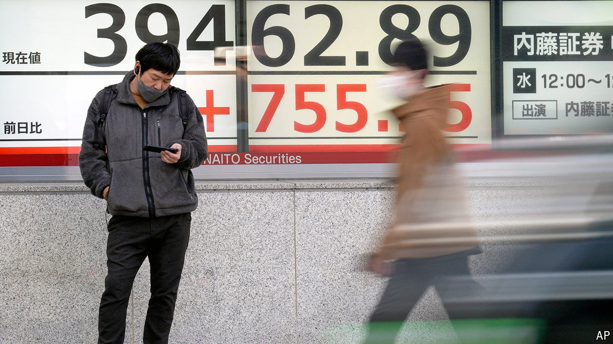

###### The world this week

# Business 

#####  

 

> Mar 21st 2024 

The  raised interest rates for the first time since 2007. The target rate for overnight loans was raised from between minus 0.1% and zero to between zero and 0.1%, making the BoJ the last central bank to end a negative- interest-rate policy (it first took rates below zero in 2016). The bank also ditched its yield-curve controls, which capped the yields on long-term government bonds. The change in direction had been signalled for months, but Ueda Kazuo, the bank’s governor, said it would maintain “accommodative financial conditions”. The bank will still buy about ¥6trn ($40bn) a month in government bonds. 

The  left rates unchanged at its meeting. Investors were more interested in the Fed’s “dot plot” of the path for interest rates, which suggested that it still expects to make three quarter-point cuts this year. Markets soared. 

In a busy week for big central banks, the  also met and kept interest rates on hold. Meanwhile, Britain’s annual inflation rate fell to 3.4% in February, from 4% in January. 

 priced its shares at $34 ahead of its debut on the New York Stock Exchange, the top end of the price range it had submitted to investors. The social-media platform’s IPO was heavily oversubscribed. 

After years of fighting his extradition from Britain and ten months under house arrest,  went on trial in San Francisco over claims that he fraudulently misstated revenues at Autonomy, a software firm that he sold to Hewlett-Packard in 2011 for $10.3bn. HP subsequently took a huge write-down on the value of its acquisition and alleged that Mr Lynch, Autonomy’s founder, had deceived the company. The prosecution says it is the biggest case of fraud in Silicon Valley’s history. Mr Lynch denies the charge. His defence counters that HP mismanaged Autonomy.

A rocky road

Under pressure from activist investors,  set out a restructuring plan that could see it shed 7,500 jobs, about 6% of its workforce. The consumer-goods conglomerate is also spinning off its ice-cream division, which includes the Magnum and Ben &amp; Jerry’s brands. Ice-cream accounts for 16% of Unilever’s sales, but prospects for the business’s growth are melting. 

 reached a $490m settlement over claims that it misled investors in 2018 about strong demand for the iPhone in China. In January 2019 the tech giant admitted that its business in China was struggling. The lead plaintiff in the investors’ lawsuit is the pension fund for the English county of Norfolk. Apple denies wrongdoing. 

 is to receive $8.5bn in government grants and up to $11bn in public loans to build or expand factories in Arizona, Ohio, New Mexico and Oregon, the biggest beneficiary yet of the Biden administration’s programme to boost chipmaking in the United States and ensure the country dominates the market for high-end chips. Intel is pledging to invest $100bn in American chip manufacturing. The public money it receives will be tied to production benchmarks. 

Meanwhile,unveiled the Blackwell graphics-processing unit, its latest line of chips for use in artificial intelligence, which will greatly increase the computing power of large language models. Containing 208bn transistors, the new chips could cost up to $40,000 each. 

May the force be with you

George Lucas said he supported  and its chief executive, Bob Iger, in its fight against Nelson Peltz, an activist investor who is seeking two seats on the board in order to overhaul the business. Mr Lucas, the creator of “Star Wars”, is one of Disney’s biggest individual shareholders. His Lucasfilm production company has been a Disney subsidiary since 2012 and his endorsement is a big boost for the company. Mr Peltz takes his proxy battle to the annual general meeting on April 3rd. 

The Biden administration unveiled sweeping new  which it hopes will ensure that most new cars and light trucks sold in America are either pure-electric or hybrid by 2032. The new standards require carmakers to raise caps gradually on the amount of exhaust-pipe pollution their vehicles emit, but it does not ban them. The regulations come amid a weakening demand for EVs in America, and will probably be challenged all the way to the Supreme Court. 

, one of China’s biggest makers of smartphones, published a solid set of quarterly earnings. The company is making a diversion into the EV market, delivering its first electric car on March 28th.

 reported its second-best ever annual profit. The luxury carmaker made lots of money from record levels of customers ordering bespoke vehicles. One customer reportedly wanted wood from his personal forest to furnish his car’s interior. 

