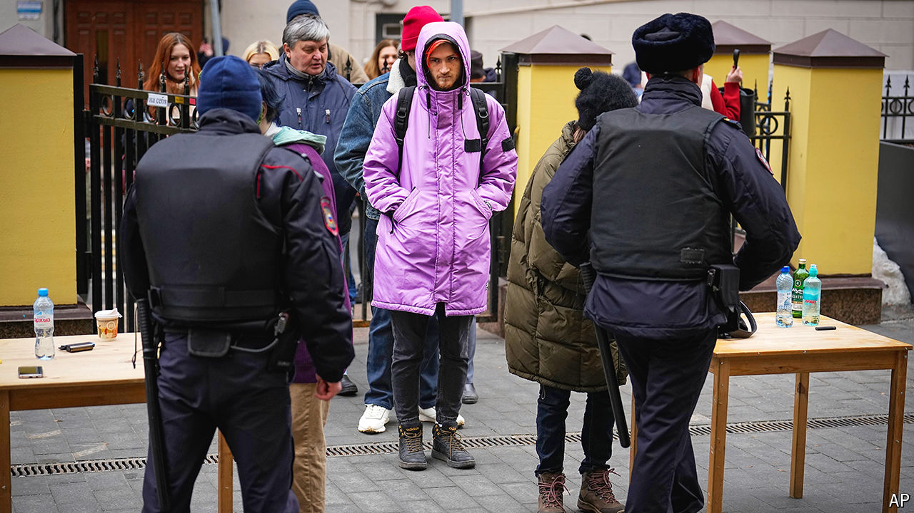
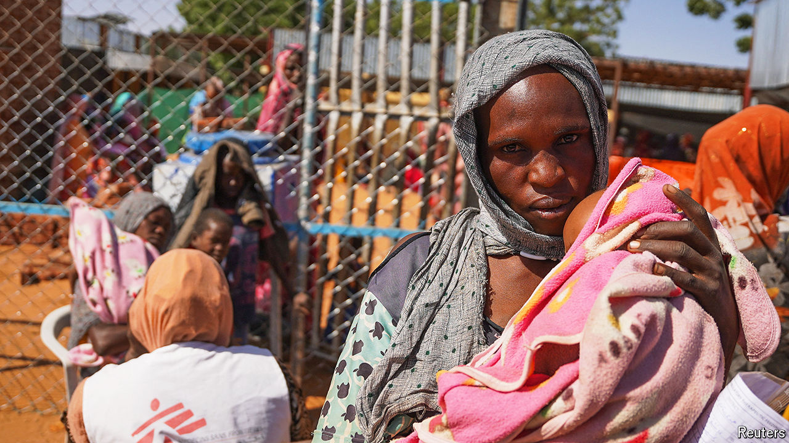

###### The world this week

# Politics 

#####  

 

> Mar 21st 2024 

Tens of thousands of  used a federal election to , bravely displaying anti-war banners in queues for polling stations and silently marking their ballots with the name of Alexei Navalny, the opposition leader who died in an Arctic penal colony last month. No serious opponents to Mr Putin were allowed to stand in the tightly managed election. The president decided to allot 87% of the vote to himself, ten percentage points more than in the previous sham poll in 2018. 

America, Britain and the EU condemned the Russian authorities for suppressing opposition to Mr Putin’s regime. The election was also held in the  that Russia has invaded, including Crimea, which Lord Cameron, the British foreign secretary, described as “abhorrent”. China, India, Iran and North Korea congratulated Mr Putin.

The European Union’s member states and the European Parliament reached a deal that extends the liberalisation on  for a year. In a nod to protesting farmers, some products, such as poultry and oats, were added to a list of items that are safeguarded against imports flooding the market. Wheat and barley were not on the list. 

Leo Varadkar said that he would step down as prime minister of , an announcement that took his countrymen, and his own deputy prime minister, by surprise. He said his reasons were personal and political without giving any further details, though his government recently suffered heavy referendum defeats over altering the constitution. Fine Gael, which heads the governing coalition, will choose a new leader in the coming weeks. 

Vaughan Gething was confirmed as the new first minister of  by the Welsh Parliament. He is the first black person to hold the post. For the first time none of the leaders of Scotland, Wales and Northern Ireland or the British prime minister is a white male.

Shockwaves

, the Senate majority leader in America and one of  staunchest supporters in the Democratic Party, called for early elections, saying that Binyamin Netanyahu, the country’s prime minister, had “lost his way”. Joe Biden endorsed the message. Mr Netanyahu agreed to send officials to Washington to discuss Israel’s plan for an invasion of Rafah—which the American president has suggested is a “red line”. Mr Netanyahu insisted that the offensive was still necessary.

Antony Blinken, America’s secretary of state, said that  were facing “acute food insecurity” and that it was the first time an entire population had been so classified. He is pushing Israel to prioritise the provision of humanitarian aid.  again raided al-Shifa hospital in northern Gaza. Israel said that it was targeting Hamas officials who had regrouped there, despite Israel’s claim to have control over the area. 

Jake Sullivan, America’s national security adviser, confirmed that Marwan Issa, the deputy commander of  military wing, had been killed in an Israeli airstrike. He is the group’s most senior leader to die since October 7th.

Mahmoud Abbas, the president of the , appointed a new prime minister, Mohammad Mustafa. Mr Mustafa has long had a close relationship with Mr Abbas as his economic adviser. Outsiders hope that he will clean up the PA.

The military junta in  revoked a military accord with America, under which roughly 1,100 American troops have been based in the country to help fight jihadists in the Sahel. The announcement came after senior American diplomats told the junta they were concerned about its growing ties to Russia and Iran.

 


The UN warned that 5m people in  could face “catastrophic” levels of hunger because of civil war and because both sides in the conflict, the Sudanese Armed Forces and the Rapid Support Forces, are obstructing the delivery of aid. The UN said it has not been able to cross the front lines to reach parts of Khartoum, the capital, since October.

 cannot raise $454m to pay the penalty awarded against him in a civil trial, according to his lawyers. The penalty was handed down by a judge to Mr Trump for fraudulently inflating the value of his assets. He has asked an appeals court to put the judge’s decision on hold while he launches an appeal against it. 

, a trade adviser to Mr Trump when he was president, began a four-month jail sentence for ignoring a subpoena from Congress in its investigation into the storming of the Capitol on January 6th 2021. The Supreme Court rejected a last-minute plea from Mr Navarro to avoid prison while he appeals against his sentence.

Meanwhile, , Mr Trump’s vice-president in the White House, said he “could not in good conscience” support his former boss’s second run for the presidency. Mr Pence also ruled out voting for Joe Biden.

Over 1m  were performed in America last year, 10% more than in 2020 and despite the Supreme Court’s removal of women’s constitutional protections for abortion in 2022. The Guttmacher Institute, which compiled the data, said abortions had surged in states that border the 14 states where the procedure has been banned. Abortions were up by 72% in Illinois and 257% in New Mexico, for example. 

 passed a new security law covering acts such as insurrection and sabotage. Critics fear it will be used to target dissidents. The authorities in Hong Kong moved quickly to approve the measure at the behest of China’s central government, which has tightened its grip on the territory.

 ruling Communist Party forced the resignation of Vo Van Thuong as president. He had been in the job a little over a year following the similarly abrupt dismissal of his predecessor. The sudden exit appears related to an anti-corruption drive by the party. Analysts worry that the campaign is beginning to threaten the country’s political stability as competing party factions use it to tarnish rivals. 

 opposition leader, Pritam Singh, pleaded not guilty to two charges of lying to a parliamentary committee. Mr Singh’s Workers’ Party has been challenging the People’s Action Party, which has ruled Singapore since 1959, ahead of a planned transition of power. The prime minister, Lee Hsien Loong, is preparing to hand over his job to his deputy, Lawrence Wong, before an election that is due by November next year. 

Jair Bolsonaro,  president from 2019 to 2022, could face a criminal indictment for the first time, after police proposed that he face charges of altering his covid-certification card to say he’d had a vaccine in order to travel to America in 2022. Mr Bolsonaro insists he has never had the jab and denies any knowledge of his records being interfered with. 

We’re melting

The World Meteorological Organisation confirmed that 2023 was the , with the average global surface temperature at 1.45C above pre-industrial levels. The UN agency listed some of the effects of a warmer world: the global mean sea level reached a record high, the extent of Antarctic sea ice hit a record absolute low and food insecurity has increased. 

