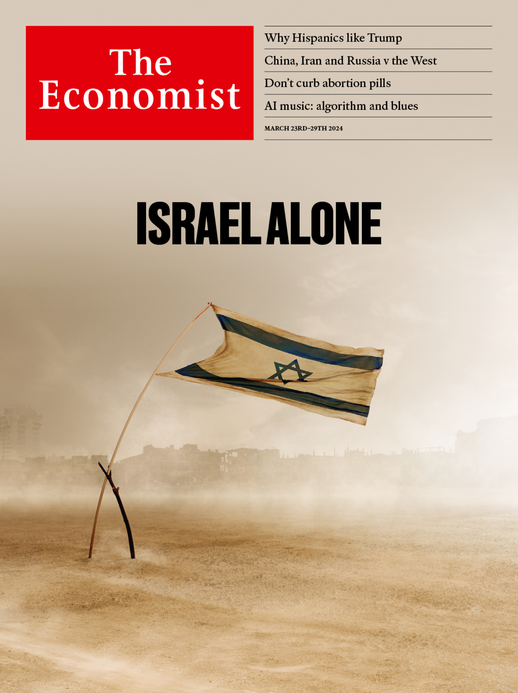
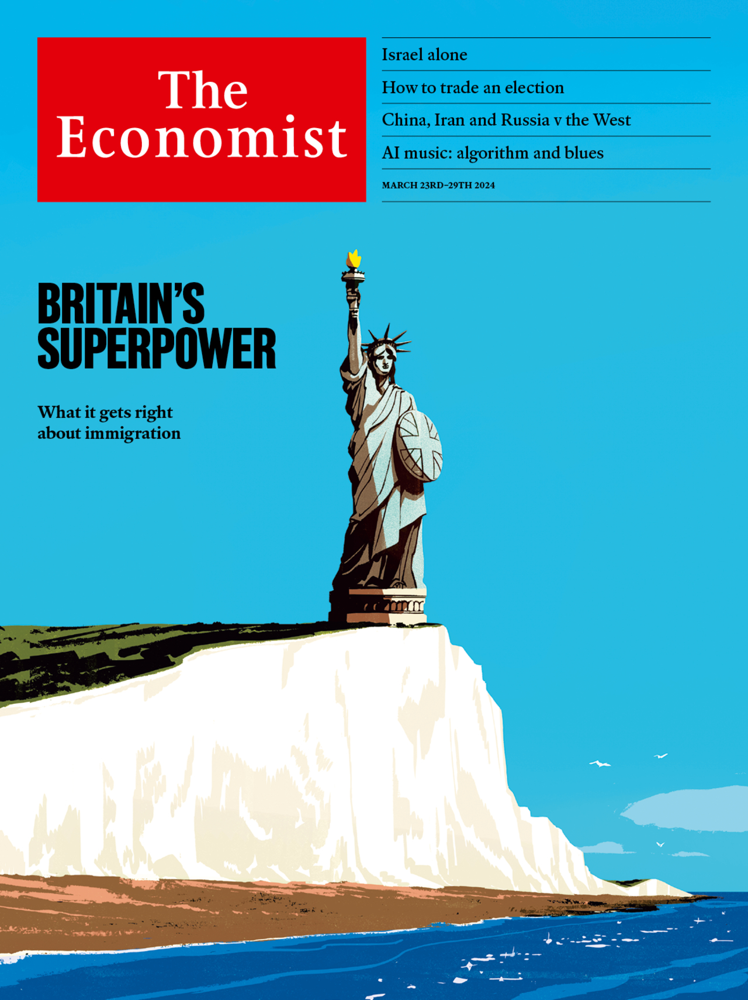

###### The Economist

# This week’s covers 

##### How we saw the world 

> Mar 21st 2024 

Some weeks, including this one, we publish more than one cover. In Britain we focus on immigration. The politics say that immigration is a crisis and a disaster, but the record says that Britain has a world-beating ability to integrate the people who come to its shores. Everywhere else we illustrate how, even at a moment of military ascendancy, Israel’s long-term future is under threat.


If ceasefire talks fail, Israel could be locked in the bleakest trajectory of its 75-year existence, featuring endless occupation, hard-right politics and isolation. Today many Israelis are in denial about this, but a political reckoning will come eventually. It will determine not only the fate of Palestinians, but also whether Israel thrives in the next 75 years. 


In October Israel launched a justified war of self-defence against Hamas, whose terrorists had committed atrocities that threaten the idea of Israel as a land where Jews are safe. Today Israel has destroyed perhaps half of Hamas’s forces. But in important ways its mission has failed.


We considered using a photograph that illustrates one of failures. One option included an image of an Israeli soldier against the backdrop of destroyed buildings in Gaza. That could point to how Israel’s reluctance to help provide or distribute aid has led to an avoidable humanitarian catastrophe, and the civilian toll from the war is over 20,000 and growing. The hard-right government of Binyamin Netanyahu has rejected plans for post-war Gaza to be run by either the Palestinian Authority (PA) or an international force. The likeliest outcome is a military reoccupation. Israel’s trajectory will intensify its ethno-nationalist politics and pose legal threats to the economy. As estrangement from the West deepens, so deterrence may weaken. Firms could be blacklisted. Bosses could move high-tech businesses abroad or, if they are reservists, be arrested there.


Another option also included devastated buildings in the background, but this time the image showed a pair of IDF troops chatting in the foreground. It captured an important point. The bleak outlook for Israel is not always acknowledged in Jerusalem or Tel Aviv. Many Israelis believe the unique threats to their country justify its ruthlessness and that the war has helped restore deterrence. Many see no partner for peace—the PA is rotten and polls say 93% of Palestinians deny Hamas’s atrocities even took place. Occupation is the least-bad option, they conclude. Israelis would prefer to be popular abroad, but condemnation and antisemitism are a small price to pay for security.


Our choice was an eloquent riposte to that line of thinking. An Israeli flag supported by a slender branch is buffeted by the wind and set against the ruins of Gaza. Israel faces a long-term threat from Iran and its proxies, including Hizbullah. Deterring this requires a military partnership with America that needs bipartisan backing, and ideally Gulf Arab support, too. The economy depends on tech exports and experts with access to global markets. And rather than making Israelis safe, permanent occupation poisons politics by emboldening the hard right and breeding Palestinian radicalism. Israelis are right that they have no partner for peace today, but they are best placed to break the cycle. 


A struggle for Israel’s future awaits. The battle in Gaza is just the start. 

 


 

 


Britain now has a larger share of foreign-born residents than America. One in six of its inhabitants began life in another country. Angsty politicians gripe that Britain is letting in people from poor countries to do menial jobs, and weak students who want visas only so they can deliver pizzas. Multiculturalism has failed, they say: too many immigrants live parallel lives in segregated neighbourhoods. This week politicians in Parliament tussled over a bill that will make it easier to ship asylum-seekers to Rwanda without hearing their pleas—the latest in a string of illiberal laws designed to “stop the boats”. 

The surprising thing is that Britain excels at getting foreigners up to speed economically, socially and culturally. It is (in this respect, at least) a model for the rest of the world. 

An early idea was to look for a symbol of integration. We considered choosing a multicoloured union flag. It was probably a good thing that we didn’t go for this, given that a row has flared up about the multicoloured St George’s cross emblazoned on the new England football kit. 

We also thought of the national drink: tea. If America is a melting pot and Canada is a mosaic perhaps Britain could be a warm brew of builder’s. These tea bags come from around the world—worryingly for any tea drinkers out there, that includes Poland and Romania. 

In the European Union foreign-born adults with degrees who are not still in education have an employment rate ten percentage points lower than natives with degrees. In Britain the gap is a trivial two points. In England teenagers who do not speak English as their first language are more likely to obtain good grades in maths and English in national GCSE exams than native English-speakers. The idea that Britain is dividing into ghettos is a myth. Every ethnic group has consistently become less segregated since the census started keeping track in 1991. 

To capture all this we needed something with more grandeur—and what could be grander than the colossal statue that greeted immigrants as they arrived at Ellis Island by sea? Our cover shows the Statue of Liberty perched on the Seven Sisters, a stretch of chalk cliff overlooking the English Channel. We considered cutting out the sea, so that readers were not reminded of the armada of small boats carrying asylum-seekers. After all, fewer than 30,000 of them came last year, compared with 1.2m long-term immigrants in the year to June.

And yet that scene was harder to make sense of. The Seven Sisters are a national landmark, but they were lost in the image. And confronting readers with the small boats was, in fact, a virtue. Asylum needs fixing and it dominates perceptions of immigration. But it does not represent what is really going on.

 


 

 

