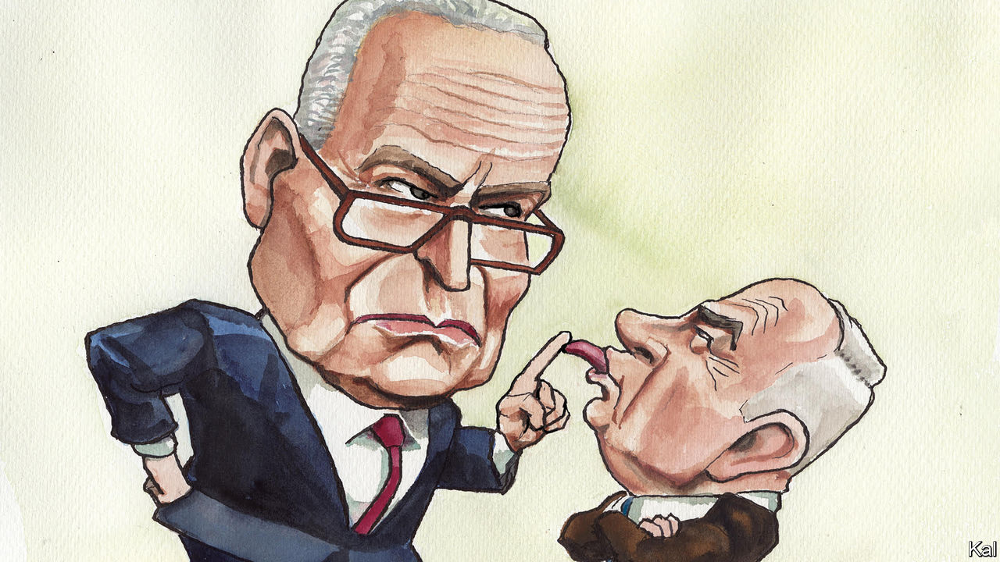

###### Lexington

# Binyamin Netanyahu is alienating Israel’s best friends 

##### The meaning of Senator Chuck Schumer’s landmark speech 

 

> Mar 18th 2024 

One day more than 30 years ago, during the administration of President George H.W. Bush, the secretary of state, James Baker, flung a newspaper article at an aide, Daniel Kurtzer, and declared he was going to eject the Israeli ambassador. He was furious about a quotation he had just read from the deputy foreign minister of Israel, Binyamin Netanyahu. 

Mr Kurtzer pleaded for 24 hours to check that the quotation was accurate. He learned that Mr Netanyahu’s wording was slightly different from what had been reported, but still shocking: America, Mr Netanyahu had said, “is building its policy on a foundation of distortions and lies”. The ambassador got a reprieve, but Mr Baker declared Mr Netanyahu persona non grata and banned him from the State Department. 

A few years later, in 1996, Mr Netanyahu became prime minister, and it was President Bill Clinton’s turn to be insulted. “Who the fuck does he think he is?” Mr Clinton vented to aides, after receiving a lecture on how to deal with Arabs during his first meeting with Mr Netanyahu. “Who’s the fucking superpower here?”

Even Donald Trump, who as president delivered item after item on Mr Netanyahu’s wish-list, found himself blindsided by a classic Netanyahu manoeuvre to box America in. When the two men appeared in the East Room of the White House to announce a peace plan they had arrived at without Palestinian participation—the plan went nowhere—Mr Netanyahu declared it meant Israel could now annex parts of the occupied West Bank. “This was not what we had negotiated,” a flabbergasted Jared Kushner, Mr Trump’s son-in-law and lead negotiator, would later write in his memoir, “Breaking History”. “I grabbed my chair so intensely that my knuckles turned white, as if my grip could make Bibi stop.” 

Far more than the unpractised Mr Kushner, President Joe Biden had reason to hope that his grip would be enough to restrain the prime minister, whom he had alternately jousted and joked with for decades, since back before Mr Baker imposed his ban. But since Hamas’s rampage into Israel on October 7th, Mr Netanyahu has repeatedly rejected Mr Biden’s counsel about the war and scorned his vision for its aftermath. That is what provoked Chuck Schumer, the Senate majority leader, to give an extraordinary, anguished speech on March 14th naming Mr Netanyahu along with Hamas as an obstacle to peace and calling for an Israeli election to oust him. Mr Netanyahu, he said, “has lost his way”.

Mr Netanyahu and other Israelis would be making a mistake to interpret the speech as just another bump in the often rocky road the allies have travelled since the founding of Israel. “This is very different,” says Mr Kurtzer, who went on to serve as the American ambassador in Cairo and then Tel Aviv. “The Israelis will need to understand that this is a wake-up call, if nothing else has persuaded them that they’re running into a problem with us.”

Mr Schumer, the highest-ranking elected Jewish official in American history, is no fair-weather friend of Israel. Back when Mr Netanyahu outraged Barack Obama’s White House by attacking Mr Obama’s proposed nuclear deal with Iran in a speech to a joint session of Congress, Mr Schumer was one of only four Senate Democrats to vote against the deal. Mr Schumer is also no progressive. Now aged 73, he was at pains in his speech to point out that “unlike some younger Americans” he was of a generation “within living memory of the Holocaust”. He described pressing a transistor radio to his ear at high school as he fearfully tracked news of the Six Day War. 

Mr Schumer is a political animal, as alert to danger in his surroundings as they come, but it is doubtful that he was worrying about Mr Biden’s chances of winning Michigan. Mr Netanyahu should worry instead that, given Mr Schumer’s political sophistication, he was correct in saying he spoke for “a silent majority” of Jewish Americans, people, he said, “who love Israel to our bones” yet take a nuanced view of the war in Gaza. Mr Schumer repeatedly condemned Hamas and a double standard in the news media that put all the blame for Palestinian suffering on Israel. But, he said, both Israel and the United States had a “moral obligation” to do more to protect Palestinian civilians: “We must be better than our enemies, lest we become them.” 

Mr Netanyahu responded on March 17th by saying that calling for elections in Israel now would be like having called for elections in America in the wake of the attacks of September 11th 2001. “You don’t do that to a sister democracy, to an ally,” he told cNN. But Mr Biden has made clear that he approved of Mr Schumer’s message. “He made a good speech,” he told reporters. 

Moving America

Mr Netanyahu was partly brought up and educated in America, and he prides himself on understanding how to manage its politics. “I know what America is,” he remarked once, apparently unaware he was being recorded. “America is a thing you can move very easily.” Maybe not this time. Given the polarisation of foreign policy, he can count on Republican backing, but bipartisan support of Israel has always been a bulwark of its security and, having lost Mr Schumer, Mr Netanyahu has all but lost the Democrats. 

Even before Mr Schumer spoke, Mr Biden had boxed himself in, saying if Israeli forces conducted a major operation in Rafah in the southern Gaza Strip they would be crossing “a red line”. He has required “credible and reliable” assurances from Israel that it is using military aid in compliance with international humanitarian law. The Americans will soon decide whether they are satisfied with those assurances. Mr Schumer has dramatically strengthened Mr Biden’s hand, should he choose to find Israel is misusing American weapons. The anger of America’s leaders is directed at Mr Netanyahu, but Israel may wind up paying the price. ■


