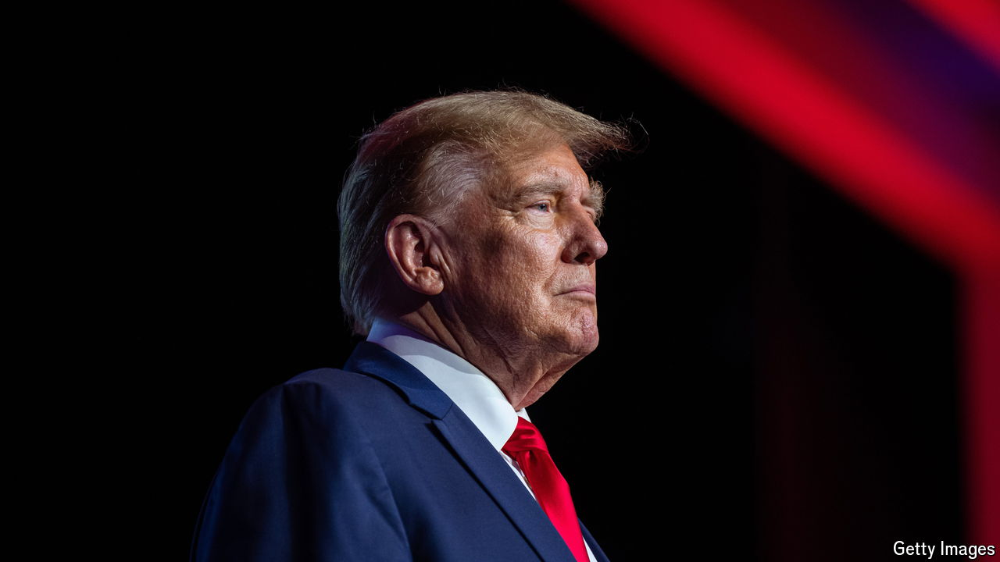

###### That’s DWAC

# Donald Trump tries his hand with meme-stocks 

##### Investors in his SPAC may get burned, but they don’t seem to mind 

 

> Mar 20th 2024 

There is a spirited corner of the internet where MAGA die-hards go to talk politics, God and the stockmarket. On Reddit and Rumble (a kind of far-right YouTube) they pump up their man Donald Trump and his social-media company, Truth Social, which they pray will soon go public via a  (SPAC). Together they pore over its latest filings with the Securities and Exchange Commission (SEC), then they read a Bible verse or two. One Old Testament proverb—“Buy the truth and do not sell it”—is almost too apt. “That’s what we’re doing here, folks,” says Chad Nedohin, a hype-man on Rumble. “Literally, as a team of investors, we have bought into truth and we are never selling because we are diamond-handed HODLers”. That is crypto-speak for “hold on for dear life”. 

Faith is a prerequisite for this merry band of meme-stock traders. Truth Social’s path to the public markets has been long and fraught, dogged by an SEC probe, lawsuits by disgruntled former employees and a cash crunch. At last a flotation looks imminent. On March 22nd investors in a SPAC—a listed pot of capital—called  (DWAC) will vote on whether to merge with Truth Social’s parent company, Trump Media &amp; Technology Group. If enough assent the combined firm will start trading under the NASDAQ ticker DJT. 


The deal comes at an opportune time. Trump Media is running on fumes: in the first three quarters of last year it lost $49m and had just $1.8m cash on hand as of September. Through the merger it will raise about $240m, estimates Michael Ohlrogge of New York University School of Law. At DWAC’s current share price the new entity will have a market capitalisation of $6.3bn. As with other meme stocks, that makes no economic sense. The firm has reported 8.9m sign-ups for Truth Social but prefers not to disclose how many are active daily. “Focusing on these KPIs might not align with the best interests” of Trump Media, says its prospectus.

Mr Trump will own a stake worth $4.1bn. But a six-month lock-up, during which he cannot sell, makes paper gains of little use in his present liquidity crunch. In February Mr Trump was fined nearly half a billion dollars for fraud at his ; by March 25th he must secure a bond for that amount while he appeals against the judgment.

That is proving tricky: about 30 bond companies have turned him down so far because he lacks enough cash to put up as collateral. He has asked an appeals court to reduce the bond. If it refuses he will have to sell assets or ask a rich supporter to bail him out. Failing that Letitia James, the prosecutor who brought the case, could freeze his bank accounts or seize some of his property. She likes to say that she can see 40 Wall Street, one of Mr Trump’s towers, from her office.

As for DJT, economic reality should sink in eventually. If and when Mr Trump liquidates his holdings the share price will drop. Since the beginning of 2019 nine out of ten SPACs have lost value after combining with their target company, notes Michael Klausner of Stanford Law School. On average the share prices of post-merger SPACs have declined by 60%. Target companies got a good deal in these mergers while SPAC shareholders who stuck through the listing—mostly unsophisticated retail investors—took a bath.

The DJT crowd hears the critics; it just thinks they are wrong. Back in 2022, when the SEC was investigating the deal, Mr Nedohin, the Rumble hype-man, insisted that Trump Media was not a Ponzi scheme. “This is different,” he assured his excitable followers. “We are helping promote a company that has the potential to be a trillion dollars easily…It will be paying out!” ■


