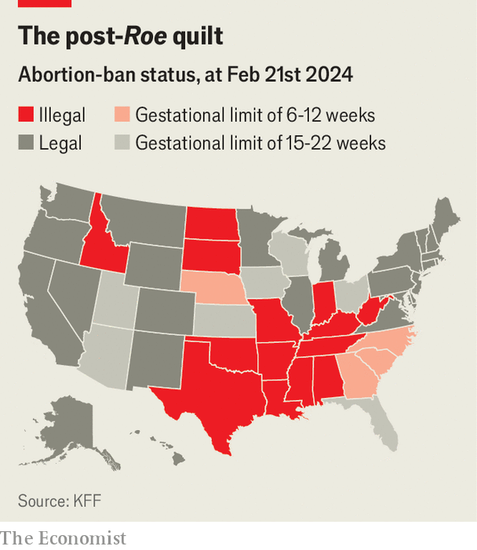
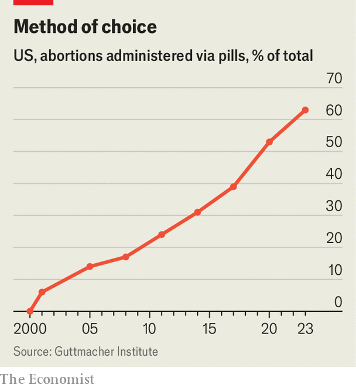

###### Down is up

# Fewer states allow abortions, yet American women are having more 

##### What’s going on? 

 

> Mar 19th 2024 

On a commercial stretch of Queens, New York, across from a hair-braiding salon and next to a McDonald’s, two security guards mark the entrance to the Jamaica Sexual Health Clinic. For years this has been the neighbourhood’s go-to place for STI testing and HIV treatment. Joaquin Aracena, from the Bureau of Public Health Clinics, proudly shows its newest addition: the  wing. With freshly painted white walls and pastel-green doors, it is distinctly less institutional-looking than the rest of the clinic. 

“Once they did [away with]  I was able to get this space,” he says. The clinic now offers walk-in medication abortions free to all. Word is clearly spreading. Last year it provided just over 700  in January it was 100, and this morning the two nurse practitioners have already sent four women home with a non-transparent bag containing the pills they need to terminate their pregnancies.

This is one of the more unexpected results of the Supreme Court’s decision in 2022 to overturn , a ruling that returned the issue of abortion to states and triggered bans. That gave the city’s government new energy to take a more active role in co-ordinating access to abortion, says the city’s health commissioner, Ashwin Vasan. This included putting up billboards in Arizona and Texas and opening clinics in underserved pockets of the city. Less than nine months after , the ruling that overturned the Jamaica clinic’s abortion service was up and running. 

Many hurdles—practical, financial, social—can stand in a woman’s way, even where abortion is legal. One consequence of  is improved access in states with a supportive approach to abortion.

 


New data from the Guttmacher Institute, a pro-abortion-rights research group, estimate that over 1m abortions were performed in America in 2023—a rise of 10% compared with 2020 and the highest number in over a decade. This is astonishing, given that the procedure is now banned in 14 states and has become restricted in several more. States bordering those with bans had the steepest rises: up by 72% in Illinois since 2020, 76% in Virginia and 257% in New Mexico. 

Last year more than 160,000 women—over 400 a day—crossed state borders to terminate pregnancies, versus 81,100 in 2020 (albeit a covid-19 year). More surprising is the growth among residents of abortion-supporting states. In California locals had an estimated 21,470 more abortions in 2023 than in 2020 (accounting for 88% of the state’s increase) and in New York they had 20,460 more (97%). Overall, in states without bans, over half of the rise was the result of locals having more abortions.

Efforts to improve access in such states may help explain this growth. Several states have reduced out-of-pocket spending for patients. Illinois, New Mexico and New York have increased their Medicaid reimbursement rates for first- and second-trimester abortion procedures by more than 200%, according to forthcoming analysis by KFF, a health-research group. In ten states health insurers are now required to cover abortion, up from six before .

 


Nothing has helped expand access as much as abortion pills, which now account for 63% of abortions in America, up from 45% in 2019 (see chart). Medication abortions are cheaper than procedural ones, and easier for clinics to provide and (especially in rural areas) for patients to receive. They are effective in the first trimester, when 94% of abortions happen. Telehealth experiments during the pandemic helped fuel the expansion, as did a loosening of regulations on their use and distribution. Next week the  will consider whether the rules should be tightened again.

Whereas in 2020 only 7% of providers offered abortions via telemedicine, by 2022 that had increased to 31%. Mai Fleming from Hey Jane, a virtual-only abortion provider, says she can offer medication abortions at “a fraction” of the cost of bricks-and-mortar clinics. She has seen particularly large increases in orders from states that border restrictive states, such as Colorado, Illinois and New Mexico.

Abortion havens have also solidified legal protections, both for patients (eg, data privacy) and providers (eg, malpractice insurance). Some have amended state constitutions to include a right to abortion. Six states now have telemedicine shield laws that protect licensed practitioners from prosecution if they prescribe and send pills to patients in states that ban abortion.

Alternative explanations for the nationwide rise in abortions, beyond the spread of pills and efforts to lower barriers, do not seem to hold water. It does not, for example, appear to stem from a spike in unplanned pregnancies, which—a short bump during the covid pandemic excepted—show little sign of change since . 

It would be wrong to conclude that all is fine in post- America. Abortion pills may be a godsend for early unplanned pregnancies, but for women in states with bans who need an abortion later—often due to fetal abnormalities detected at the 20-week scan—getting an abortion is harder than it has been for decades.■


