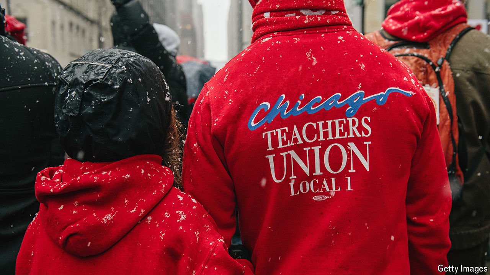

###### Militant tendency

# Is the most powerful teachers union in America overreaching? 

##### Chicago’s teachers have become a model for radical left-wing organising 

 

> Mar 21st 2024 

As election-night parties go, the mood was bleak. On March 19th primary-election voters in Chicago were asked to vote on a ballot measure that would have raised the transfer tax on properties worth over $1m so as to generate money to pay for homelessness relief. The measure was backed by the city’s entire progressive establishment. Its opponents, mostly from the real-estate industry, did not even bother to organise a rival event. And yet by 9pm on election night, “No” was leading by around eight percentage points. “Let’s just pretend,” said Myron Byrd, from the Chicago Coalition for the Homeless, an activist group, mournfully, before he belted out a song he had wanted to perform to celebrate victory. The party ended with chants of “we will not give up”, long after most attendees gave up and left. 

The defeat of the “Bring Chicago Home” measure was crushing for Chicago’s mayor, Brandon Johnson, who had heavily promoted it. But it is perhaps an even bigger defeat for his former employer, the Chicago Teachers Union (ctu), which put $400,000 and the organising work of its 28,000 members into getting a Yes vote. In the past decade or so, the union has become one of the most powerful in the country by adopting a model of radical left-wing political organising. From 2022 to the end of last year it put $2.3m into Mr Johnson’s campaign fund. Its support helped elevate Mr Johnson, previously an unknown county commissioner, into office. This year it hopes to reap the spoils—the teachers’ contract is up for renewal. But is the union overreaching?

The ctu’s transformation began over a decade ago, when Rahm Emanuel was mayor. On coming into office and discovering a huge hole in the teachers’ pension scheme, Mr Emanuel cancelled a pay rise and took a hardline approach to negotiation. In 2012 incensed teachers went on strike for the first time in 25 years. In 2013 he then began a deeply controversial programme to close 50 of the city’s public schools, further invigorating the union’s organising efforts. After another strike in 2019, by last year it had developed the confidence to help push out Mr Emanuel’s successor, Lori Lightfoot.

With Mr Johnson in office, the ctu is in an enviable position. Instead of dealing with somebody like Ms Lightfoot or Mr Emanuel, this year teachers will negotiate with their own union’s former lobbyist. They expect a payoff. In early March the Illinois Policy Institute (IPI), a right-leaning think-tank, leaked the union’s early negotiating proposals. Among the suggestions were that teachers ought to get “cost of living” pay increases of 9% a year, subsidised housing, more generous pensions, and health insurance with smaller copays. The union also wants every school in the city to be guaranteed a librarian and more staff of all sorts to be hired. “They can demand almost anything under the sun,” says Austin Berg, of the IPI.

Johnson’s choice

The union sees this as only what it is due. At its head is Stacy Davis Gates, a former history teacher who says she was radicalised by school closures. Ms Davis Gates takes a no-compromise approach to politics. In a speech to bigwigs at the City Club on March 5th she told journalists wondering about how the district would pay for her union’s proposals to “stop asking that question”. She also discussed the toll it took on her mental health to have it revealed she sends her teenage son to a private Catholic school, rather than a public one. At the end of the speech she finally offered a figure for the cost of her proposals: “$50bn and three cents”.

The trouble is there is no more money. This year the budget amounts to $29,000 per pupil. Such spending is possible only thanks to a huge slug of federal covid-relief funding. By 2026 the school district projects it will have a deficit of $691m even before the costs of a new contract. It cannot raise its property tax any faster. A state bailout is unlikely, says Hal Woods of Kids First Chicago, a charity. That leaves only the equally cash-strapped city. Even some once sympathetic to the ctu are nervous. “They are trying to solve the bad policy decisions of the past two or three decades by just throwing money at it,” says Stephanie Farmer, an academic at Roosevelt University. “It makes me very disappointed.” 

What Chicago’s schools actually need is reform. As things are, even large sums of money do not go especially far. One of the biggest problems is that there are simply too many schools. Over the past two decades enrolment has shrunk by over a quarter, even as new charter schools opened. Over a third of the city’s schools are operating at below 50% capacity. A few high schools have less than 10% of the number of students they were built for. Oversized schools cost huge sums to run even as they have to skimp on services (like librarians). Closing them would be fiercely unpopular, but the ctu’s solution in essence amounts to staffing them all as though they are full.

In the negotiations Mr Johnson has a choice. If he simply pays up, he will have to starve the rest of the city’s services to pay for it. The alternative is defying those who put him into office. And yet in a way, the results of the Bring Chicago Home ballot measure could make that easier. In the mayoral race last year, when asked about how he would negotiate with the teachers, Mr Johnson replied, “who better to deliver bad news to friends than a friend?” That becomes a lot easier if your friend suddenly seems a lot less popular. ■


