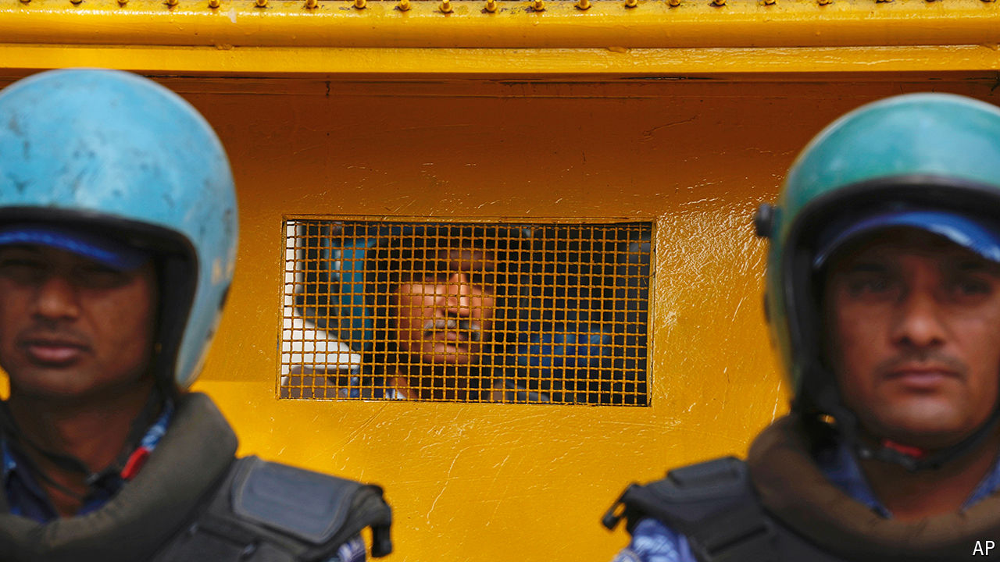

###### No country for critics?

# Arvind Kejriwal’s imprisonment is a stain on India’s democracy 

##### He is the first sitting chief minister in the country’s history to be arrested 

 

> Mar 27th 2024 

With just over three weeks to go until the start of a general election Narendra Modi, India’s prime minister, has little reason to worry about the outcome. His popularity is at an  both at home and abroad. His ruling Bharatiya Janata Party (BJP) is expected to win re-election comfortably. But the government is not resting easy. It appears to have stepped up a campaign to quash dissent. That makes many concerned that, were Mr Modi to win a third term, he may become even less tolerant of the opposition.

On March 21st the Enforcement Directorate (ED), one of two main Indian agencies tasked with investigating financial crimes, arrested Arvind Kejriwal, the chief minister of Delhi and the leader of the opposition Aam Aadmi Party (AAP), as part of a corruption probe. He is the third opposition leader to be arrested this year and the first sitting chief minister to be arrested in India’s history. The ED accuses him of failing to co-operate with the probe after he ignored nine summons to be questioned by investigators. The AAP leader denies wrongdoing and says he is the victim of a political vendetta. On March 26th members of his party who were attempting to march to Mr Modi’s home in protest were arrested. A big rally by the opposition is planned for March 31st. 


This crackdown unfortunately appears to be part of a broader pattern. The same day as Mr Kejriwal’s arrest Congress, the main national opposition party, claimed that tax authorities had frozen its bank accounts over alleged undeclared cash income in the 2017-18 financial year, leaving it unable to cover campaign expenses. On March 26th a court in Delhi also extended the pre-trial custody for an opposition lawmaker from the southern state of Telangana, who was arrested earlier this month in connection with the same probe that snagged Mr Kejriwal. 

Meanwhile the courts have also continued to defer pleas for bail from two other senior AAP leaders who have been in jail as part of the probe for six and 13 months, respectively. None has been put on trial. In January the ED also arrested the chief minister of Jharkhand, an opposition-run eastern state, on allegations of money-laundering. He resigned hours before his arrest. All deny wrongdoing. They will not be able to campaign in the upcoming election.

The BJP says that law-enforcement agencies are independent of the government, and are merely doing their job in rooting out corruption. It says that opposition politicians who allege a political conspiracy are trying to find excuses for their “imminent and miserable defeat” in the election. Even so, some 95% of financial-crime probes since Mr Modi took power in 2014 have targeted the opposition. By contrast few BJP politicians have found themselves in the crosshairs of law enforcement. Opposition politicians troubled by anti-corruption officials have seen their legal problems shelved or postponed as soon as they defected to the BJP. 

Increasingly it looks as if the BJP is unable to brook any dissent. NGOs and think-tanks that are critical of the government have found themselves subject to close attention by the authorities. The media is broadly pro-BJP, while the judiciary is increasingly selective about how it chooses to challenge the government.

Despite the questionable timing of the moves against Mr Kejriwal and others, the probes are still likely to inflict considerable damage on the opposition, while posing little electoral risk to Mr Modi’s government. Disclosures earlier this month of controversial corporate donations through “electoral bonds”, which the Supreme Court ordered in February, have not roused voters or anti-corruption officials, despite the fact they were largely to the BJP. Mr Modi remains incredibly popular, with fully 78% of those polled in a recent survey approving of him. He would easily win a democratic election, even without the recent crackdown. ■


