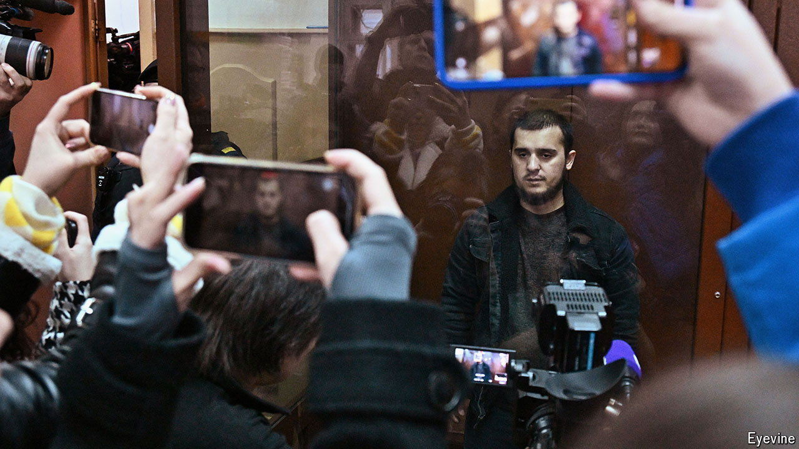

###### Holier than thou

# The Islamic State’s branch in Afghanistan is at war with the world 

##### The group which claimed responsibility for the Crocus City Hall attack is increasingly worrying 

 

> Mar 27th 2024 

No government formally recognises the Taliban regime in Afghanistan, partly because its restrictions on female education are the world’s most oppressive. Yet even the Taliban are not radical enough for the Islamic State Khorasan Province (ISKP), an offshoot in Afghanistan of the group that established a “caliphate” in Iraq and Syria in 2014. ISKP propagandists rubbish the Taliban as sell-outs to the West because, among other sins, they meet non-Islamic diplomats and allow unbelievers to supply aid.

During its nine-year existence, ISKP has mainly killed Afghans. The group’s global ambitions burst into view on March 22nd, when at least four gunmen killed 139 people at a concert in Moscow. American officials blamed ISKP for the attack; Russia later arrested suspects from Tajikistan. If the charges are proved they will underscore the group’s expanding record of strikes beyond Afghanistan. It cultivates a long list of enemies, including America and China. In January its recruits hit a church in Turkey and carried out the deadliest terrorist attack in Iran in decades. Two of the suspects spent time in Turkey before travelling to Russia. The Turkish government says that it has made a wave of arrests.

Russia is in ISKP’s crosshairs because it maintains an embassy in Kabul and has accepted a Taliban military attaché in Moscow. It also provides aid to Syria, where Bashar al-Assad’s regime helped dismantle ISKP’s parent organisation. The attack in Moscow may also reflect ISKP’s recruiting among Tajiks, Uzbeks and Kazakhs. The group’s in-house media arm, al-Azaim, distributes content in Central Asian languages. Until his arrest last year, Abu Miskin, a Tajik militant, was among its “most active propagandists and high-ranking recruiters”, according to the UN.

Estimates of the ISKP’s strength vary from fewer than 2,000 to 5,000. Taliban offensives have taken back territory the group once held in Afghanistan. According to Riccardo Valle, director of research at Khorasan Diary, an Islamabad-based group, ISKP’s strength these days is “its ability to find and connect with small numbers of disaffected people”. The current leader is believed to be Shahab al-Muhajir, a 29-year-old of Arab descent. He is rarely heard from, but he can be certain that his disparate organisation will now be at the centre of global attention. ■

