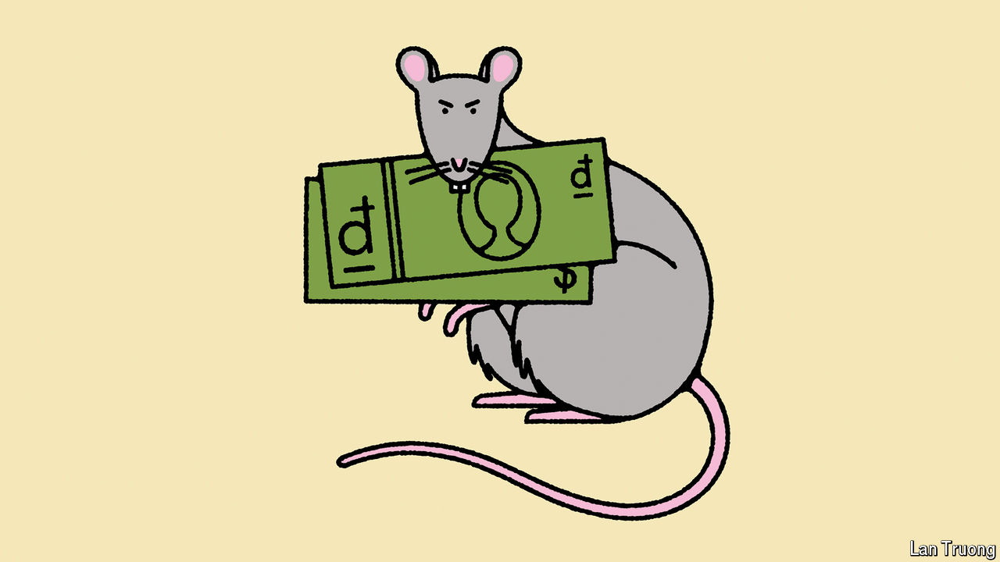

###### Banyan

# Vietnam’s head of state leaves under a cloud 

##### Investors should worry about the state of the country’s politics 

 

> Mar 27th 2024 

The Communist Party of Vietnam is among the most secretive bodies on Earth. The façade it presents to its own people and to the world is one of circumspection, conformity and consensual order. So to lose one head of state early last year, departing under a cloud of corruption, was careless. To lose a second, Vo Van Thuong, in late March is downright disconcerting. It is not just ordinary Vietnamese who should care. So, too, should foreign investors, who have bet big on Vietnam as the hottest economy in South-East Asia.

Mr Thuong, in his early 50s, was the youngest-ever president. A propaganda whizz, he thought he was going places. He succeeded Nguyen Xuan Phuc, who resigned in January last year after taking responsibility for a scam involving pandemic testing kits (he insists neither he nor his family were involved). Mr Thuong relished his public role. But a planned visit to Vietnam by the king and queen of the Netherlands was abruptly cancelled at Vietnam’s request. Then, on March 20th, the party’s central committee said Mr Thuong had resigned from all posts. His “violations and shortcomings” had left “a bad mark” on the party’s reputation. The vice-president, Vo Thi Anh Xuan, a rare woman in the upper echelons, is standing in for now. Mr Thuong has not been heard of since.

To be sure, the presidency is only one of four key positions. Authority is usually spread among four “pillars”: the general secretary of the party (the most important post), the prime minister (running the government), the president and the speaker of the National Assembly. The current general secretary is Nguyen Phu Trong. He has, exceptionally, been in the post since 2011. He is nearly 80 and will surely step down at the next party congress in 2026—if rumoured ill health allows him that long. Any ructions behind the façade must be viewed in the context of who succeeds him.

Mr Trong’s key tenet is that the party cannot survive without going after widening corruption. His “blazing furnace” campaign had already floored ministers, a deputy prime minister and a string of senior leaders in Ho Chi Minh City, Hanoi and the provinces. To complicate things, powerful party figures use Mr Trong’s campaign as a pretext to jockey for power. 

Mr Thuong was a protégé of the general secretary’s—but in the end that did not help him. According to Le Hong Hiep of the ISEAS-Yusof Ishak Institute, a research body in Singapore, Mr Thuong’s supposed wrongdoings relate to his time as party secretary of Quang Ngai province from 2011 to 2014. The investigation of corruption at a local developer has already brought down a handful of provincial officials. The powerful and ambitious minister for public security, To Lam, who is at the heart of the anti-corruption campaign, may have been involved in Mr Thuong’s fall. Certainly, Mr Lam will be keen to position himself for a grab at the top job in 2026. 

A delegation of 60 American businesses, including Boeing and Meta, has just been in the country. To those and others with an interest in Vietnam’s development, Mr Thuong’s fall presents a conundrum. On the one hand it confirms that the effects of corruption reach to the very top of the party. The national extent of corruption is huge, if the trial under way of an alleged fraud of $12bn at the Saigon Joint Stock Commercial Bank is any measure. The amount alleged to have been bilked is well over twice the notorious fraud at 1MDB, Malaysia’s now-insolvent sovereign fund. 

That is one uncertainty for those who have turned to Vietnam as a hedge against putting all business bets on China in an age of great-power rivalry between China and America. Annual foreign direct investment has been flooding in to Vietnam, rising by over a third last year, to $36.6bn. 

On the other hand, multinationals know how to navigate somewhat corrupt economies. Corruption, for all its costs, can grease the wheels of commerce by getting deals done. Besides, in Vietnam the foreign-invested manufacturing sector is much less riven with graft than are state-directed sectors.

Worse is when reform stalls—and that, analysts say, is happening now, as officials terrified that the blazing furnace will come for them lack the nerve to open up the economy further and encourage investment. Mr Trong once said that going after corruption while ensuring stability was like “catching a rat without breaking the pot”. Rats are being caught, but can the pot remain intact? Vietnam is about to find out. ■


