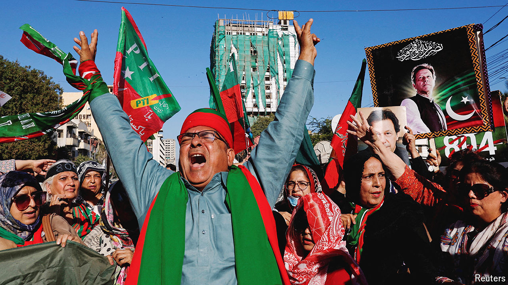
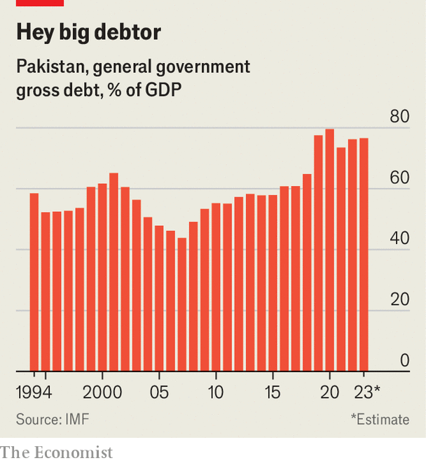
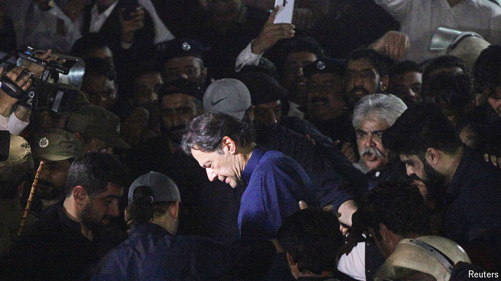

###### Imran Khan in prison

# What next for Pakistan? 

##### The new government faces polarised politics, a faltering economy and terrorist threats 

 

> Mar 27th 2024 

A stint in jail is a rite of passage for civilian Pakistani leaders bold enough to challenge the country’s generals. Imran Khan is doing his penance these days in Rawalpindi’s Adiala jail. Judges sentenced the 71-year-old former cricketer turned populist politician to 31 years earlier this year after convictions on religious, corruption and national-security charges. Because candidates allied with his party, Pakistan Tehreek-e-Insaf (PTI), managed nonetheless to win more national-assembly seats in February’s election than any rival party, Mr Khan is in “extremely high spirits”, says his sister Aleema, a regular visitor. He passes his time reading and keeping fit on a stationary bike in his cell.

The image of Mr Khan pedalling furiously while stuck in place seems an apt metaphor for Pakistan’s post-election politics. PTI’s unexpected success at the polls demonstrated the party’s resilience under pressure. Yet while it has managed to form one provincial government, in Khyber Pakhtunkhwa, PTI’s leaders are otherwise marginalised. Shehbaz Sharif, the prime minister, enjoys firm backing from “the establishment”, as Pakistan’s armed forces are euphemistically known. He now leads a minority national administration anchored in his family’s dynastic party, the Pakistan Muslim League-Nawaz (PML-N). Mr Sharif recently put the finishing touches to a cabinet of technocrats and traditional politicians. After two tumultuous years, he could be forgiven for hoping for calm. 

But he is likely to find it elusive. Mr Sharif’s government faces three challenges in the coming months. The first is that Mr Khan is determined to overturn the status quo, even from prison. Outraged by allegations of vote-rigging during the February vote, PTI leaders say they will seek redress in parliament, the courts and through peaceful street protests. Their goals include a new election and liberty for Mr Khan and other jailed leaders. “I have no doubt—and I think the party feels very confident—the so-called result of this election will be overturned,” says Taimur Jhagra, a former PTI provincial minister, referring to the evidence of vote fraud that the party is submitting to the courts. 

Yet Pakistan’s judges rarely defy the army’s preferences on big political matters. And since February, the government has used social-media blackouts and overwhelming shows of force by police to suppress PTI’s attempts to stage public demonstrations. General Asim Munir, the powerful army chief, is not signalling room for compromise. In a recent statement following a conference of top generals, the military denounced those in Pakistan who are “creating political instability and uncertainty” by resorting to “emotional outbursts”, a transparent reference to PTI.

 


Even if he overcomes Mr Khan’s pressure campaign, Mr Sharif has a second big problem: Pakistan’s volatile economy, which is in the middle of a multi-year crisis. GDP shrank slightly in 2023 amid high debt, a balance-of-payments crisis and inflation that peaked at near 40% before falling back to its current rate of 23%. Before the election, while heading a government that lasted 16 months, Mr Sharif staved off disaster by securing a $3bn stand-by emergency loan from the IMF. That arrangement expires in April. Mr Sharif and a successor caretaker administration earned credit for delivering a primary fiscal surplus. But they were unable to advance the deep reforms that Pakistan has long needed, such as privatisation of state-owned enterprises saddled with zombie debt or an expansion of the tax net. 

The new government is expected to return to the IMF for a larger and longer-term package. If agreed it would be the 25th IMF bail-out in Pakistan’s 77-year history, placing the country among the most profligate of fund borrowers. There seems little doubt that a new multi-year arrangement is attainable, perhaps in the range of $6bn. “Even our enemies don’t want us to fail or default,” notes Miftah Ismail, who served as finance minister during 2022. A new IMF programme will seek to reduce Pakistan’s staggering debt levels, which some analysts now regard as unsustainable.

As a nuclear-armed nation of 242m, Pakistan is indeed too big to fail. Yet this has only entrenched complacency and corruption, encouraging its leaders to rely on emergency external finance and temporary fiscal adjustments rather than stomach economic restructuring. 

First as tragedy

Will this time be different? Mr Sharif has raised hopes by recruiting Muhammad Aurangzeb, a Wharton-educated CEO of one of Pakistan’s largest private banks, as his finance minister. Mr Aurangzeb has pledged to carry out ambitious reforms and declared after his appointment that he would tolerate “no debates, no waste of time: just a steadfast commitment to implementation”. But whether Mr Sharif will give him the backing to follow through is uncertain.

A plan to sell off debt-ridden Pakistan International Airlines (PIA) will provide an early test. Forty years ago PIA offered service superior to its state-owned counterparts in India. But during the 1990s, the rise of formidable Gulf competitors like Emirates, and competition stimulated by an open-skies policy, caused the carrier’s market share to crumble. By 2017 PIA had 550 employees for every aircraft, more than two-and-a-half times its target. The airline now staggers under more than $3bn-worth of rupee debts. Mr Sharif has initiated a scheme to erase PIA’s debts and split the company into two parts, so that core operations could be offered for sale. 

The PIA case hints at some of the problems that have long bedevilled would-be modernisers in the country. Privatisation of state-owned firms hits workers, their families and unions: groups that are politically well-connected and which have in effect vetoed even the most common-sense divestments of state assets. Other reforms hit many more citizens and thus are even more politically sensitive. These ideas include stopping the government fixing prices; taxing retail and agriculture, previously exempt sectors; or withdrawing expensive fuel subsidies. Whenever such changes are attempted, however, they provoke huge protests amplified by social media and only partially free broadcasters.

Pakistan’s military-managed, constrained democratic set-up also prevents civilian leaders from taking bold action. Mr Khan’s rise and fall is a case in point: the armed forces were widely seen as his backers in 2018. Four years later, they were seen as being behind Mr Khan’s sacking. 

A third test for the new government comes in the form of a campaign of terror mounted by the Tehreek-e-Taliban (TTP), the Pakistani branch of the Taliban movement. Since the Afghan Taliban’s takeover of Kabul in 2021, TTP-linked attacks in Pakistan have surged, claiming more than 2,200 lives, according to the government. Many victims have been members of the security forces. The latest TTP attack took place on March 16th when suicide-bombers hit an army base on the Afghan frontier, killing at least seven soldiers. Pakistani jets launched a retaliatory strike against alleged TTP targets inside Afghanistan. 

 


There exists a serious risk of escalation. Pakistan accuses Afghanistan’s Taliban regime of providing aid and sanctuary to the TTP. “Terrorism against us is mostly being conducted from Afghanistan,” Khawaja Asif, Pakistan’s defence minister, said after the latest attack. During the past two years, Pakistan has tried many forms of persuasion and coercion to influence the Taliban’s restored regime in Kabul. The efforts have included diplomatic negotiations, halting cross-border trade, expelling Afghan refugees from Pakistan and military action. None of this has worked. Although the Afghan Taliban have issued decrees banning Afghans from fighting inside Pakistan, the attacks and accusations of Kabul’s complicity persist. 

Mr Sharif has long accommodated the armed forces. Decisions about how to handle the Taliban regime in Kabul will fall to General Munir. The army chief is a more reticent figure than some of his predecessors. Well-connected analysts say the general seems mainly interested in shoring up Pakistan’s bedrock alliance with China and its historical ties to Gulf states, particularly Saudi Arabia, where the general paid a visit on March 20th. 

General Munir also visited America late last year, hosted by Central Command, the military force responsible for Afghanistan and Pakistan. Pakistan’s correct if largely transactional relations with Washington these days offer a modest hedge against its dependency on China and help to ease its dealings at the IMF.

Second as farce

General Munir may also want more influence over the country’s economy. Last year he touted a new body, the Special Investment Facilitation Council, on which he sits, that he said would create “an investor-friendly system that avoids unnecessary delays and provides easy terms and conditions for business”, particularly in mining and agriculture. The apparent purpose is to attract direct investment from Gulf sovereign-wealth funds and elsewhere. Yet it will be hard for Pakistan to advertise itself as a stable destination for investment as long as its most popular politician is locked up on dubious charges and his supporters clamour for redress. 

Pakistan’s tragedy has been its inability to sustain a workable political consensus. “The reason our economy stinks is that every three years we press a self-destruct button and start from zero again,” says Mr Jhagra, the former PTI provincial minister. But it is one thing to be aware of the problem and another to solve it. The reality is that if Mr Khan wishes to achieve political rehabilitation, he would probably require either General Munir’s blessing or a reconciliation pact with other major civilian parties. Neither seems likely. 

Mr Khan’s charisma and defiance has delivered a rollercoaster ride to his party and his country. During his sojourn in prison, he recently told his sister, “I’m really busy getting knowledge” by reading about history, politics and Sufism. Perhaps Mr Khan can help overcome his country’s dysfunction by sharing new-found insights with generals and rival politicians. He might start with Rumi, the best-known Sufi poet: “Yesterday I was so clever, so I wanted to change the world. Today I am wise, so I am changing myself.” ■

