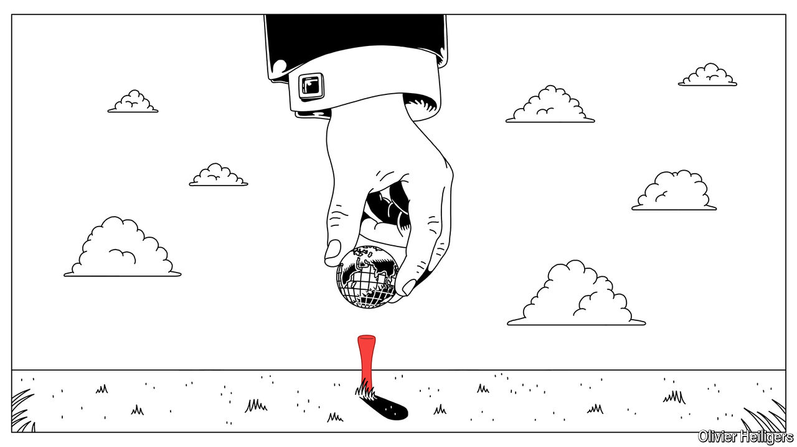
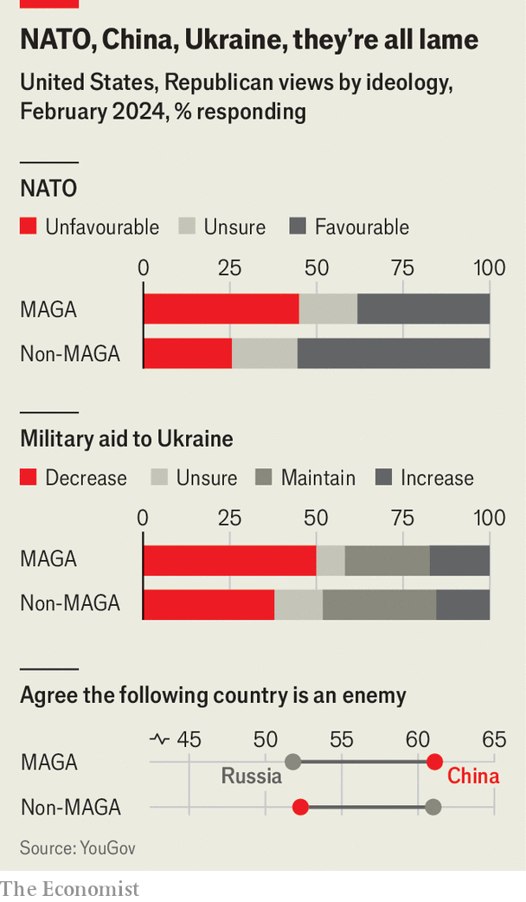
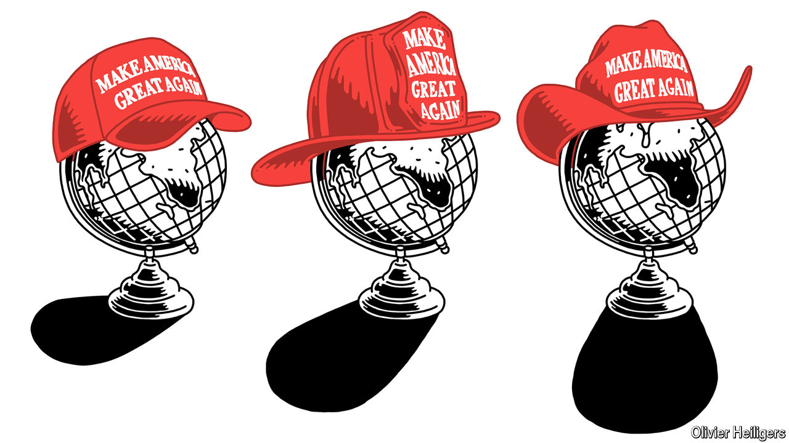

###### Stranger danger

# How to predict Donald Trump’s foreign policy 

##### He may be inconsistent, but his advisers offer some clues 

 

> Mar 27th 2024 

JOHN BOLTON, Donald Trump’s national security adviser in 2018-19, has simple advice for anyone trying to understand his former boss’s philosophy on foreign policy: don’t bother. Mr Bolton, who fell out with Mr Trump, says the former president has no consistent principles, only moods, grudges and an obsession with his image. Thus he could both threaten North Korea with “fire and fury” and hold three chummy summits with Kim Jong Un, for example, or both talk about leaving the NATO alliance and then reinforce its eastern flank.

Mr Trump’s current acolytes retort that “America First” is a perfectly coherent ideology, which was never properly adopted owing to obstructive advisers like Mr Bolton and the inexperience of the ex-president’s true devotees. Anyway, enthuses Fred Fleitz of the America First Policy Institute (AFPI), a Trumpist think-tank, “You forget how good things were when Trump was in office.” There were no big wars, four peace deals between Israel and Arab states, a successful renegotiation of the NAFTA free-trade agreement with Canada and Mexico and a partial trade deal with China—not to mention low inflation and a less permeable southern border. If Mr Trump regains the White House, he will reverse President Joe Biden’s “weakness” which, in the Trumpists’ telling, encouraged Russia’s full-scale invasion of Ukraine, Hamas’s attack on Israel and China’s bullying of Taiwan. By sheer force of character, Mr Trump will restore American power, deter foes and impose order.


Admirers and detractors alike, however, struggle to predict specific policies Mr Trump might adopt. Even those close to him admit that, until he is in the room with the likes of Vladimir Putin, Xi Jinping or Prince Muhammad bin Salman, he may not know himself what he wants to do. The art of the deal, they claim, lies in personal dynamics. Yet both the critics and the true believers argue that those around Mr Trump play a part in channelling his urges, whether muddled or masterful. To understand what Mr Trump might do around the world, therefore, it pays to look at the competing ideologies of his advisers.

Make America Inchoate Again

Republicans have now splintered into at least three distinct schools of foreign policy, to borrow the taxonomy of the European Council on Foreign Relations, a think-tank: primacists, restrainers and prioritisers. At least a few members of each group are likely to have Mr Trump’s ear if he becomes president again. Where these groups all align, it is relatively easy to predict policy. Where they are at odds with each other, or with Mr Trump’s impulses, expect erratic policymaking. 

The primacists, the heirs of Ronald Reagan, want to preserve America’s global hegemony. They include many “never-Trumpers” who have been largely sidelined within the conservative movement. Also weeded out of Mr Trump’s inner circle is the “axis of adults” that once held him in check, such as John Kelly, his former chief of staff, James Mattis and Mark Esper, both former defence secretaries, and Mr Bolton and another former national security adviser, H.R. McMaster. 

Some Reaganites have nonetheless stayed on Mr Trump’s good side by kowtowing and, when necessary, suppressing their beliefs. They include Mike Pompeo and Robert O’Brien, Mr Trump’s last secretary of state and national security adviser respectively, who may again have big jobs in a second term. In the Senate Marco Rubio, Lindsey Graham and Tom Cotton—all hawkish primacists—remain in favour. 

Against them are ranged the “restrainers”, akin to the isolationists of yesteryear. They believe America should not attempt to police the world but instead focus on troubles at home, notably the border with Mexico. Outright isolationists, such as Vivek Ramaswamy, who ran for the Republican presidential nomination, are probably a minority in the party elite. But they increasingly capture the mood of the Republican electorate. The Chicago Council on Foreign Affairs finds, for the first time in half a century of its polls, that a majority of Republicans—particularly Mr Trump’s most ardent supporters—think America should stay out of world affairs.

Between the primacists and the restrainers stand the prioritisers, who want America to do less in Europe and the Middle East in order to concentrate resources in Asia to confront China. Elbridge Colby, a former Pentagon official under Mr Trump, has become the prioritisers’ high priest. He argues that most Americans are neither ready to pay for the high defence spending needed to try to preserve America’s primacy, nor willing to yield Asia to China. Instead America must adjust priorities, just as imperial Britain reset relations with France and Japan to confront a rising Germany at the turn of the 20th century. 

But prioritisers are a broad group (the Biden administration, for example, also says it wants to focus on China). They include China hawks like Mr Colby and figures who prefer to spend money at home than abroad, such as J.D. Vance, a senator from Ohio. Sceptics wonder whether the emphasis on China is really just disguised isolationism. Would those who do not even want to confront Russia indirectly in Ukraine really be prepared to fight a war with China over Taiwan?

Mr Trump bestrides all three groups. Restrainers see him as one of their own. He shares their desire to reduce military commitments, especially in the broader Middle East. “By destroying the Republican establishment, and by reconfiguring the electoral base of the Republican Party, Trump opened the space for restrainers more radical than he is to gain positions of prominence and influence,” says Matthew Continetti of the American Enterprise Institute, another think-tank.

Yet Mr Trump also has plenty of primacist moments. He believes in strong military forces, echoing Reagan’s call for “peace through strength”. He bombed Syria over its use of chemical weapons and ordered the assassination of Qassem Suleimani, who co-ordinated the foreign militias that act as proxies for Iran. And in true prioritiser fashion, he devoted far more attention as president to China than to Europe or the Middle East.

In part, that may be because Mr Trump thinks of foreign affairs in business terms, as a source of profit and loss. He believes trade deficits are the result of “unfair” practices (most economists see them as a reflection of different levels of saving and investment in different countries). Mr Trump used to ask aides before meeting the leader of a foreign country, “What’s the trade deficit?” He also takes umbrage at allies that skimp on defence while benefiting from American security guarantees, claiming, “The world is laughing at us.” 

Like primacists and prioritisers, Mr Trump will favour muscular defence. Arms control is liable to be further eroded, since none of the three factions will champion it. A Trump administration will probably not renew the New START treaty, which limits long-range nukes and expires in 2026, partly because Russia has abandoned many of its provisions, and mostly because China is rapidly expanding its stockpile. 

Make Russia Great Again

America First has come to mean, in effect, “Europe last”—a view shared by both restrainers and prioritisers. YouGov polls find that more Trumpist, Make America Great Again (MAGA) Republicans regard NATO unfavourably than favourably. Among other Republicans the pattern is reversed. Similarly, MAGA Republicans are less likely than non-MAGA ones to regard Russia as an “enemy” (see chart).

 


The Senate, where primacists still hold sway, recently passed a bipartisan bill to provide more military aid to Ukraine (as well as Israel and Taiwan). But the House of Representatives, where MAGA types have more clout, has for months blocked the assistance. They argue America must first adopt strict curbs on migration across America’s southern border (even though, at Mr Trump’s urging, they rejected a bipartisan Senate bid to do just that). 

As a result, ammunition-starved Ukrainian forces are under pressure. Mr Trump professes concern at the bloodshed and promises to resolve the conflict in a day. How? General Keith Kellogg of AFPI, mooted as a possible national security adviser to Mr Trump, argues for a carrot-and-stick approach: tell Ukraine it will lose American support if it refuses to negotiate a deal, and warn Russia America will give Ukraine more and better weapons if the Kremlin does not agree to reasonable terms. Others such as Viktor Orban, the Hungarian prime minister and a darling of American ultra-conservatives, think Mr Trump would simply abandon Ukraine. Either way, the primacists alone will not have the clout to maintain the Biden administration’s generous assistance.

Beyond Ukraine, Mr Trump says he will not defend “delinquent” NATO allies (those that do not spend at least 2% of GDP on defence) from Russia: “In fact, I would encourage [the Russians] to do whatever the hell they want.” Messrs Bolton and Esper think Mr Trump may leave NATO entirely. Mr Rubio dismisses the risk. Primacists see advantage in scaring Europeans into doing more, but would draw the line at abandoning NATO. Indeed, Mr Rubio helped push through legislation that requires the Senate to approve a withdrawal from the alliance. Yet Congress could not stop Mr Trump from undermining NATO so thoroughly—by withdrawing American forces from Europe, say—that it would be tantamount to leaving.

Mr Kellogg, for one, says countries that do not meet the spending target are violating Article 3 of NATO’s treaty, requiring allies to have the “capacity to resist armed attack”, so should not benefit from Article 5, which holds that an attack on one is an attack on all. “We are not quitting on them; they are quitting on us,” he says. Meanwhile, the Centre for Renewing America, another Trumpist think-tank, has published articles advocating a “dormant” NATO, in which America would withdraw ground forces from Europe, while preserving the nuclear umbrella. It is not clear how far a second Trump administration will go, given these divisions, but upheaval for NATO seems inevitable.

Though increasingly sceptical of Ukraine, Republicans are avidly pro-Israel. According to the latest YouGov survey for  just 20% of Republicans considered Ukraine an “ally”; for Israel the share was 59%. As with Ukraine, Mr Trump claims he could quickly settle the crisis in Gaza but does not say how. He may also seek to renew the effort to crown the Abraham accords with an Israel-Saudi peace deal. There is broad Republican agreement on giving Israel a freer hand in its war with Hamas, on cutting off funds to the United Nations Relief and Works Agency, which helps Palestinian refugees, and on reimposing “maximum pressure” against Iran and its network of proxy militias. 

But there are some cross-currents, too. Scarred by long conflicts in the region, restrainers and prioritisers alike want to avoid war with Iran, so may not be as energetic as Mr Biden in warding off pro-Iranian militias. And they dislike Saudi Arabia’s price for ties with Israel: a formal defence treaty with America. In Congress, moreover, attempts at an Israel-only aid package foundered partly because Republican fiscal hawks demanded measures to pay for it, such as a cut to the Internal Revenue Service, America’s tax-collection agency.

As for Mr Trump, he holds a grudge against Binyamin Netanyahu, Israel’s prime minister, because he embraced Mr Biden’s election victory in 2020. But more recently Mr Trump has declared, “Any Jewish person that votes for Democrats hates their religion.” And in his love of risky, unorthodox summitry, Mr Trump came close to meeting Iran’s then-president, Hassan Rouhani, on the margins of a G7 meeting in Biarritz in 2019. With restrainers, prioritisers and primacists all pulling in different directions, and Mr Trump himself inconsistent in his views, confusion beckons. 

When it comes to Asia, there is broad consensus about the threat that China poses, but not necessarily about what to do about it. A majority of Republicans—especially those of a MAGA bent—define China as an “enemy”, according to YouGov.

Hawkish prioritisers want to focus on ensuring Taiwan is sufficiently armed to defend itself against a Chinese invasion, and America has the forces to help it. On this front, though, Mr Trump looks like a restrainer. In the Oval office, Mr Bolton recounts, the ex-president would point to the tip of his Sharpie, likening it to Taiwan. Then he would point to the huge Resolute desk and say, “This is China.” Mr Trump has also accused Taiwan of, in effect, stealing America’s semiconductor industry. 

The ex-president is keener on trade wars than shooting ones. Although he may again face internal opposition from Reaganites worried about the economic damage, Mr Trump overcame resistance from economic advisers in his first term to bombard friends and foes alike with higher tariffs. He is likely to resort to even heavier guns the second time around. He proposes a uniform 10% levy on all imports. Robert Lighthizer, his former trade representative, seemingly in line for a top job, thinks tariffs should keep rising until America’s trade deficit is eliminated. He wants a 60% tariff on Chinese goods, up from 19% now. That said, insiders say Mr Trump still seeks an eye-catching trade deal with Xi Jinping, China’s leader. He also wants to  with the European Union, which he detests as “worse than China, only smaller”.

America’s immediate neighbours and biggest trading partners, Canada and Mexico, also have much to worry about. A universal tariff would violate USMCA, the tweaked version of NAFTA that Mr Trump hailed as an “amazing deal”. Trade is not the only source of friction, however: Republicans denounce Mexico as a transit country for migrants and a source of drugs, notably fentanyl. Mr Trump once mused about shooting missiles at Mexican drug labs. Others suggest deploying the navy to intercept chemicals used to make fentanyl on their way to Mexico, or even sending special forces to fight drug gangs. It seems safe to assume that relations with Mexico, at least, will suffer.

Adjudicating among his advisers will not be Mr Trump’s only difficulty in crafting foreign policy. He may also face resistance from the bureaucracy. Trumpist think-tanks are busy vetting candidates to fill the 4,000-odd jobs in the president’s gift, about 1,200 of which require the Senate’s approval, too. 

Some fear Mr Trump may purge some or all of America’s top generals, whom he considers too woke. He has spoken of using troops against rioters or protesters. The generals, says Mr Esper, one of Mr Trump’s estranged former defence secretaries, may be given orders that are “awful but lawful”, as well as a distraction from the main military task of deterring and fighting foreign foes.

The make-up of Congress will shape Mr Trump’s team, too. If, against the odds, the Democrats retain the Senate, only reasonably moderate nominees for senior jobs will win its approval. If Republicans secure a majority in the chamber, more controversial figures may get the nod. In any case, officials appointed by Mr Trump in an acting capacity can serve for months without Senate confirmation.

Those close to Mr Trump predict much turbulence. “He’s going to say a lot of things that make people nervous but that’s because he’ll be telling the truth or negotiating to clean up a lot of mess,” says one.

 


What should America’s friends do? “Listen to him, treat him with respect and look for compromises,” insiders advise. Many governments are indeed seeking to befriend biddable members of his entourage. Others will look for allies among American businesses and in states that risk being harmed in any trade war. Still others will try to stroke his ego. Britain wowed him with the royal family; France with military parades. 

The diverging experiences of Germany and Japan are instructive. In Mr Trump’s first term both had large trade surpluses with America and spent woefully little on defence. Mr Trump, got on terribly with Angela Merkel yet surprisingly well with Abe Shinzo, their respective leaders at the time. Why? Partly because Japan made some trade concessions and Mr Abe was known as a defence hawk, whereas Ms Merkel was a “block of stone”.

Declare America Great Again

Mr Abe also understood Mr Trump’s weakness for flattery. His posthumous memoirs are packed with tips: craft meetings with Mr Trump to include activities he likes (lots of golf, once with a Japanese pro), his favourite food (burgers), bling (a gold-plated club), pomp (meeting the emperor) and entertainment (ringside sumo). “It was important to create an environment where we could talk,” wrote Mr Abe. Mr Trump was “cautious about anything that costs money, and thinks about diplomacy and security through an economic lens”. A nervous ambassador in Washington suggests a completely different tactic: “Do you know how to pray?” ■


