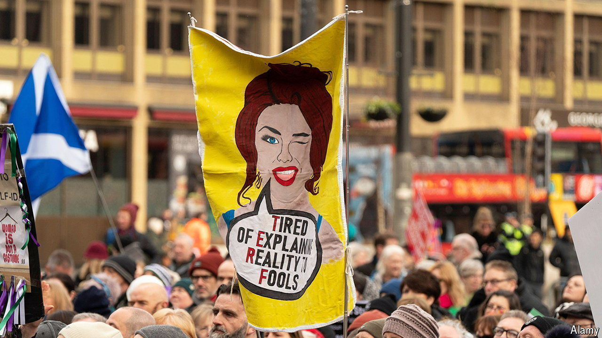

###### You can’t say that

# A new hate-crime law in Scotland causes widespread concern 

##### Transgender identity is protected; biological sex is not 

 

> Mar 27th 2024 

April 1st might seem an inauspicious day to bring in controversial legislation. But that is the day the Scottish government has chosen finally to bring into effect its Hate Crime and Public Order Act. The law was passed three years ago, but its implementation was delayed by worries about how the police would deal with its expected effects. Critics of the law say the government is still taking the Scottish people for fools. 

Scotland already has an offence of “stirring up racial hatred”. From April it will become a crime to use “threatening or abusive” behaviour with the intention of stirring up hatred on the basis of other characteristics, too—namely religion, age, disability, sexual orientation and transgender identity. It will also become possible to prosecute people for things they say in the privacy of their own home. Humza Yousaf, Scotland’s first minister, has insisted that the threshold for what constitutes stirring up hatred is “incredibly high”. Plenty of critics disagree.

“Discussion or criticism” of protected characteristics is acceptable, and a carve-out has been made that allows Scots to voice “antipathy, dislike, ridicule or insult” for religion. But the carve-out does not apply to the other characteristics named under the law. And some characteristics are not covered by it at all, most obviously sex and non-religious beliefs. That explains why some of the law’s most vocal critics are women who argue that biological sex should take precedence over proclaimed gender identity in areas from sports competitions to changing rooms to prisons. Many of them believe the new law will be weaponised by trans-rights activists to try to silence them. 

They are not the only ones to fret. Stephen Allison of the Free Church of Scotland points out that the new act actually abolishes an old blasphemy law. But he says that Christians and Muslims worry it is being replaced by a modern version. “We accept that our beliefs are not shared, nor necessarily understood, by everyone. However, we should not be criminalised for expressing orthodox Christian beliefs relating to sexuality and gender.” 

“The debate needs to calm down a bit,” says James Chalmers, a legal scholar at the University of Glasgow. “The new law does not change things as much as some people think. It provides a more accurate label for prosecuting serious cases of hatred.” But he concedes that “if people believe that the criminal law has been broadened, you may see more reports to the police.” 

Much, then, may depend on how police deal with those reports. Despite the delay in implementing the law, officers in Scotland have received only a two-hour online training session ahead of its introduction. David Kennedy, the general secretary of the main police union, says the training is “not fit for purpose”, and believes the attempt to legislate hate crime is “a recipe for disaster”. “Police officers are saying to me, ‘We’ll just have to charge everyone’.” 

Some critics flag the potentially malign influence of lobby groups. “All the groups who think that we are hateful have been deeply involved in training the police,” says Lucy Hunter Blackburn of MBM, a policy-analysis group that has questioned government policies on gender in particular. 

Another concern centres on investigations that do not result in a prosecution. These are still recorded against the person’s name as a “non-crime hate incident” and may show up on safeguarding checks for job applications. On March 25th Murdo Fraser, a Conservative politician, threatened to take legal action against Police Scotland after a tweet of his criticising the Scottish government’s policy on non-binary people was logged as a “hate incident”, even though no law had been broken. “The process is the punishment,” says Ms Hunter Blackburn. It need not require prosecutions for the legislation to have a chilling effect on free speech. ■


