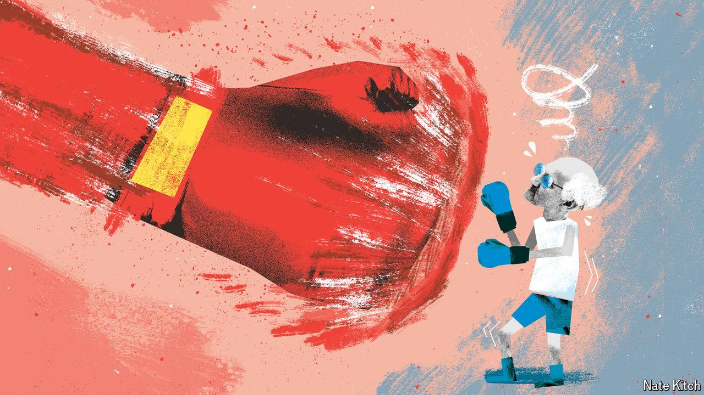

###### Bagehot

# British boomers are losing out for the first time 

##### A generation used to having everything its own way is not happy 

 

> Mar 27th 2024 

The 1950s were a good decade to be born in Britain. A newly minted welfare state ensured that your early years were free from squalor. For the lucky few who made it there, university cost nothing. During your peak earning years, taxes plunged thanks to Margaret Thatcher, oil gushing from the North Sea and the restorative effect of the EU’s single market on the sick man of Europe. Rocketing house prices more than compensated for a few years of high interest rates. Defined-benefit pension schemes, then still the norm, ensured that retirement would be prosperous. 

Whatever this generation wanted, this generation nearly always got. Remarkably, someone born in the 1950s would have been on the winning side of every election if they had voted with the bulk of their age group. The result was that baby-boomers paid in less and took out more from the welfare state than any generation before or since. In 2010 David Willetts, a Tory grandee and self-aware member of this blessed cohort, summed it up best in a book titled: “The Pinch: How the Baby Boomers Took Their Children’s Future—And Why They Should Give it Back”.

Now the good times are coming to an end. Boomers can expect to pay more tax, watch other generations benefit from perks they themselves never had and face being on the defeated side of an election for the first time. A generation used to having everything its own way is starting to lose out for the first time. The pinch is over; the dynamic is reversing. Call it the punch. 

Jeremy Hunt, the chancellor of the exchequer, landed the first blows. The Tories have overseen giant tax rises by letting inflation lower the value of tax-band thresholds. To ease their pain, Mr Hunt has focused on taxes paid only by those of working age. Rather than cut income tax, which is paid by everyone from landlord pensioners to students with a bar job, Mr Hunt chopped National Insurance (ni) contributions, which are paid only by those under 66. Since November ni contributions have fallen from 12% to 8%, saving workers about £20bn ($25bn; 1% of gdp) a year. All taxpayers face some pain; only younger taxpayers enjoy any relief.

Where the state is expanding into new areas, it is now to the benefit of younger people. Britain has become a literal nanny state: the government will soon cover the bulk of child-care costs for working parents, again due to Mr Hunt’s largesse. At £8bn per year—a shade less than the budget for the justice department—this is strikingly generous. The highest earners aside, young parents benefit to the tune of about £6,500 per child. During the pinch, millennials moaned that their parents received perks that they failed to pass on. On child care, the roles are reversed. 

Goodies for pensioners are comparatively frugal. Mr Hunt confirmed on March 24th that, if re-elected, the government would maintain the “triple lock”, which increases the state pension by the higher of the rate of inflation, earnings growth or 2.5%. Although the policy triggers millennial tantrums, it is cheap compared with recent giveaways. Britain’s annual pension bill is about £10bn (0.5% of GDP) bigger than it would have been if the state pension had increased by earnings or inflation since 2012. But in the past few months Mr Hunt has set aside the best part of £30bn (1.5% of GDP) a year for tax cuts and freebies for working-age people, with young parents doing best of all. On paper Mr Hunt is a 57-year-old Thatcherite and the finance minister of the Pensioners’ Party; in practice, he is Britain’s first millennial chancellor.

Politically, the voices of older voters are already fading. Women Against State Pension Inequality, a campaign group, moan that the government failed to properly notify women born in the 1950s that the state pension age was set to increase from 60 to 65, the same age that men started to draw their retirement benefits. In 2019 the Labour Party’s leadership declared that the women who missed out should be repaid in full, at a cost of £58bn. Now, even after an ombudsman has suggested they deserve some money (although not £58bn), politicians from both parties offer excuses rather than the promise of juicy payouts.

Then there is the next election. What matters more to boomers than the unfamiliar sting of being on the losing side, as seems almost certain, will be the strength of the punch that the Labour Party ends up delivering. Rather than lacing up its boxing gloves, Labour is still in denial. In government it plans to stick with ludicrously austere spending plans put forward by the Conservatives while returning Britain to growth levels last seen in the noughties, when the country hosted some of the world’s biggest banks and was still a net energy exporter.

An expensive trainer stamping on a human face for ever 

Once reality sets in, Labour will face a choice of whom to pummel. On the one side are younger voters, who endure high marginal tax rates, have few assets and overwhelmingly vote Labour. On the other are older voters, who revel in much lower marginal rates, have lots of assets and generally will not vote Labour. The politics point in one direction, but so do the practicalities. Older voters will be more heavily taxed for the same reason that Willie Sutton robbed banks: “Because that’s where the money is.”

The pinch lasted decades. Privilege built up over years will take more than a few budgets to undo. The punch will be a long, slow reversal. But it will also be a familiar story. Millennials will use their demographic weight—they overtook the boomers in size in 2020—to rebalance taxes away from themselves, shifting the burden onto other generations to spend on perks for themselves, much as the boomers did. “Being a great big generation makes you a powerful disruptive force: you pour through society like a flooding river breaking its banks,” wrote Lord Willetts about his boomer peers. Perhaps boomers and millennials are not so different after all. Everyone turns into their parents eventually. ■


