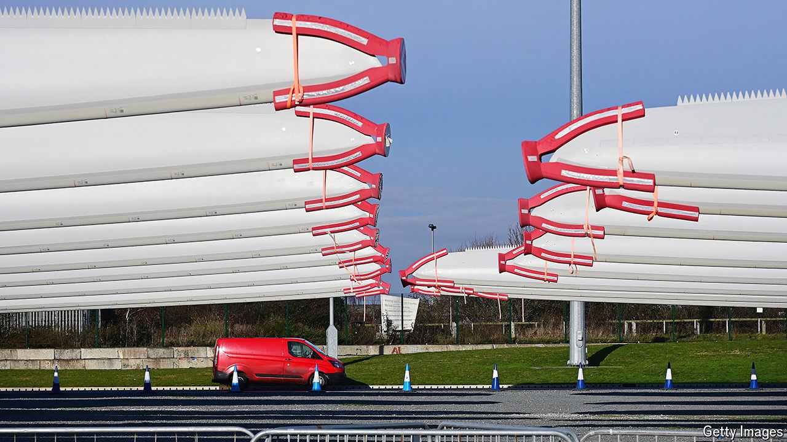
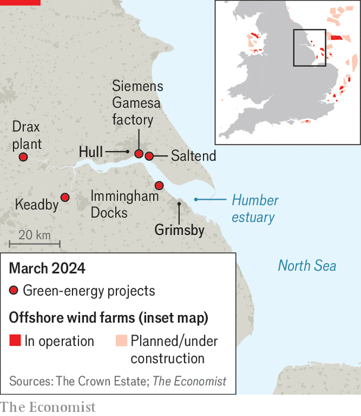

###### The energy estuary

# How Britain’s dirtiest region hopes to become a hub for clean energy 

##### What the Humber says about the country’s ambitions for green manufacturing 

 

> Mar 26th 2024 

At the Siemens Gamesa factory in Hull, workers are busy making 180 turbine blades  of Aberdeenshire in Scotland. Each is 108 metres long, a giant sabre-shaped tooth crafted to slice through the air. A core of fibreglass is layered with epoxy resin, balsa wood and plastic to produce “just the right combination of flexibility and stiffness”, says Andy Sykes, the project director. 

Once ready, the blades will be laid horizontally on boats in the Humber estuary to head north for installation. The waters off Britain’s east coast are dotted with windmills that supplied almost a sixth of the country’s electricity last year. Two-thirds of these turbines have blades made in Hull.

Politicians of all stripes point to the Siemens factory as a model. On a visit in 2021, Rishi Sunak, then chancellor, said it pointed to the critical role of domestic green industries. Sir Keir Starmer, the Labour Party’s leader, has bold ambitions of Britain becoming a “green-growth superpower”, spurred by a boom in manufacturing jobs. Ed Miliband, the shadow energy secretary, whose constituency is nearby, wants to “rebuild Britain’s industrial strength”. 

That is improbable. Britain is an open, services-based economy. Unlike Germany, South Korea or parts of America, it has little industrial heft. Only 7% of jobs are in manufacturing. “Politicians hate saying it but Britain is a services superpower…we’re not going to turn ourselves into Germany,” says Torsten Bell, head of the Resolution Foundation, a think-tank, and a former adviser to Mr Miliband. Boosting services in second-tier cities, Mr Bell argues, is a more plausible plan for economic revival.

But green industries could still play a big role in helping Britain lower its carbon emissions and in improving the prospects of its former industrial heartlands. Britain has some advantages in high-value manufacturing and clean-technology innovation, according to a study by Anna Valero of the London School of Economics. The country has excellent universities. It has ready access to the North Sea. It could expand in areas such as offshore wind and carbon capture and storage (CCS), where carbon produced in industrial processes is isolated and pumped underground. 

A tour of the Humber gives a sense of the possibilities and the hurdles. Its geography is unusual, combining a deep-water channel, some 14km wide near the mouth, with vast tracts of flat land perfect for factories. In the 18th century the estuary propelled the expansion of the Yorkshire coalfields by making water-borne freight easier. In the 20th century it expanded as a hub for North Sea oil and gas. Along with Teesside, the Humber’s banks became the most industrially intensive part of Britain. By the early 1980s there were 1,600 factories on Humberside, employing almost a third of the local workforce. 

 


The Humber now aspires to be the “green-energy estuary”. Beyond the blade factory, the region has attracted a bevy of green projects (see map). Grimsby is the busiest port for offshore wind servicing in Europe. Orsted, a Danish state-owned developer, is erecting the world’s biggest offshore wind farm, one of many off the coast. There are plans to produce hydrogen from natural gas at Saltend with CCS; the port of Immingham is being upgraded to allow for hydrogen to be exported. 

Head inland to Keadby and SSE, a British company, has won approval to build one of the world’s first gas-fired power stations with CCS. At Selby, Drax is trying to do the same with . In both cases the plan is for the captured carbon to be piped back under the North Sea.

It makes sense to develop CCS in Britain’s dirtiest region. Building the infrastructure required to store hydrogen or sequester carbon is expensive, but once done it should attract more investment. To make “green” hydrogen, which is produced from water using a renewables-powered electrolyser, it helps to be near sources of cheap renewable energy. 

A green-energy boom could bring more jobs to the region. The blade factory, which the government helped to lure in 2016 with tax incentives, employs around 1,500 people, many of whom have come through a nearby technical college. Making blades is essentially “craft-based work”, says Mr Sykes. One reason Siemens chose Hull is that it was already the British capital of caravan manufacturing—another “craft based around composites with lots of transferable skills”. 

But as much as the factory has been a boon for the city, it may not be a model for Britain. Only around a fifth of the value of manufacturing a turbine is in the blades. Twice as much is in the nacelle, the central hub which contains all the electronics, points out James Gilbert, professor of engineering at Hull University. Siemens does that in Cuxhaven in Germany. Britain ought to be aiming to attract investment in the higher-value end of the supply chain. 

Spend time on the Humber and you can see why that will be hard. Hull has a good university with strengths in robotics and manufacturing. But like many former industrial areas, it feels neglected and cut off. Over the past 40 years manufacturing’s share of jobs in the region has fallen by almost half. Philip Larkin said he liked living there because it was “so far from everywhere else”. What pleases misanthropic poets is less alluring to investors. Visiting executives are put on a minibus at Manchester airport because rail services across the Pennines are so unreliable, says Ian Kelly of Hull and Humber Chamber of Commerce. Isolation makes it hard to retain young graduates. 

Much depends on policies made in Westminster. The Humber must compete for green investments with the likes of Lower Saxony, in Germany, and Midtjylland, in Denmark. But according to Andrew Elmes of Siemens Energy, Britain has much less settled climate policies than Denmark, Germany or France. 

Mr Miliband remains keen for Britain to have its own national champion to rival the likes of Orsted. The Humber, he says, “can absolutely be at the vanguard of Britain winning the [global] race.” But there is a tension between attracting foreign investment and domesticating the supply chain. As with turbine blades, success will rest on having the right amount of flexibility. ■


