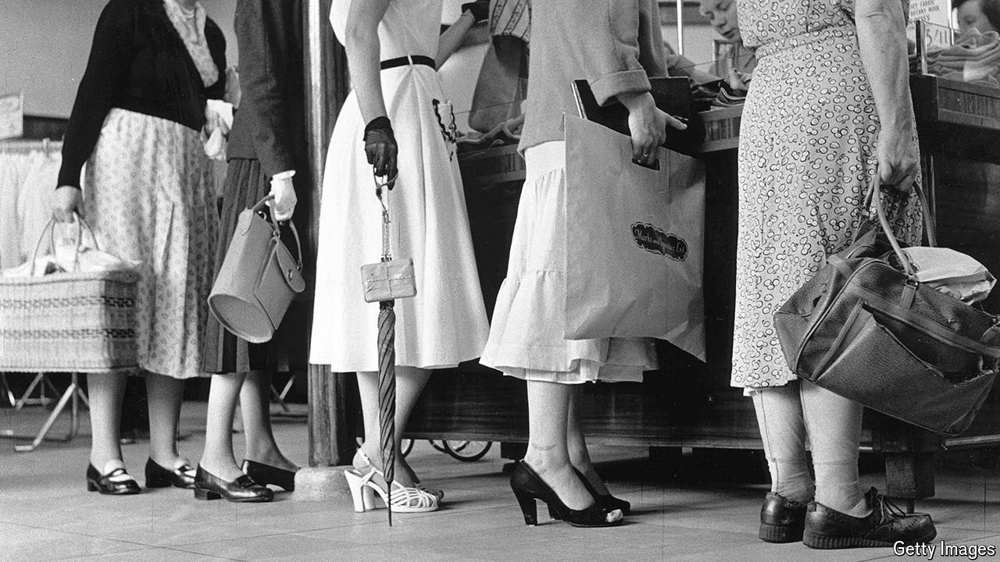
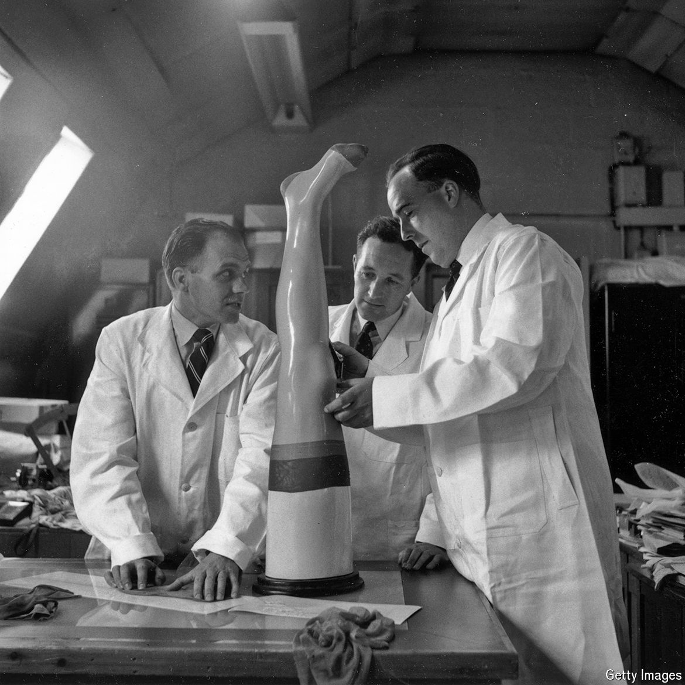

###### This is not just an archive

# Marks & Spencer’s archive is a window on 20th-century Britain 

##### Pants, socks and social history 

 

> Mar 22nd 2024 

Consider the corpse. Or to be more precise: consider its underpants. When the body was finally pulled from the  in 1994, most clues to its identity had gone. A few facts remained. It was clear that the man had been very tall (six feet five inches); that he was well-dressed (he had fancy loafers on his feet); and that whatever had led to him bobbing in the North Sea had not been nice (his head was injured). But knowing more—and dating his death—would be difficult. 

Except for one thing: his underwear. For in his pants was a small, white label. It stated that they were medium, that they were 100% cotton and, best of all, that they were made by “St Michael”. Suddenly there was hope. This was not just a corpse. This was an M&amp;S corpse.

That matters. Because Marks &amp; Spencer (whose brands include St Michael) is a British retailer with a rich history, and that history is contained in its own archive. Just outside the centre of Leeds, in a squat yellow building, sit 72,000 items, 3,300 of them clothes, from the firm’s past. On rails and on shelves, in suit covers and in boxes filled with tissue paper, lie the ghosts of bygone wardrobes: jumpers and cardigans, suits and romper suits, leggings and jeggings, bed-jackets and bras. 

Above all, there are pants—tiny pants and startlingly enormous pants; silky pants and bafflingly woolly pants; lacy pants, racy pants and supremely sensible pants—245 pairs in all, dating back to the 1940s. As Katie Cameron, an M&amp;S archivist, acknowledges: “We have a huge collection of knickers.” 

Pants might seem trivial. They are not. They are occasionally important to police looking to solve crimes: the archive’s detailed records, and M&amp;S’s date-stamped labels, can help to date corpses (top tip for murderers: cut the labels off your corpse). Knickers are also very important to M&amp;S itself (which sells food and home accessories as well as clothes). Around one in every four pairs of pants sold in Britain today is bought there. If you are reading this in Blighty, there is a good chance you are sitting on a bottom that has been wrapped in M&amp;S cotton. 

 


Pants are also—though this is rarely noticed, since historians tend to prefer grander topics than gussets—important to British history. For clothes, and how well they wear and how easily they wash, matter “fundamentally to women” says Rachel Worth, a professor of fashion history at the Arts University Bournemouth. M&amp;S helped to improve both.

And more besides. The chain, which began life in Leeds in 1884 peddling dry goods and started selling clothes in 1926, was by the 1990s Europe’s most profitable shop. It remains a staple of the British high street, with advocates among the young and old. It altered how the country ate and dressed and lived; it is a thread through 20th-century British history. 

M&amp;S was the first British shop to use sell-by dates; the first large retailer to sell fresh, not frozen chicken (other stores feared food poisoning); the first to sell machine-washable wool (which it helped to develop). It was a pioneer in measuring women’s bodies to ensure clothing sizes measured up (an earlier sizing method had rested on measurements taken from 1m conscripts in the American civil war which, though useful for men, was less helpful for a housewife in Hemel Hempstead). 

M&amp;S also specialised in selling synthetic fabrics: nylon and Terylene and Crimplene. Such fabrics sound comic to modern ears but they were of serious importance to “easing the housewife’s daily burden” as Simon Marks, a former head of the business, once put it. Much is written about labour-saving devices such as washing machines; what is often forgotten is that sturdy (often synthetic) materials were needed to go in them. Such fabrics “freed women up” says Professor Worth. Long before women were liberated by burning their bras, they were liberated by being able to pop them in the twin tub and let them drip dry.

To step into the archives at Leeds is an odd experience. At first sight, it feels much like any other archive. But open its boxes and another world appears. In one box is a beautiful 1940s pink silken bra, the cups puffed up with tissue paper as if by a ghostly bosom. On a nearby rail hang dressing gowns: one post-war and woolly, one diaphanous, one of a paisley-ish pattern a father from the 1950s might have worn. Each is almost unbearably evocative of its era. Proust had his madeleines. Britons have M&amp;S Crimplene cardigans. ■


