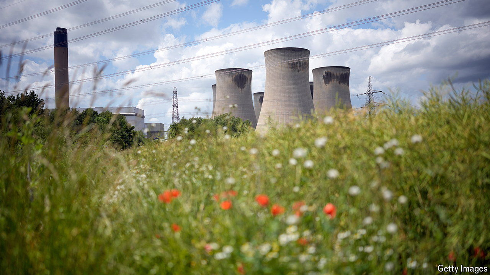

###### Smoke alarm

# The future of Drax, Britain’s largest power plant 

##### From coal to wood to carbon capture and storage? 

 

> Mar 27th 2024 

IF YOU want a monument to Britain’s energy transition, look no further than the 12 smoke-stained cooling towers of Drax power station, which loom over the north Yorkshire countryside. Built close to the now-dormant Selby coalfield, which once delivered the dirtiest fossil fuel to its furnaces, Drax is Britain’s largest power plant, generating around 4% of the country’s electricity supply. The final coal unit on the site closed in 2023; the vapour that now billows from the cooling towers is a byproduct of the process of burning wood pellets. 

Drax’s role in the next stage of the transition is uncertain, however. The government is mulling whether to extend subsidies for the plant. The current arrangement, which tops up lump-sum payments to Drax if the wholesale electricity price falls below a set level, is due to end in 2027. An extension would give its owners, Drax Group, which also owns biomass plants in North America and hydropower plants in Scotland, time to fit the plant with a carbon-capture-and-storage unit. 

In principle bioenergy with carbon capture and storage (BECCS) could be a carbon-negative form of electricity. As long as the trees turned into wood pellets are regrown, a plant like Drax has very low emissions (mostly from getting the wood to the burners). If the carbon released from burning the pellets is also captured and stored underground, it can have negative emissions. Drax has plans to pipe captured carbon out into exhausted gas reservoirs under the North Sea as part of the “East Coast Cluster”, a government-based programme to remove carbon dioxide produced in the industrial heartlands around the Humber estuary and on Teesside. 

In practice, whether BECCS is carbon-negative depends on how the original biomass is gathered. Drax imports its wood pellets from forested America rather than denuded Britain; green types fret that the trees being harvested across the Atlantic may not be being replanted sustainably. Any emissions from deforestation abroad are excluded from the British carbon footprint; a report by the National Audit Office, a spending watchdog, concluded that there was inadequate oversight of the supply chain. Even if all the wood is well-sourced, says Philip MacDonald of Ember, a non-profit, the timber could be used for other purposes than burning.

Wind and solar power have both become much cheaper since 2012, when Drax received its latest set of subsidies to refit its coal units to burn wood instead. There are fewer potential efficiency gains from biomass power than other technologies: trees are a mature technology and the land to grow them is finite. For the moment Drax has the advantage that it does not depend on the sun shining, nor the wind blowing. That may be enough to keep Drax’s furnaces fuelled until 2030 and perhaps beyond; the government has admitted more gas power plants will be needed as a backup to wind power. But if the electricity-storage problem can be solved, Drax’s cooling towers may become a monument of a different kind. ■


