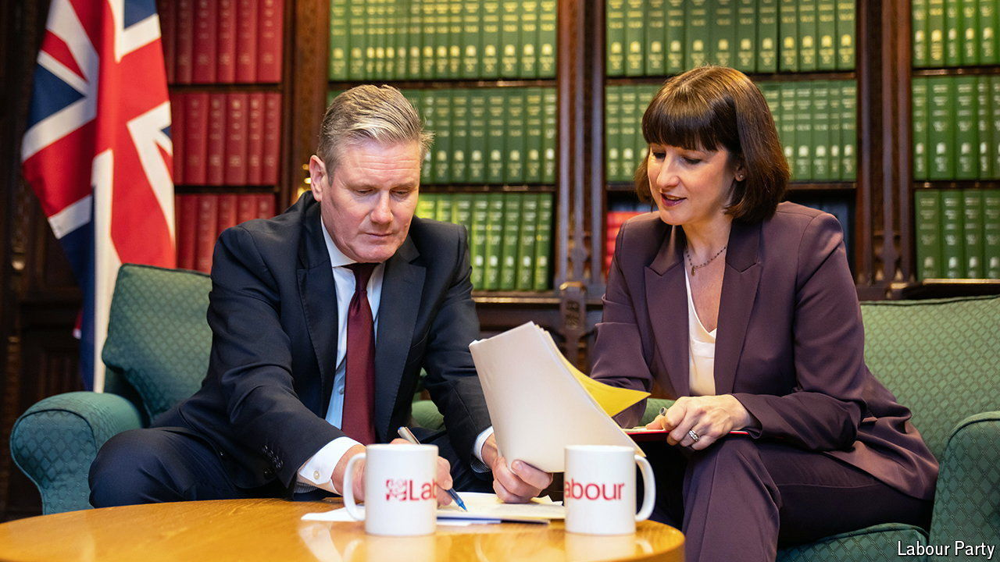
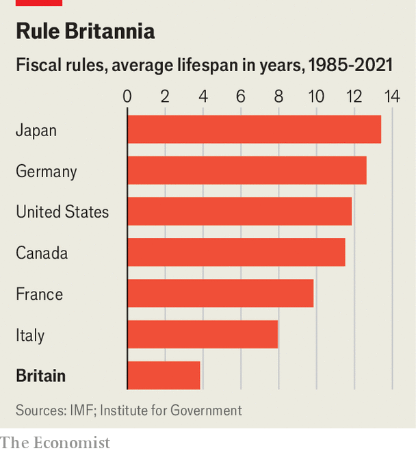

###### Rule intentions

# What fiscal rules should Britain have? 

##### Labour has chosen its framework. Could it be better? 

 

> Mar 25th 2024 

Not many politicians last more than a few years in charge. Short tenures give rise to temptation: to borrow money now and leave the next lot to foot the bill. Economists call this “deficit bias”, the fiscal equivalent of St Augustine’s prayer: “Lord, make me chaste. But not yet.”

To tackle this problem Britain has fiscal rules, self-imposed restrictions on government borrowing. The problem is that politicians keep changing them, or make them too easy to game. On March 19th , the shadow chancellor of the exchequer, announced plans for Labour’s fiscal rules if they win the next election. They would represent an improvement, not a fix. 


Start with stability, where Britain has a particular problem (see chart). Between 1992 and 2021 its fiscal rules have lasted, on average, for under four years, about the lifespan of a gerbil. Fiscal rules gain power with age: bond markets take ever-changing promises less seriously, which means higher borrowing costs. So it is somewhat welcome that Ms Reeves plans mostly to retain the existing rules. But only somewhat. 

 


She opted to preserve wholesale the main rule, which requires that the ratio of government debt to GDP falls in the fifth year of the five-year forecast from the Office for Budget Responsibility (OBR), a watchdog that marks the Treasury’s sums. This rule has several flaws. One is that five-year forecasts are imperfect. The OBR‘s past growth projections have missed the mark by 0.9 percentage points on average.

The rule ignores borrowing between the first and fourth years of the forecast period; governments can ratchet debt up freely before then. Once a year has passed, the clock resets and another five-year period begins; the government is said to be looking at fresh giveaways after a new fiscal year starts on April 6th. Long time-horizons mean that chancellors can comply with the rule by pencilling in future restraint that they have little intention of actually showing. Current spending plans imply implausibly sharp cuts to police, the courts and local government by 2028-29.

Making the debt rule bind over three years, not five, would help. OBR growth estimates have been a third more accurate over that shorter period. And it is harder for voters to ignore plans for spending cuts that are only a year or two away.

Ms Reeves does intend to tweak Britain’s second fiscal rule. She plans to move from capping yearly government borrowing at 3% of GDP five years out to a rule that ensures a balanced budget for day-to-day spending on things like welfare but excludes borrowing to invest on infrastructure and the like. That is sensible: separating them mutes incentives to raid capital budgets to plug gaps in current spending (even if the boundary between the two is not completely clear-cut).

The shadow chancellor also announced plans to put more emphasis on public sector net worth (PSNW), a measure of the government’s full balance-sheet. Debt-to-GDP measures focus on governments’ liabilities and ignore their assets. That lets chancellors flatter the public finances by flogging state-owned property. Ditching debt-to-GDP targets altogether in favour of PSNW would be a mistake, since the concept is tricky to measure, but one proposal worth exploring would be to make the impact of government policy on PSNW a yardstick. That would end up incorporating well-executed investments into calculations of fiscal sustainability while penalising money-wasting failures.

Ms Reeves has also promised to require the OBR to forecast all big tax-and-spend announcements, to prevent the watchdog from being sidelined as it was when  and Kwasi Kwarteng concocted their disastrous “mini-budget” in 2022. More significant would be to ensure those forecasts are realistic. The OBR’s forecast is bound to take the government’s stated intentions at face value. This protects the watchdog’s independence, by ensuring it is not seen to make political judgments, but strains its credibility. Since 2011 successive chancellors have pledged to raise fuel duty, for example; none has done so, yet the OBR must pretend they will. 

The watchdog does now estimate a more realistic secondary scenario in which fuel duty stays frozen (this reduces by half the current fiscal headroom the government has to cut taxes or increase spending). It could extend this approach—for instance, by constructing scenarios that explicitly embed governments’ past tendency to underestimate its future borrowing, or that show how longer-term spending cuts might actually be parcelled out among specific departments.

There is no perfect set of fiscal rules. Elected governments need leeway to borrow. Over-rigid limits cause problems: Germany faced a  last year, after a ruling by the country’s constitutional court limited the government’s room for borrowing. Just resisting the urge to fiddle with them would be a step forward. ■


