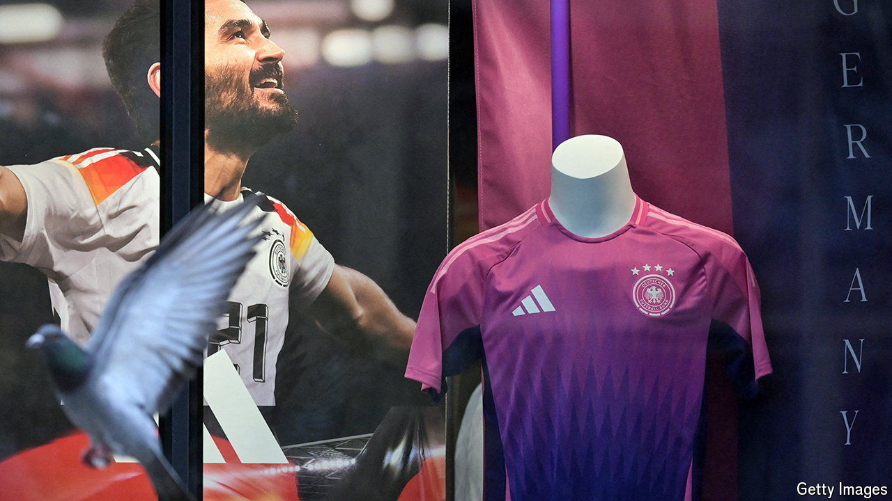
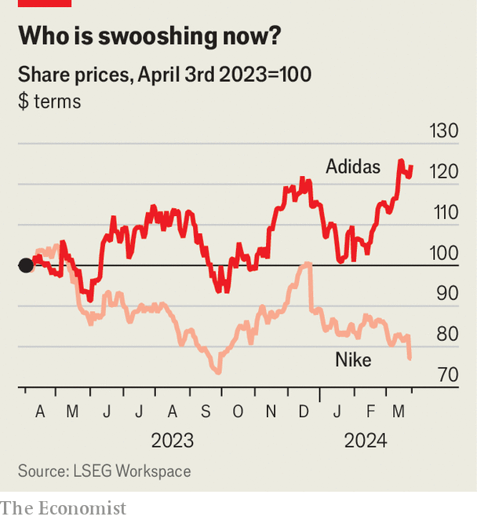

###### Three stripes and you are out

# A marketing victory for Nike is a business win for Adidas 

##### The contest of the sportswear giants heats up 

 

> Mar 27th 2024 

The choice to replace Adidas with Nike as the supplier of kit for the German football team from 2027 to 2034 was a purely commercial decision by the German Football Federation (DFB). Germans’ reaction to the ending of a 77-year-old all-German partnership was, by contrast, highly emotional. Commerce is destroying a piece of , lamented Karl Lauterbach, the health minister, using the German word that evokes the idea of home, belonging and place. Robert Habeck, the economy minister, said that he would have hoped for a bit more “local patriotism”. Markus Söder, Bavaria’s straight-shooting premier, declared it simply “wrong, a pity and incomprehensible”.

Bernd Neuendorfer, head of the dFB, was “aghast” at the outcry. In his view, the decision was a no-brainer. The DFB is in financial dire straits and he received an offer from the American company that was far higher than the one from Adidas, so he accepted it. According to reports in the German press, Nike offered €100m ($108m) to kit out the , twice as much as its German rival. For the world’s biggest maker of sportswear, with an annual operating profit of $6bn, it is pocket change. For Adidas, the distant number two, which eked out just €268m from operations in 2023, matching Nike would have burnt a hole in its pocket.

 


Bjorn Gulden, who took over as chief executive of Adidas at the start of 2023, chose finance over football—his earlier career as a professional player notwithstanding. Under the no-nonsense Norwegian’s leadership, Adidas seems to be at last on the path to recovery. Its share price has risen by around 40% over the past 12 months. Its operating profit may pale in comparison with Nike’s, but it came as a pleasant surprise to analysts, who had forecast a loss. Mr Gulden expects an operating profit of €500m this year. 

Adidas’s chief “runs the business well”, sums up Aneesha Sherman of Bernstein, a broker. He has mended Adidas’s dysfunctional relationship with retailers. He has increased the production of Gazelle and Samba, two classic Adidas trainers popular with European and American fashionistas, ten-fold. And he has found an elegant solution to €1.2bn in unsold stock of Yeezy shoes designed by Ye, an American rapper (formerly known as Kanye West) with whom Adidas has severed ties after his offensive outbursts. The Yeezies are being sold in tranches with parts of the profit going to charities.

Nike, for its part, needed a win. It recently warned that its sales will be clobbered this year by On and Hoka, two trendy running-shoe brands. In China, a huge market, it faces competition from homespun rivals such as Anta. Cristina Fernández of Telsey Advisory, another broker, notes that a renewed focus on sport is one way that Nike’s boss, John Donahoe, is trying to revive the swoosh, along with reducing inventory and improving relations with wholesalers. In December he also announced $2bn in cost cuts over the next three years. And in February he said he would eliminate around 1,600 jobs, or 2% of Nike’s worldwide workforce.

One area where Mr Donahoe’s axe will not fall is marketing. He pumped a cool $1bn into promoting Nike’s brand in the last quarter, 10% more than in the previous three months. As part of this campaign he is reportedly willing to pay much more for kitting out the German squad, which is ranked a middling 16th in the world, than for the French team, which is second. Instead of bashing Mr Gulden and Adidas, Germans should be praising the firm’s pfennig-pinching. After all, what is more  than thriftiness? ■


