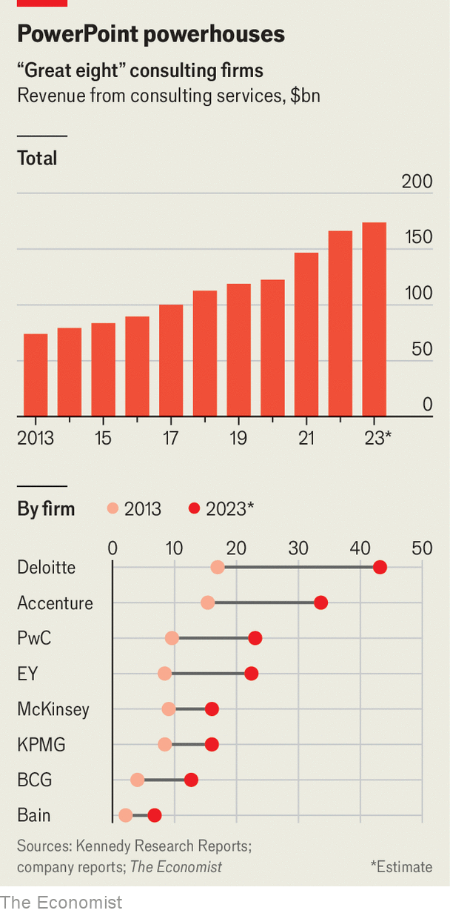

###### The lost art of self-management

# Have McKinsey and its consulting rivals got too big? 

##### The golden age for CEO whisperers may be coming to an end 

 

> Mar 25th 2024 

AN ANONYMOUS MEMO briefly circled the web in March. The authors, who claimed to be former partners at McKinsey, rebuked the illustrious strategy consultancy for its pursuit in recent years of “unchecked and unmanaged growth”, and chastised its leadership for, of all things, a “lack of strategic focus”. With humility typical of McKinseyites, they warned that “an organisation of genuine greatness” was at risk of being lost.

 


The memo, which was swiftly taken down, is but the latest murmur of discontent at McKinsey. In January Bob Sternfels, its managing partner, was forced into an internal contest for the top job after he failed to clinch support for re-election from a majority of senior partners in an initial round of voting. Although he ultimately prevailed, the saga hinted at the trouble brewing within the firm.

Not long ago the consulting industry looked indestructible. Fees rocketed during the covid-19 pandemic as clients sped up efforts to digitise their businesses, diversify their supply chains and respond to growing calls to bolster their environmental, social and governance (ESG) credentials. The consulting revenues of the industry’s most important firms—including the triumvirate of strategy advisers (Bain, BCG and McKinsey), the “big four” accounting giants (Deloitte, EY, KPMG and PwC) and Accenture (also the world’s largest outsourcer)—grew by 20% in 2021 and then 13% in 2022 (see chart).

Since then, however, growth has been soggy for the industry’s “great eight”, slowing to around 5% in 2023, according to estimates by Kennedy Research Reports, an industry-watcher, and calculations by , based on company filings. Clients grappling with inflation and economic uncertainty have cut back on splashy consulting projects. A dearth of mergers and acquisitions has led to a slump in demand for support with due diligence and company integrations.

That has caused a headache for the consultancies. When demand from clients looked limitless, they recruited staff as if there were no tomorrow. Revenues at McKinsey are up by a third since 2019—but headcount is up by half, to 45,000. As job opportunities at startups and private-equity firms have withered, fewer consultants have left the firms of their own accord, reversing the spike in attrition rates during the pandemic.

Now tomorrow is here, with a vengeance. Bain and Deloitte have paid some graduates to delay their start dates. Newbie consultants at a number of firms complain that there is too little work to go around, stunting their career prospects. Lay-offs, typically rare in consulting, have become widespread. All of the big four have made cuts to their advisory teams. Last year Accenture, the only one of the eight that is publicly listed, said it would fire 19,000 staff. On March 21st the company reported that its consulting revenues for the quarter to February shrank by 3%, year on year, after flattening in the previous quarter. It also lowered its growth forecast for the year ahead, sending its share price down by 9%.

The consulting industry has made it through choppy waters before, including the dotcom crash and the global financial crisis. Yet its recovery this time will be complicated by three things. The first is geopolitics. The consulting giants, all of which are based in America or Europe, have benefited from decades of globalisation during which they spread their tendrils into every part of the globe. Deloitte, the biggest of the bunch by consulting revenues, has offices in more than 150 countries and territories.

That is now placing the firms in awkward spots. Last month it emerged that the Urban China Initiative, a think-tank co-founded by McKinsey, provided advice to the Chinese government in 2015 that helped shape its “Made in China 2025” plan, which has sought to reduce the economy’s reliance on foreign know-how and place China at the forefront of sectors from electric vehicles to artificial intelligence (AI). Although McKinsey denied that it wrote the report, some American lawmakers have called for the firm to be barred from American government contracts. In the 12 months to September 2023 the federal government paid McKinsey more than $100m in fees.

Now China is also starting to squeeze foreign advisers of various stripes out of its market. Last year Dentons, a global law firm, unwound its tie-up with Dacheng, a Chinese one, in response to new cyber-security and data-protection rules that made the combination unworkable. Although China is yet to produce a home-grown consulting powerhouse, it has already begun to make life difficult for foreign ones. Staff in Bain’s Shanghai office were questioned by Chinese authorities last year, for reasons unknown. On March 22nd it was reported that the Chinese government was scrutinising PwC’s auditing work at Evergrande, a bankrupt Chinese property developer that has been accused by China’s government of fraudulently inflating its revenues. That could weigh on PwC’s consulting business in the country.

It is not only the West’s relationship with China that is causing problems. In February the bosses of BCG, McKinsey and Teneo, a smaller consultancy, along with Michael Klein, a dealmaker, were hauled before a congressional committee in Washington after failing to hand over details of their work for Saudi Arabia’s Public Investment Fund. The committee is investigating Saudi Arabia’s efforts to build “soft power” in America through, for example, its investments in sports such as golf. McKinsey and BCG said that their staff in Saudi Arabia could be imprisoned if the firms divulged what they had done for their client. The Gulf has been a rare bright spot for the consultants of late, with the oil-rich states splashing out on advice as they seek to diversify their economies.

Waning enthusiasm for ESG, denounced by critics as “woke capitalism”, presents a second threat to the industry’s recovery. In recent years the consulting giants have spent big on building out their ESG offerings, especially around decarbonisation. In 2021 McKinsey acquired three sustainability consultancies. In 2022 Accenture gobbled up five. So far these investments seem to be paying off. Christoph Schweizer, the boss of BCG, which acquired Quantis, an environmental consultancy, in 2022, says that sustainability was one of his firm’s fastest-growing areas of work last year.

Whether that growth will continue at the same pace is less clear. In America Republican-run states including Florida, Missouri and Texas have withdrawn funds parked with BlackRock, the world’s largest asset manager, in protest over its use of ESG considerations when making investments. Consulting clients surveyed in January by Source Global Research, another industry analyst, ranked sustainability projects tenth in their list of priorities for the year, down from fourth in 2023. Some consulting grandees admit that certain clients are reining in their climate ambitions. Stretched consumers are now less able to pay a green premium, suggests one bigwig.

The third and thorniest challenge for the great eight is technological change. For many years clients sought their help to modernise creaky old systems. Increasingly, the consultants themselves are grappling with digital disruption. The boss of a big buy-out firm says that his dealmakers are turning to software tools and data providers rather than pricey consultants for some of the analysis needed to evaluate a target company. Other tasks that legions of consultants once spent hours on, such as compiling and categorising data on a company’s spending habits, can now be done at the push of a button.

The consultants are not standing idle. Bain, for example, has redesigned the way it does due diligence on companies, incorporating nifty tools such as web-scraping programs. The firms are also racing to stay one step ahead of AI. Last August McKinsey launched Lilli, a ChatGPT-like bot trained on its corpus of frameworks and other intellectual property, which consultants can use to speed up their work. Others have followed suit. Manny Maceda, the managing partner of Bain, reckons these bots will free up time for consultants to better understand the “organisational realities” of their clients.

Excitement among clients over this type of “generative” AI is also creating opportunities for new work. Mr Schweizer says that BCG has already completed hundreds of projects with clients around the technology. Accenture has booked $1.1bn-worth of generative-AI work in the past six months. Much of this is happening in collaboration with the tech companies developing the AIs. Accenture has been working with Microsoft. In March the consulting firm also announced a partnership with Cohere, an AI-model builder with which McKinsey has buddied up, too. Bain has an alliance with OpenAI, the maker of ChatGPT. BCG is collaborating with Anthropic, one more AI firm.

Such partnerships look like a welcome source of growth for the consultants. In time, though, they could become a drag—especially if they are successful. The quicker corporate clients become comfortable with chatbots, the faster they may simply go directly to their makers in Silicon Valley. If that happens, the great eight’s short-term gains from AI could lead them towards irrelevance. That is something for all the strategy brains to stew on. ■


