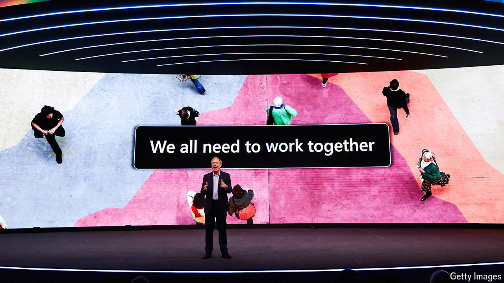

###### Trustbusters v the machine

# Regulators are forcing big tech to rethink its AI strategy 

##### Startup acquisitions have been replaced by hiring sprees and tight partnerships 

 

> Mar 27th 2024 

Trustbusters have big tech in their sights. On March 25th the European Commission opened a probe into Apple, Alphabet (Google’s parent company) and Meta (which is Facebook’s). Regulators in Brussels think the measures which the American technology behemoths have put in place to comply with the Digital Markets Act, a sweeping new law meant to ensure fair competition in the EU’s tech industry, are not up to scratch. 

Days earlier America’s Department of Justice, along with attorneys-general from 16 states, sued Apple in what could be the most ambitious case brought against American tech since the DoJ battled Microsoft a quarter-century ago. It alleges that the iPhone-maker uses a monopoly position in smartphones to “thwart” innovation, “throttle” competitors and discourage users from buying rival devices. Apple denies wrongdoing. 

All this scrutiny is, on its face, backward-looking; the cases concern the tech giants’ existing products and business models. But it is intensifying just as they try to position themselves to profit from the next wave of technological disruption—ChatGPT-like “generative” artificial intelligence (AI). And it is changing how the titans of tech approach the challenge.

During previous waves of technological change large companies often bought upstart innovators to stay ahead. In another lawsuit the Federal Trade Commission (FTC), America’s main trustbusting agency, alleges that Meta stifled competition in social media by, among other things, buying Instagram and WhatsApp, two budding rivals. Whether or not the FTC has its way in court and forces Meta to divest one or both of the apps, any similar deal today would be a non-starter with regulators in America and Europe. 

With takeovers getting thornier, the tech giants have instead taken to investing piecemeal in promising startups. In 2023 about two-thirds of the $27bn raised by smaller AI companies came from Alphabet, Amazon and Microsoft, according to data from PitchBook, a research firm. That includes Microsoft’s $10bn investment in OpenAI, maker of ChatGPT and the world’s hottest AI startup, and Google’s $2bn stake in Anthropic, another creator of clever “large language models”. The giants are spreading these smaller bets: Microsoft has backed other model-makers, such as Mistral, a year-old French firm trying to give OpenAI an run for its money. (The startups are diversifying their financing, too: besides Google’s investment, Anthropic may get up to $4bn from Amazon.)

Such deals often involve terms other than getting onto a startup’s shareholder list. They often give the investor access to the smaller company’s technology, sometimes exclusively. Microsoft is at pains to point out that its investments in OpenAI and Mistral do not involve taking equity stakes (though it declines to divulge what they do involve, exactly). 

Some AI deals may involve arrangements between the behemoths themselves. Apple and Alphabet are reportedly discussing one that could result in some iPhone features being powered by Gemini, the search giant’s generative AI. 

Another approach is to poach star AI entrepreneurs and technologists. Since the start of 2022 Alphabet, Amazon, Apple, Meta and Microsoft have collectively hired some 30 AI experts from OpenAI, Anthropic and Cohere, a Canadian model-maker, according to Live Data Technologies, a research firm. On March 19th Microsoft announced that it would recruit almost the entire workforce of Inflection AI, another builder of cutting-edge models, including its co-founder, Mustafa Suleyman. (Mr Suleyman sits on the board of ’s parent company.)

Trustbusters are not blind to these developments. Regulators on both sides of the Atlantic are already probing some of the recent tie-ups that fall short of full acquisitions. Apple’s rumoured Gemini deal with Google is modelled on a similar agreement that makes Google the default search engine on Apple’s devices—and that is already at the centre of another antitrust case that the DoJ has brought against Google. It is probably only a matter of time before they start looking into big tech’s AI-hiring practices. 

The giants may be hoping that by the time these antitrust actions are pursued, let alone resolved, they will have cornered the AI market—as they have done with today’s digital businesses. Forgiveness can be sought later, even if that means repeated trips to the courtroom. ■


