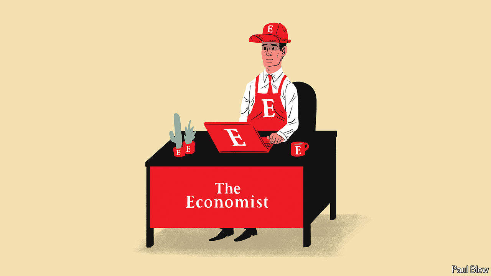

###### Bartleby

# The pros and cons of corporate uniforms 

##### A quarter of the American workforce wears one. Why? 

 

> Mar 27th 2024 

If you work in a white-collar job in an office and make your way there this week, it is unlikely that anyone will be able to guess exactly what you do from your clothes. That is not true for lots of the people you will interact with. The bus driver who gets you to your destination, the barista who makes your coffee and the people on reception who wish you “good morning” as you enter the building—they, and many others, are likely to be wearing some kind of corporate uniform. A poll of American workers conducted last summer by Gallup found that although most employees wear casual clothes—some smart, some really not—almost a quarter donned a uniform. 

For employers who require them, there are several arguments in favour of uniforms. They help ensure a level of professionalism in appearance. They project a brand identity, from the red coats of Virgin Atlantic crew to the “Browns” uniform of UPS delivery drivers. They may have useful job-specific features: chefs’ jackets are double-breasted to protect against burns and can be reversed to hide stains. They send a clear signal to customers about whom they should approach with questions, avoiding those awkward “do you work here?” moments. 

Those customers draw different conclusions if staff are in uniform, for good and bad. A study by Robert Smith of Tilburg University and his colleagues asked people to imagine being on the receiving end of poor service when picking up a pizza. They were then shown pictures of uniformed or non-uniformed employees; the person who had notionally treated them badly was circled. Participants were more likely to blame the company than the individual or the circumstances for a bad experience when a uniform was involved. If corporate clothing makes each worker seem more representative of their employers, the authors suggest that it may be a good idea not to give it to inexperienced workers.

Uniforms can also affect the psychology of employees. In 2012 Hajo Adam, now of the University of Bath, and Adam Galinsky, now of Columbia Business School, coined the term “enclothed cognition” to describe the effect that specific clothes have on the way that people think and feel. Questions have been raised over the validity of enclothed cognition, but a new meta-analysis by Messrs Adam and Galinsky, along with Carl Blaine Horton of Columbia Business School, concludes that the phenomenon is real.

In one study Guillaume Pech of Université Libre de Bruxelles and Emilie Caspar of Ghent University gave participants the option to administer electric shocks to other people in return for money; those dressed up in Red Cross uniforms showed more empathy than those in normal outfits. Xuehua Wang of Asia Europe Business School and her co-authors found that formal clothes made people more likely to make healthy eating choices. According to a paper by Saaid Mendoza of Providence College and Elizabeth Parks-Stamm of University of Southern Maine, people who wore a police uniform during a video-game simulation designed to test reaction times were more likely than those in their own clothes to shoot unarmed targets. Clothes maketh the bang.

The effects that uniforms have on workers will obviously vary. A uniform that confers a sense of professional identity—a doctor’s white coat, say—is likely to be more motivating than one that does not. People will be happier to be a corporate billboard if they feel pride in their employer. Some work clothing looks good and some of it is a paean to polyester: you do not so much represent a brand as a fire hazard. Some uniforms are comfortable and some are not, with women usually getting the worst of it. Only in 2023 were female police officers in Britain issued with body armour made to suit their anatomy.

The obvious objection to uniforms, at least from people who do not wear them, is that they suppress individuality and autonomy. But employees who do not have to wear a formal uniform often gravitate towards a costume anyway. Some coders seem to be under an unspoken obligation to wear T-shirts. The combination of shirt, trousers and Patagonia gilet is known as the “midtown uniform” for finance types in New York. Executives wear cultlike corporate lapel pins. Celebrity bosses build brands by wearing the same outfit day after day. You may not be required to don a uniform when you head off to work. You may nonetheless be wearing one. ■


