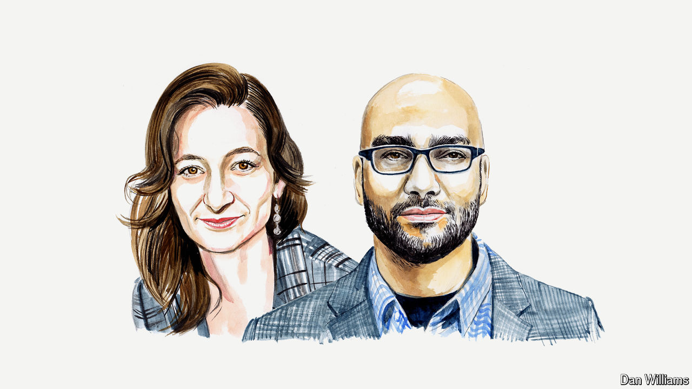

###### False narratives

# Video will kill the truth if monitoring doesn’t improve, argue two researchers 

##### Madeleine Daepp and Robert Osazuwa Ness share lessons from Taiwan for fighting disinformation 

 

> Mar 26th 2024 

GENERATIVE ARTIFICIAL intelligence (AI) is rewriting the disinformation playbook. There is no better place to study this than Taiwan, which, the Swedish Varieties of Democracy Project finds, is subject to more disinformation from abroad than any other democracy. China has greatly increased the scope and sophistication of its influence operations on the island using cutting-edge AI. We conducted fieldwork during the elections in Taiwan in January, meeting organisations on disinformation’s front lines. We saw in their experience the signs of how AI could disrupt this global year of elections.

One such sign is the rise of AI-powered video, in particular deepfakes—content created to convince people of events that did not occur. One video aired on TikTok, a Chinese-owned platform, showed Taiwanese presidential candidate William Lai endorsing his rivals’ joint opposition ticket.

Deepfakes are just one of several tactics being developed for video-based propaganda. CapCut, an app produced by Bytedance, TikTok’s parent company, uses AI to generate videos from text descriptions. CapCut was reportedly used by Spamouflage, a China-linked foreign-influence campaign, to turn written propaganda into AI-generated newscasts. These videos are not quite deepfakes: few viewers would think such broadcasts were real. But they mark disinformation’s expansion to video-based platforms. As online attention shifts from tweets to TikTok, disinformation is following.

AI also makes it easier to pump out media about events as soon as they occur. A few days before the election every Taiwan-registered phone buzzed simultaneously with an air-raid alert triggered by a Chinese satellite crossing Taiwanese airspace. Within 24 hours Taiwan AI Labs, a research outfit, observed over 1,500 co-ordinated social-media posts promoting conspiracy theories about the alert and sowing distrust. At one point as many as five a minute were appearing. Many were far more readable than the stuff produced by a typical content mill. 

In the three months leading up to the elections, Cloudflare, an internet-services provider, found that efforts to crash Taiwanese websites jumped by 3,370% compared to the same period the year before. Had these sites been taken down in large numbers, Taiwanese residents seeking information online would instead have seen a deluge of disinformation on social media. This is what happened after Hawaii’s wildfires in 2023, when Spamouflage spread AI-generated conspiracy theories.

Many Taiwanese feel as if their country is desperately adding sandbags to its levees the night before a typhoon. Government agencies and research organisations lack the tools for timely tracking of video content. Fact-checkers struggle to keep pace: during Taiwan’s 2020 presidential election Cofacts, a fact-checking platform, was able to respond to around 80% of incoming requests within 24 hours. This year, on election day, it managed to respond to just 15% of requests.

Worse, technology companies lack effective technical countermeasures against disinformation distributed by states. They are increasingly using “watermarks”, digital branding of content as AI-generated, and content policies to prevent their proprietary AI from being abused by others. But well-resourced states can build their own AI that is unimpeded by watermarking and content-policy constraints. Tech firms are also focused on building tools for detecting AI-generated content, but Taiwanese disinformation-fighters say these provide conflicting and inaccurate results. 

AI-generated disinformation requires a broad response that involves governments, technology companies, fact-checking outfits and think-tanks. Big tech companies should help fund fact-checkers and other private-sector organisations that provide front-line intelligence. They should also share more of their data with civil-society groups, whose local knowledge and legitimacy mean they are well placed to track accounts and counter false narratives in their countries of operation.

Front-line organisations need to be on the video-sharing platforms, of course, both to monitor them and to create and share content. Some, though, have reasons to be wary of TikTok. In Taiwan, just one of the major fact-checking and disinformation-research organisations has a TikTok account, owing to concerns about the app’s Chinese ownership. 

This means ceding a front—and a potentially powerful tool. A study by USC Annenberg, a journalism school, in 2017 showed that video-based fact-checking is more effective than text-checking at correcting the beliefs of users exposed to disinformation. In 2022 a study in , a journal, found that “prebunking” videos, which are designed to pre-empt disinformation—before an election, say, or after a natural disaster—worked even across political divides, offering viewers on both left and right a certain level of inoculation.

Taiwanese civil-society organisations avoid TikTok because they doubt they would be treated fairly on a Chinese-owned platform. Taiwan’s government has concluded that there is no legal basis for a blanket ban on TikTok and that it lacks the power to require Chinese disinvestment from the platform—a move being considered by lawmakers in America, where, unlike in Taiwan, TikTok has a subsidiary. That means Taiwan, and others in a similar situation, will have to find ways to better monitor TikTok.

That will require sharper tools. The best available open-source tools for monitoring video content, such as the EU-funded InVid, focus on verification (enabling reverse image searches, magnifying details and so on). This painstaking approach made sense before generative AI, when the question was about whether the claims or images in a particular video could be trusted. But the scale of the problem and pace of change have grown to the point where this approach no longer works. Instead the challenge is in figuring out when new narratives are being spread (and to whom) and countering them quickly. Disinformation-fighters don’t yet have the tools for video-monitoring at scale or the methods to track what content algorithms are suppressing or amplifying. 

Disinformation has reached an inflection point in a year when more than half the world’s population lives in countries that will hold nationwide elections. Malicious actors will be using AI to make falsehoods more engaging and believable and to distort narratives in moments of crisis. Those who wish to safeguard 2024’s elections must be ready to tell their story before others tell it for them.■


