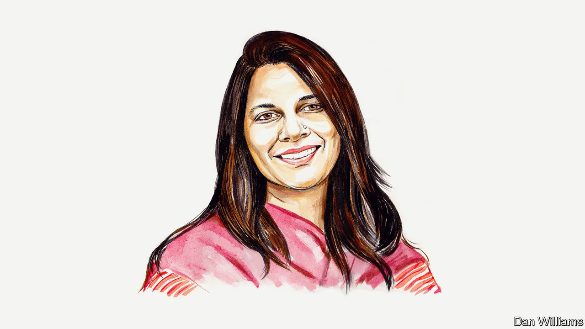

###### India’s election

# Yamini Aiyar laments the damage done to Indian democracy under Narendra Modi 

##### Toxic majoritarianism is just part of the story, says the policy scholar 

 

> Mar 23rd 2024 

A DARK SHADOW of creeping authoritarianism looms over India as it prepares for its 18th general election. The incumbent Bharatiya Janata Party (BJP) government of Narendra Modi is set to win a third term and surveys show that the prime minister’s personal popularity is at an all-time high. But his governance, built on aggressive centralisation, legitimised by a cult of personality and undergirded by an exclusionary Hindu-nationalist ideology, is eroding India’s democracy. If unchecked, the consequences for the country’s political, economic and social fabric will be grim.

The most striking evidence of this is the fact that the space for the political opposition, media, academia and civil society to freely express their views is fast shrinking. Genuine democracy requires the active, public contesting of ideas and policy. In its place, the government is systematically weaponising investigative agencies, tax laws, sedition laws, anti-terror laws and laws regulating foreign funding of NGOs to disproportionately target opposition politicians and criminalise dissent. The most brazen illustration of this is , Delhi’s chief minister and a popular opposition figure, on March 21st, just as the election campaign was hotting up.


New, insidious forms of political centralisation are being legitimised. Two state governments have been stripped of their powers to function as autonomous elected governments and brought under central control—first in Jammu &amp; Kashmir, which was converted to a Union Territory when its special status was revoked, and later in Delhi. This, coupled with an administrative culture that increasingly supports the personality cult of Mr Modi, jeopardises a long-established principle of federal co-operation and dual accountability for the centre and states. Parliament, meanwhile, barely performs its deliberative function, and the judiciary is increasingly reticent about protecting civil liberties. 

That power in India’s democracy is increasingly centralised and autocratic is now well documented. But its implications demand greater reflection.

In the political realm, new federal fault lines are emerging. India simply cannot be governed with stability and coherence by a narrow, powerful centre that eschews federal consensus. Given India’s diversity of language, region and religion, specific language- or ethnicity-based assertions of statehood require accommodation. India’s federal system has provided this, allowing for the expression of multiple identities within a nation-state framework.

Hindu nationalism is impatient with the principle of accommodation, seeking instead a singular national identity within “One Nation” governed by “double engine” efficiency (to borrow the BJP’s slogans), driven by BJP governments at the central and state levels. This ideological framework erodes the political credibility needed to mediate assertions of ethnic and regional identity. Its limits are already evident in the north-eastern state of Manipur, for example, which has been gripped by ethnic violence for almost a year. 

In the economic realm, growing disparity in development between the relatively more prosperous southern and western parts of India and poorer but more populous northern states is placing strains on long-accepted principles of tax-sharing and representation. Moreover, economic growth and the emergence of a national market is placing new pressures on inter-state co-ordination. India needs a new federal compact and stronger federal institutions. Instead, the BJP’s proclivity for centralisation is creating a more polarised federal politics that makes consensus and co-operation difficult.

At the same time, technology has legitimised a new kind of welfare politics: one that removes traditional intermediation by local leaders and state governments, enabling in its place a direct, emotive connection with recipients built around the cult of Mr Modi as sole benefactor. Welfare schemes are branded as personal “guarantees”, replete with photographs of the prime minister. Neelanjan Sircar, a political scientist, characterises this as  (trust) politics—a politics premised on the deification of the leader in return for voter trust.  politics encourages a preference for welfare as direct benefits for which the leader can claim direct credit in areas ranging from cooking gas to toilets. 

Embedded in this is a subtle social contract that positions welfare as largesse of the leader rather than a moral obligation of the state to rights-bearing citizens. Citizens seek accountability and demand welfare services through local state actors, whether politicians or bureaucrats. Today this is being sacrificed at the altar of a centralised  politics.

In the social realm, hate and bigotry targeted against India’s 200m Muslims are being fuelled by aggressive and often violent . Public discourse has coarsened to the point that if you criticise the government or its policies you are “anti-national”. If you speak for secularism, you are “anti-Hindu”, a “Sickular Libtard”. Rather than upholding the constitutional ideal of secularism and equal citizenship, the state is complicit in demonising Muslims, bulldozing their homes and promoting anti-Muslim laws while consciously infusing statecraft with a Hindu character. 

Indian secularism is about principled distance between state and religion. It found expression in the anti-colonial freedom movement as an antidote to the politicisation of religion that had fuelled a competitive nation-building culminating in partition and violence. Secularism was a path to peace and toleration in a multi-religious society. In independent India, the constitutional commitment to secularism, liberty and equality was the foundational source of India’s global influence. This is now at risk. India’s elites and even opposition parties are increasingly reticent in their defence of secularism.

In debates in India, the authoritarian proclivities of past leaders—including the period of dictatorship in the 1970s after Indira Gandhi declared a state of emergency—are used to play down fears of democratic erosion today. They were spasms rather than the first signs of permanent change in the body politic, goes the argument. The truth is, in the 1970s India fought the emergency to preserve and deepen democracy. Today’s methods of centralisation and repression are not only more sophisticated and systematic but have broader political and institutional approval. 

Add in toxic majoritarianism, and India’s democracy is now a long way from its constitutional ideal. Consequently, fault lines in India’s political, economic and social life are widening. Preserving democracy is a struggle all Indians must undertake. Their future prosperity depends on it.■


