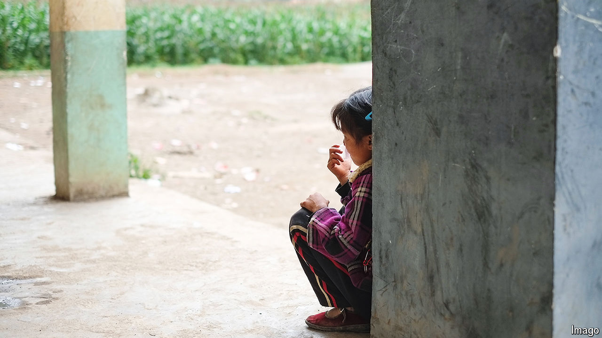

###### Spare the rod?

# A gruesome murder sparks a debate about juvenile justice in China 

##### A system that had become more merciful is being tested 

 

> Mar 27th 2024 

IN ONE OF the best-known commentaries attributed to him, Confucius said that at the age of 15 he set his mind on studying. At the ages of 30, 40, 50 and 60 he reached successive new levels of maturity and understanding. But it was only at the age of 70 that he had learnt how to follow his heart’s desires without overstepping boundaries. Today, 2,500 years since the great sage held forth, Chinese society continues to grapple with ethical questions about the appropriate balance between leniency and accountability for juvenile transgressors of the law.

A horrific murder has spurred a new round of debate about how to treat young criminals. The case involves three middle-school students in the rural outskirts of Handan, a city in northern China. They are alleged to have bullied a classmate over a long period of time. Then, on March 10th, they killed him. His body was buried in an abandoned greenhouse. Some Chinese media outlets are reporting that the suspects began digging the grave a day before the murder, indicating that the crime was premeditated. The alleged killers are all said to be in custody. Like the victim, they are all under the age of 14.

That is significant because China amended its criminal code in 2021, lowering the age at which murder suspects can be prosecuted from 14 to 12. The Handan case appears to be the first in which the new age standards will apply.

The Chinese justice system does not, in general, have a reputation for leniency—or fairness and independence, for that matter. Police, prosecutors and judges are all controlled by the Communist Party. Acquittals in criminal cases are exceedingly rare. But in the field of juvenile justice, China has been moving in a more merciful direction, say observers. The number of convictions of those aged 14 to 18 fell from 55,817 in 2013 to 27,757 in 2022. Officials are also increasingly open to the idea of sealing the criminal records of juveniles so that they don’t haunt them in adulthood, says John Kamm, an American rights activist. His Dui Hua Foundation, based in San Francisco, has worked with Chinese officials to improve the treatment of young detainees.

Not everyone is happy with these changes, though. “In China you certainly encounter a ‘do the crime, do the time’ sort of attitude, regardless of an offender’s age,” says Mr Kamm. Such opinions have been expressed in response to the murder in Handan. One expert told , a local newspaper, that the bloody episode demanded a harsh response in order to deter “little demons”. Luo Xiang, a well-known legal scholar, posted a statement online saying the appropriate handling of the case “could only be achieved through punishment”. 

In another grisly case from earlier this year a four-year-old girl was reportedly murdered by a boy under the age of 12 in the central province of Hubei. Because of his age, the boy could not be prosecuted and was instead referred for psychiatric treatment. But some expressed outrage on social media. One commenter said age-based prohibitions on criminal prosecutions only serve to embolden bullies and that the perpetrator “should not be allowed to grow up”.

A tough way to grow up

There is one facet of the Handan case that has elicited more sympathy. That is the plight of “left-behind children”, or those whose parents have left their villages to look for work in cities. According to the most recent census, in 2020, there are 67m such children in China (out of a total population of 1.4bn). Many live in rural boarding schools far from their homes, a result of the government’s attempt to improve educational standards in the countryside. These boys and girls have higher rates of depression, substance abuse and bad behaviour than their peers.

According to reports, the victim and the perpetrators in Handan were left-behind children. That has led to calls for better support in schools and communities. Confucius, who made much of the connection between well-managed families and well-governed states, would surely agree. ■


