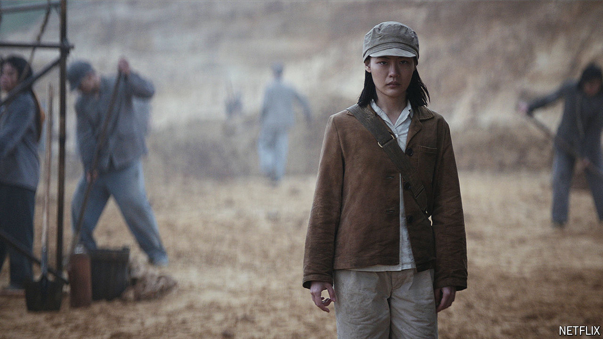

###### Three-body shaming

# Chinese nationalists have issues with “3 Body Problem” 

##### The show is a hit in the West. But its history lesson is not for everyone 

 

> Mar 27th 2024 

The book is full of technical jargon, with copious references to particle accelerators and nanotechnology. The story, about Earth preparing for an alien invasion, is dark. Nevertheless, “The Three-Body Problem” by Liu Cixin has been a huge hit in China since it was published in 2008. It was translated into English in 2014 and quickly gathered awards and fans in the West, too. Most readers rejoiced when Netflix, an American streaming giant, announced in 2020 that it was turning the novel into a big-budget television series.

The series, called “3 Body Problem”, launched on March 21st to positive reviews in America. Netflix is blocked in China. But many in the country managed to watch the show using pirate sites or software that can bypass official internet controls. It became one of the hottest-trending topics on Weibo, a social-media platform. Many commenters seemed to like this version (a previous adaptation was produced in China). Nationalists, however, did not.

Quick to take offence, the nationalists were unhappy that Netflix dropped some of the Chinese elements of the novel. In the series, much of the action takes place in London and Oxford, whereas in the book Beijing features more heavily. Similarly, in the show some Chinese characters have been replaced with English-speaking Westerners. 

But the main reason nationalists are upset has to do with something that Netflix left in the show. The first episode begins in the 1960s, during the Cultural Revolution. A young character called Ye Wenjie (pictured) witnesses her father, a physics professor, getting beaten to death by Red Guards (Maoist youth gangs) for refusing to renounce science in favour of Marxism. The experience causes her to lose faith in humanity.

The scene is inspired by grim historical facts—many academics were killed by their students during that period. It is also an important part of the novel. Mr Liu had to bury it in the middle in order to placate Chinese censors. But it comes at the beginning of the English translation. The nationalists do not care. “Why should China’s mistakes be remembered for ever?” complained one online. Netflix “made a batch of dumplings just as an excuse for using this vinegar”, said another, suggesting that the series was produced only to make China look bad.

China’s nationalists, mind you, are not opposed to all adaptations of Mr Liu’s work. They tended to like “The Wandering Earth”, a Chinese-language film released in 2019 that was based on a different novel. As in “3 Body Problem”, the stakes are high. A group of astronauts has to stop Earth from colliding with Jupiter. But the heroes are all Chinese and the film is set in the future. ■


