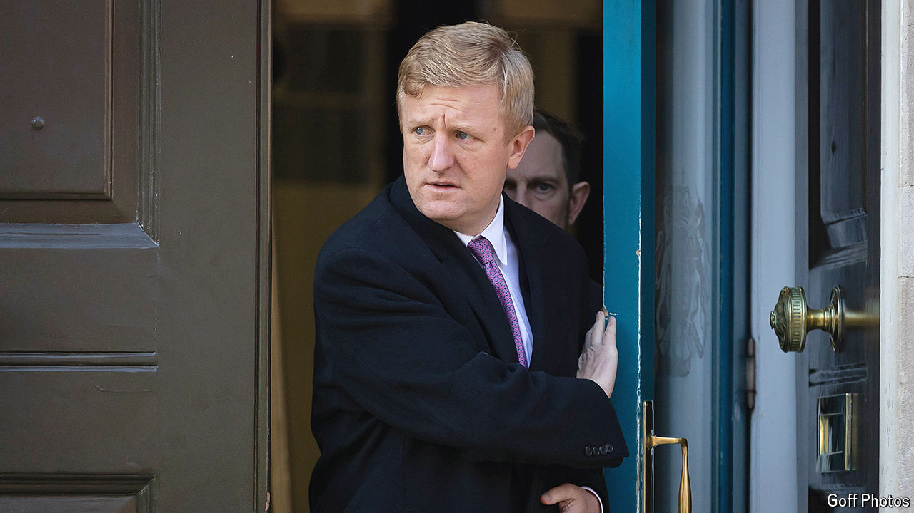

###### Spooks in the machine

# What to make of China’s massive cyber-espionage campaign 

##### America and others offer rich details of what Chinese spies are up to 

 

> Mar 26th 2024 

When calling out China, Western governments sometimes like to stand together. On March 25th and 26th America, Britain and New Zealand did so in a co-ordinated blast against Chinese cyber-espionage. American federal prosecutors accused China’s cyber-spooks of waging a campaign for years against a wide range of targets in the West, including critics of the Chinese Communist Party. Britain’s deputy prime minister, Oliver Dowden, said China showed “ongoing patterns of hostile activity targeting our collective democracies”. New Zealand blamed state-linked hackers in China for a cyber-attack on the country’s parliament. 

Both America and Britain placed sanctions on an alleged front company for one group of Chinese hackers, which they called APT31. They also imposed sanctions on two of the group’s alleged members, while America laid criminal charges against them and five other men. These actions are unlikely to have much impact on China’s efforts. The letters APT stand for “advanced persistent threat”. This is technical jargon for an attack that involves lurking undetected in a target’s network. The words also happen to convey the West’s gloomy view of China’s cyber-onslaught. 

Spotting a cyber-intrusion, let alone identifying those responsible, can take time. The incidents revealed by the three Western countries mostly occurred two or three years ago. Mr Dowden told Parliament that “Chinese state-affiliated actors” had penetrated the Electoral Commission’s email and file-sharing systems in 2021. The breach was first publicly declared in August 2023, when officials revealed that suspicious activity had not been identified until October 2022—more than a year after the hackers had broken in. The perpetrators would have had access to the addresses of Britain’s voters. Mr Dowden did not specify the group involved in that attack. But he said APT31 was “almost certain” to have been behind “reconnaissance activity” aimed at MPs’ email accounts in 2021. Most of those targeted were prominent critics of China. 

The indictment filed in a New York court against the alleged seven members of APT31 offered rich detail of this team’s activities. The 27-page document said the group operated under the Hubei provincial branch of China’s Ministry of State Security (MSS), the country’s main civilian spy agency. Its front company, Wuhan Xiaoruizhi Science &amp; Technology, was set up around 2010. Since then it has allegedly targeted thousands of politicians in America and elsewhere, as well as academics, journalists and pro-democracy activists. According to the document, it has also taken aim at people and companies in American industries deemed of “national importance”, including those relating to defence, IT and telecommunications.

The British played down the impact of the Chinese hacking it had detected—no elections had been affected and the targeting of MPs’ emails had been “blocked by Parliament’s cyber-security measures”. New Zealand said another MSS-linked group, known as APT40, had been involved in the cyber-attack on its parliament in 2021, but this had not caused the leak of sensitive information. The American indictment, however, said APT31’s activities had “resulted in the confirmed and potential compromise of work and personal email accounts, cloud-storage accounts and telephone-call records belonging to millions of Americans, including at least some information that could be released in support of malign influence targeting democratic processes and institutions”. 

Mark Kelly of Recorded Future, a cyber-security firm, says his company is aware of about 50 hacking groups in China, including private firms working for the MSS or People’s Liberation Army. There are undoubtedly many more. Mr Kelly describes China’s cyber-espionage efforts as “orders of magnitude” greater in scale than those mounted by Russia or North Korea. 

As the indictment shows, they are surprisingly devolved. Some of them specialise in spying on different parts of the world, says Nigel Inkster, a former deputy head of Britain’s spy agency, MI6. They have considerable leeway to do as they wish, he says: “I’m not even sure that there is any kind of formal political clearance mechanism.” Much of their work is subcontracted to private firms. Last month a huge online dump of documents from one such company, I-Soon, showed its involvement in large-scale cyber-snooping on behalf of a variety of government agencies. 

The West’s anxieties, not least about the hackers’ theft of corporate data, are becoming increasingly manifest. In January the head of the FBI, Christopher Wray, said that China’s state-sponsored hackers outnumbered his agency’s cyber-personnel by “at least 50 to one”. He added that China’s hackers are laying the groundwork for a possible Chinese strike, “positioning on American infrastructure in preparation to wreak havoc and cause real-world harm to American citizens and communities.”

Chinese diplomats have dismissed such accusations. A Chinese embassy spokesperson in London called Britain’s allegations “fabricated and malicious slanders”. If the West hopes that naming, shaming and sanctions will dissuade the Chinese spooks, it is likely to be disappointed. As Mr Inkster puts it: “I don’t think Beijing is particularly concerned about the political ramifications of getting caught with their fingers in the till any more.” ■


