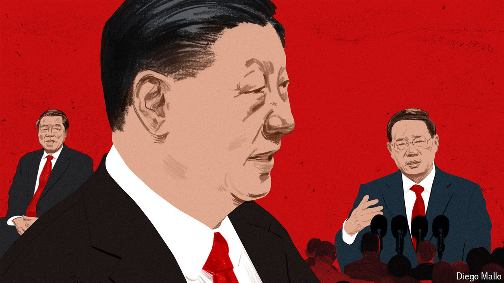
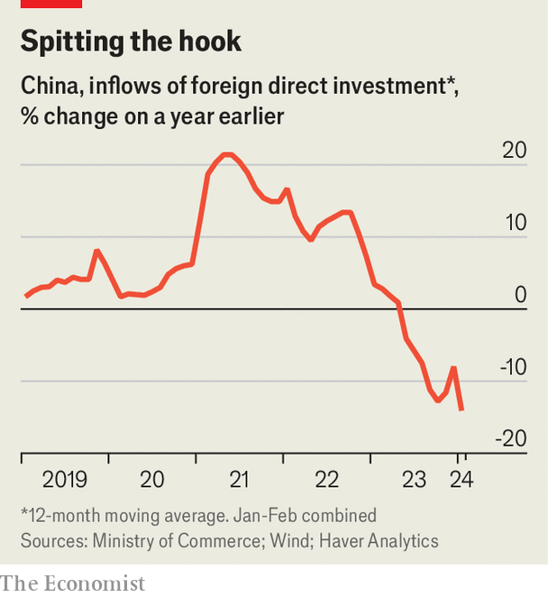

###### The men with Xi’s ear

# Who is up and who is down on China’s economic team 

##### Xi Jinping is in charge. The rest need sorting 

 

> Mar 27th 2024 

On March 27th, when Xi Jinping met American business executives in Beijing, it was a rare opportunity for these corporate bigwigs to interact with China’s leader on his home turf. The meeting followed the China Development Forum, an annual economic conference held amid the lakes and willows of a tranquil state guesthouse in the capital. The economic backdrop to the meeting was less serene, thanks to a faltering economy, depressed stockmarket and sporadic regulatory crackdowns. Foreign direct investment has slumped (see chart).

 


In the past, such meetings were entrusted not to China’s president, but to its prime minister, who has traditionally held sway over economic policy. Li Qiang (pictured, right) was still new in the job when he met businessmen, including Tim Cook, the chief executive of Apple, on the sidelines of last year’s forum. Hoping to restore optimism after the pandemic, Mr Li urged his visitors to look up at the metaphorical rainbow after the rain, rather than down at the mud under their feet.

This year, however, Mr Li’s thunder has been stolen by his boss. The prime minister also missed a high-profile chance to communicate to the outside world earlier this month, when the annual meeting of China’s parliament dispensed with his closing press conference.

This reticence is becoming a pattern. Compared with his predecessor, Mr Li has held fewer meetings with foreign officials and business leaders in his first year: only two-thirds as many, according to the  in Hong Kong. He has travelled to only half as many meetings abroad. And when he has taken to the skies, he has flown on chartered flights rather than a government plane.

There is a swirling debate inside China about what explains these changes. One view is that Mr Li is adroitly signalling his deference to Mr Xi, even as he retains substantial influence on policymaking. Another view is that he has been in effect demoted. Either way, the prime minister’s economic purview seems to have narrowed, focusing on new domestic growth engines not international exchanges. Mr Li has spent more time than his predecessor on inspection tours around the country, the  points out. Economics has also lost ground to national security in the leadership’s priorities. Regardless of whether his influence has slipped, Mr Li holds sway over a diminished portfolio.

The power of China’s leaders derives not from their position in the government, but from their standing in the Communist Party, including its 24-person Politburo. By the time the party picks its next Politburo in 2027, Mr Li will be above the customary retirement age of 68. He might then step down as prime minister after one term.

If so, a plausible successor would be Ding Xuexiang. The youngest member of the Politburo’s seven-man Standing Committee, Mr Ding was a close aide to Mr Xi in Shanghai in 2007. He then followed him to Beijing and accompanied him on many of his foreign trips during his first term as president, including a visit to Donald Trump’s Mar-a-Lago resort in Florida.

Mr Ding is the highest-ranked of four deputy prime ministers on the State Council, China’s cabinet. But he does not hold a position on the most powerful party commission handling the economy: the sweeping Central Comprehensively Deepening Reforms Commission (known for its less-than-comprehensive reforms of everything from pensions to football).

Similar party commissions have proliferated under Mr Xi. Compared with government bodies, these groups have fewer constraints on their action and no awkward age limits on their members. A prominent example is the Central Financial and Economic Affairs Commission (CFEAC). One of its meetings in 2021 signalled the start of Mr Xi’s “common prosperity” campaign (which aimed to chasten billionaires and reduce inequality). A meeting in February gave the nod to China’s version of a “cash for clunkers” scheme, which provides households and firms an incentive to trade in old appliances and equipment for new gear. On economic policymaking, these commissions have crowded out the influence of the State Council. Since a tweak in rules last year, the council’s executives meet only two or three times a month, rather than every week.

If Mr Li has lost clout, who has gained it? The obvious answer is He Lifeng, another deputy prime minister, who has become Mr Xi’s economic tsar. Mr He (pictured, left) hails from the province of Fujian, where Mr Xi spent 17 years of his career. In Xiamen, a port city, they became friends and colleagues. Mr He was even a guest at the future president’s second wedding.

Mr He holds a position on three of the party’s financial commissions, notes Macropolo, a think-tank in America. He is the office director of CFEAC. He also sits on two lower commissions that oversee the financial system and its regulators. The commissions’ vision was summed up in an article in , the party’s main theoretical journal, in December. It insisted that finance serve the “real” economy, warned about the dangers of “pseudo-innovation” in the sector, and emphasised that financial risks can be infectious, hidden and destructive. “Xi Jinping, at some level, does not like finance people with fancy suits and nice shoes,” says one economist.

Mr He last year oversaw the appointment of Li Yunze as the head of China’s new financial super-regulator, which covers both banking and insurance. This new body has also taken on some of the supervisory responsibilities previously held by the People’s Bank of China. The central bank has never enjoyed the autonomy or stature granted to monetary authorities elsewhere. Its governor, Pan Gongsheng, holds a PhD and is probably a better economist than any of the policymakers above him. But the bank nonetheless appears to be losing staff and status.

According to “Decoding Chinese Politics”, a project of the Asia Society Policy Institute, another think-tank in America, Mr He has personal links with officials across China’s economic-policymaking apparatus. Liu Kun, his classmate at Xiamen University in Fujian, served as finance minister until 2023 and helped pick the current holder of that office, Lan Fo’an. The head of China’s anti-monopoly agency, Luo Wen, spent a year as Mr He’s deputy when he was head of the National Development and Reform Commission (NDRC), China’s main planning agency.

The current head of the NDRC, Zheng Shanjie, also comes from Fujian province and worked under Mr He in Xiamen. He once criticised local officials in another coastal city for their complacency. “If you don’t make progress, you are regressing; if you progress slowly, you are regressing.” His own progress has been impressive. In 1997, he was the manager of a cod-liver-oil factory, having risen up the ranks from a job in equipment maintenance.

At this year’s China Development Forum, both Mr Zheng and his mentor, Mr He, urged foreign businesspeople to invest in China’s “new productive forces”, dangling the opportunities offered by the country’s vast market and ambitious programme of innovation. A smiling Mr He was pictured shaking hands with bosses from Blackstone, Pfizer, Corning and Siemens outside a guesthouse on the site, near where an emperor used to fish. If foreign businesses want to know what line China’s leaders are casting, Mr He is the person to see. Now, will they bite? ■


