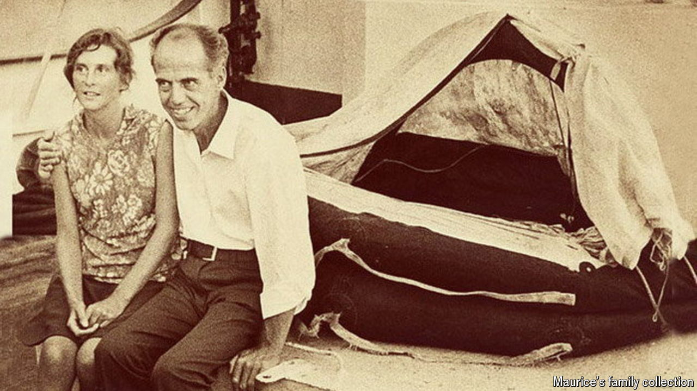

###### Survival stories

# Could your marriage survive a shipwreck? 

##### “Maurice and Maralyn”, a new book about a couple stranded almost four months at sea, makes you wonder 

 

> Mar 27th 2024 

By Sophie Elmhirst. 

When the captain of a Korean tuna-fishing ship first caught sight of Maurice and Maralyn Bailey bobbing in the Pacific Ocean in June 1973, he could not work out what they were. About four months earlier, while they were trying to sail from England to New Zealand, their boat had  into a sperm whale. The couple was stranded in a tiny inflatable life-raft tied to a flimsy dinghy, subsisting on rainwater, turtles whose throats they had slit, birds they strangled and sharks they suffocated. Unable to stand and wearing clothes that had disintegrated, their skeletons looked ready to burst through their skin.

Miraculously, they were alive. In “Maurice and Maralyn”, Sophie Elmhirst (an occasional contributor to , ’s sister magazine) draws on her own reporting, Maralyn’s diaries, the memoirs that the two published and a trove of news clips to tell the tale of this couple’s survival—and the love story that bubbled alongside.

The pair (pictured) had met a decade earlier at a car rally in Derby, England. Maurice was older and flew planes, but was lonely, awkward and felt that he had “so much to wade through before he could anything”. Maralyn was chatty and brave and, unlike Maurice, “seemed to know instinctively how to things”. They married, bought a home and then sold it, using the money to buy a yacht. Their dream was to become explorers.

They found their adventure. But despite the  and adrenaline, in “Maurice and Maralyn” it is love itself, “a terrifying fluke”, which makes life extraordinary. Two people choose and are chosen, “and, most unlikely of all, these choices must happen at roughly the same time”, Ms Elmhirst writes. 

The heartbreak comes later, long after the shipwreck. The pair age, illness strikes, loneliness returns. In the end, though, Maurice declares his life a triumph. Not because of any pioneering expedition or headlines about their extraordinary survival, but simply because he has loved and been loved. Never sentimental and perfectly paced, this is the best sort of story: a true one.■


