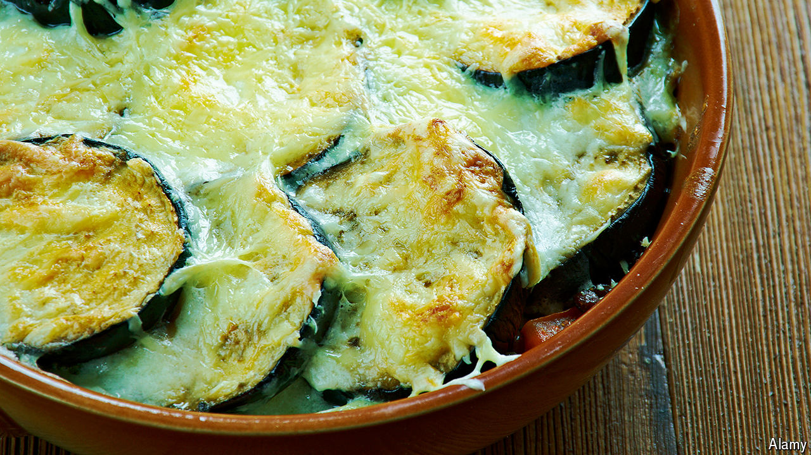

###### World in a dish

# How moussaka made it into the pantheon of Greek gastronomy 

##### Patriotism revolutionised a classic dish 

 

> Mar 25th 2024 

IN 1821  revolutionaries rose up against the Ottomans, setting off years of bloodshed that culminated in the creation of a free state in 1829. On March 25th each year Greeks celebrate Independence Day with parades and abundant feasts of delicately battered cod with garlic dip. 

And yet it is moussaka—sloppy squares of richly flavoured mince, potatoes, aubergines and indulgent béchamel sauce—that many consider Greece’s national dish. Its entry into the pantheon of Greek gastronomy came about a century after Greek independence. The country’s embrace of the dish is a lesson in how traditions are forged and how a nation’s cuisine evolves. 

Nikolaos Tselementes is considered the godfather of Greek moussaka. In the 1920s he published the first complete Greek cookbook, “Odigos Mageirikis” (“Cooking Guide”), which included six recipes for moussaka. His creations contained none of the pungent flavours hitherto used by Greek cooks, such as bay leaf and cinnamon. These were “contamination” from nearly four centuries of Ottoman rule, Tselementes wrote. He hated garlic and—unusually for a Greek—. The chefs of antiquity had not tossed cumin or other “eastern” spices into their pots, he said.

His efforts to bake politics into food were successful. “Odigos Mageirikis” became a staple of wealthy urban kitchens and the word “” synonymous with a recipe book for a while. By tapping into patriotism and Hellenising the hearth, Tselementes revolutionised Greek cuisine. 

Not all foreign influences were anathema. Like many culinary contemporaries, Tselementes was besotted with French gastronomy. This may have been what inspired him to coat his moussakas in velvety béchamel. His Gallic-Greek creations also featured aubergine, as well as fried courgette and, in winter, artichoke. The French gratin—a vegetable casserole enveloped in white sauce and breadcrumbs—was a more likely source of inspiration than versions of moussakas cooked in the Middle East, says Aglaia Kremezi, a food writer. 

As chefs and food historians seek to revive lost recipes and resurrect culinary traditions, moussaka proves that  in food. Cultures have long borrowed from one another, and gastronomy is all the richer for it. 

A dish ripe for reinvention is also more likely to endure. Tselementes’s moussaka is still served in  around the world. Nowadays there is no single way to prepare it. A restaurant in eastern Corfu bakes crayfish between layers. In Britain cooks might chuck in roast goose: lo and behold the “goussaka”. As for the béchamel, it is best kept light by whipping tangy yogurt with olive oil. If he knew, Tselementes would be whipped into a frenzy. ■


