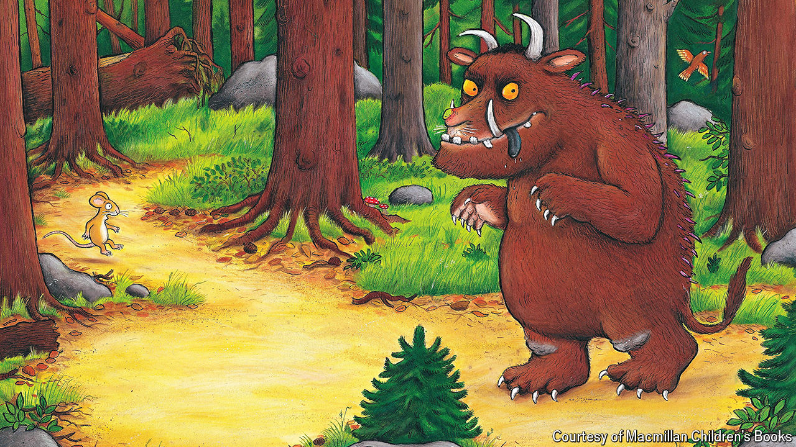

###### Where the wild thing is

# How “The Gruffalo” went global 

##### The children’s book, first published 25 years ago, rewrote the rules for success 

 

> Mar 26th 2024 

When Julia Donaldson set out to write a children’s book featuring a mouse—who would take a stroll through “the deep dark wood”, fending off a series of predators with wit and cunning—she intended him to meet a . Ms Donaldson, a British author who wrote songs for children’s television, had been inspired by a Chinese fable about a girl who escapes death by convincing a tiger that she is the queen of the forest. But there was a problem: Ms Donaldson wanted the book to be in rhyming couplets, and not a lot rhymes with tiger. She decided it would be more pragmatic for the beast’s name to end with the sound “oh”. And so, with the help of Axel Scheffler, a German illustrator, one of the most lucrative monsters in children’s publishing was born.

“The Gruffalo”, which was published 25 years ago in March, has achieved such great success that tired parents everywhere have considered jacking in their boring jobs to write children’s books. To date it has sold 11.6m copies worldwide, according to the publisher. Last year Ms Donaldson’s whole oeuvre—now 200 books and counting—brought in £15.6m ($19.6m) in sales, with “The Gruffalo” leading the pack.

Whereas some books cause grown-ups to groan inwardly when a child selects them at bedtime, “The Gruffalo” is almost as fun to read aloud as it is to listen to. Like most fables featuring animals, it has an unspecific setting and universal themes—the triumph of the underdog, brains over brawn—that help it resonate with both young and old audiences. Credit is also owed to Mr Scheffler, an illustrator with the most recognisable style since Quentin Blake (who collaborated with ). Mr Scheffler has said initial sketches “were deemed to be ‘too scary for tiny children’ by the editor so I had to make him a bit rounder and more ‘cuddly’.” The result resembles one of the terrible creatures from Maurice Sendak’s “Where the Wild Things Are” (1963), another classic. 

Today you can buy Gruffalo-branded slippers, cushions and crisps (cheese-and-onion Gruffalo claws, anyone?); get tickets to the stage show; and keep a toddler quiet for half an hour with the Oscar-winning short film featuring the voices of James Corden and Robbie Coltrane. Many fans think that the book’s sequel, “The Gruffalo’s Child”, is—like “The Godfather Part II” and —even better than the original. 

At the last count “The Gruffalo” has appeared in 107 languages and dialects, including Armenian, Basque, Esperanto, Kurdish and Thai, making it the second-most translated children’s book of recent times. Only “The Little Prince” by Antoine de Saint-Exupéry, first published in 1943, has racked up more foreign editions, says Michele Young, rights director at Macmillan Children’s Books, the publisher of “The Gruffalo” in Britain. 

Because its fame now seems like a foregone conclusion, it is easy to forget that the book defied early expectations. Before Ms Donaldson “paved the way” for other authors, editors were nervous about books that rhymed, according to Ms Young. It was hard to sell the rights to international publishers, because poetry is notoriously difficult to translate.

Vladimir Nabokov thought translating rhyme was so challenging that writers should not bother. In the introduction to his translation of “Eugene Onegin”, which rendered ’s Russian verse into English prose, the novelist spelt out his belief that translators should be as faithful to the original text as possible. “To reproduce the rhymes and yet translate the entire poem literally is mathematically impossible,” he wrote. Happily for children and parents who do not speak English, most translators of “The Gruffalo” ignored Nabokov’s pleas. Instead they have chosen to channel poets such as Alexander Pope, whose translation of Homer’s “Iliad” captures the spirit of the original rather than striving for verisimilitude. 

Of mice and men

Andy Smart, who translated “The Gruffalo” into Arabic with his wife, Nadia Fouda, distilled the pair’s modus operandi to: “Keep the mood, keep the rhyme, don’t lose the humour.” Their version, in which the pictures have been flipped so it can be read from right to left, is one of the few to change the name of the Gruffalo: to “”, a made-up word drawing on “ghoul”, because it was easier to rhyme in Arabic.

The need to make lines rhyme and scan, coupled with a translator’s desire to give their own spin to the text, leads to delightful variations. Whereas Ms Donaldson’s last line in the original English is “The mouse found a nut and the nut was good”, the Italian mouse gets a closing soliloquy: “Mmmh, è squisita! Che bella giornata! Che dolce è la vita!” (“Mmm, it’s delicious. What a beautiful day! How sweet life is!”). 

Gruffalo connoisseurs can have fun spotting the differences between what the mouse claims are the Gruffalo’s favourite foods, in a successful ploy to scare off predators. In the German version, “roasted fox” becomes “Fuchsspieß” (fox kebab). The Japanese translator has turned “scrambled snake” into “snake ”, adapting a traditional dish of grilled fish, while in the French version it becomes “crème de serpent” (“cream of snake”). Such local adaptation makes “The Gruffalo” a perfect treat before bed, wherever you are. ■

Picture credit: The Gruffalo © Julia Donaldson and Axel Scheffler 1999, 2019, 2024 - Macmillan Children’s Books


