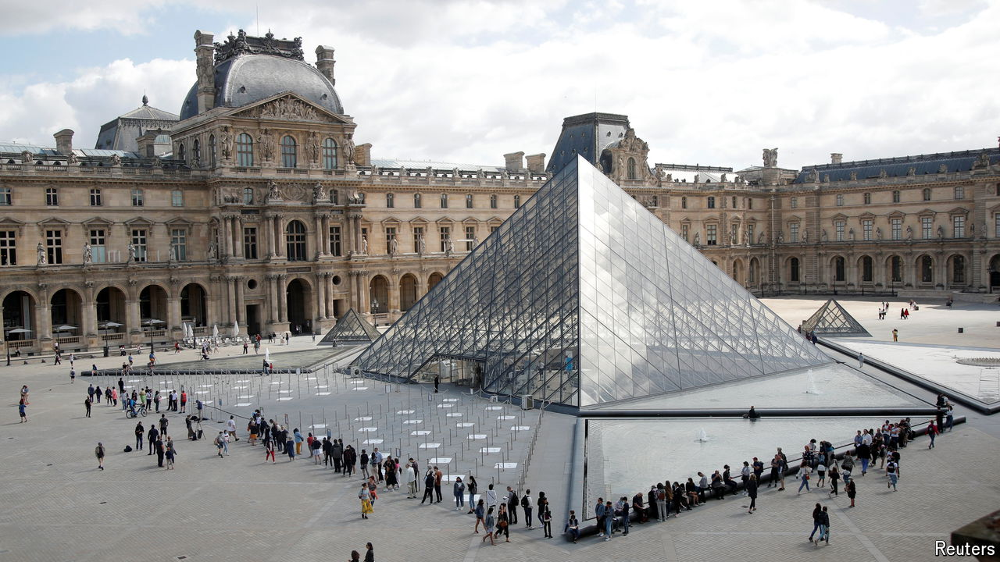

###### A different sort of art heist

# Museums are becoming more expensive 

##### Will it kill off future patronage and attendance? 

 

> Mar 27th 2024 

“It’s almost a moral duty that museums should be free,” said Glenn Lowry, director of the Museum of Modern Art (MoMA). That was in 2002, when a ticket to MoMA cost $12 (around $19 in today’s prices). In October MoMA started charging $30, the latest in a series of price rises.

MoMA is not the only museum raising the cost of admission. The in New York ended its longstanding “pay what you will” policy for out-of-town visitors in 2018 and raised general admission for them to $30 in 2022. Last summer the San Francisco Museum of Modern Art, the Philadelphia Museum of Art, the Whitney Museum and the Guggenheim Museum all followed suit, bumping a standard ticket from $25 to $30. 

Museum staff complain of climbing costs and a case of “long covid”. In America only a third of museums have met or surpassed pre-pandemic visitor numbers. Higher energy and labour costs have pushed up ticket prices in Europe, too. In January the Berlin State Museums, the Louvre and the Vatican Museums, which include the Sistine Chapel, raised the price of general-admission tickets by 20%, 29% and 17%, respectively. Prices have remained stable only in  and the Middle East, where museums are younger and state funding is especially generous. 

Ticket fees may seem high, particularly in destination cities where tourists are not likely to be dissuaded by spending a few more dollars. But “whatever museums charge, it is not covering their operating costs,” says Javier Jiminez, a director at Lord Cultural Resources, a consulting firm. The Association of Art Museum Directors reported in 2018 that ticket sales accounted on average for just 7% of total revenue at American art museums. Memberships contributed another 7%. The remainder of budgets usually come from endowments, charitable donations, grants and retail operations.

European museums are less reliant on admissions fees, because they are often  by governments. This can make it awkward to ask taxpayers to buy a pricey ticket and in effect pay twice. Many institutions choose to offer reductions for the young, pensioners and locals. 

All national institutions in Britain offer free admission, as do most state-run museums in China. (Exceptions are made for special exhibitions.) In America some 30% are free, including big public museums like those of the Smithsonian Institution and private ones such as the Getty Centre in Los Angeles. Some observers have repeated Mr Lowry’s call for museums, especially the most well-endowed, to stop charging for admission entirely. 

Ballooning prices go against museums’ goal of sharing art with a more diverse public. They could also accelerate the already steep decline in the share of Americans attending museums and galleries: between 2017 and 2022 it shrunk by 26%. 

Declining public interest, particularly among young people, is a challenge for institutions that rely heavily on public support. Those who choose not to visit a museum today may be the people who vote against government subsidies or refuse to write personal cheques as patrons in a few years. Those who spend time inside museums’ galleries are more likely to grasp their richness and want to invest their own riches in them. 

Yet significantly reducing costs may not actually do much to attract new audiences either. In both America and Europe, people say that price is just one of several factors when it comes to deciding what to do with their leisure time. If tickets were free, “people who typically come anyway might come more often. Otherwise, you’re not really changing your demographic,” says Michael Rushton, an economist at Indiana University who studies pricing in the arts. He compares museums to : Harvard and Stanford could afford to make tuition free for all, but many wealthy students who do not need the gift would be among the biggest beneficiaries. As museums throughout the West debate what price is right, most are unlikely to conclude the answer is zero, “moral duty” or not. ■


