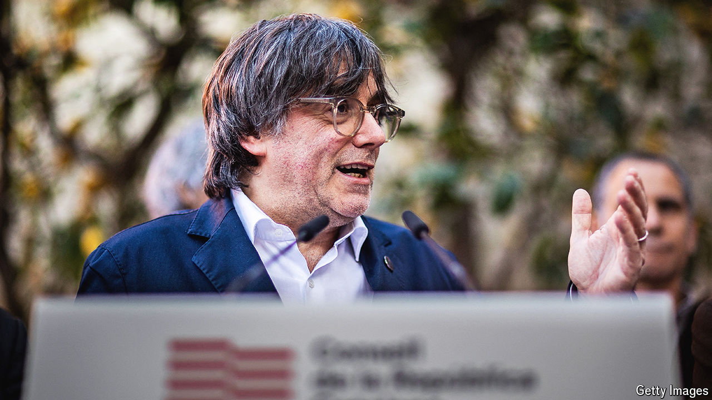

###### Catalonia’s elections

# Carles Puigdemont aims to reignite Catalan separatism 

##### But the region is tired and divided 

 

> Mar 27th 2024 

“PRESIDENT! PUIGDEMONT!” The supporters who greeted Carles Puigdemont (pictured) on March 21st in the French town of Elne still see him as the true leader of Catalonia. And they hope he will soon be the official one again too. Mr Puigdemont announced that he will lead his party, Junts per Catalunya, in regional elections in May. But he did so 13km from the border, because he cannot set foot in Spain without being arrested.

In 2017, when he was president of Catalonia, Mr Puigdemont held an unconstitutional referendum on independence. After a Spanish crackdown, he fled to exile in Belgium. But when Spanish elections left a hung parliament last July, Mr Puigdemont’s price for letting his party’s MPs back Pedro Sánchez as prime minister was amnesty for the referendum’s organisers, including himself. That amnesty passed the lower house of Spain’s parliament on March 14th. The senate, controlled by the conservative People’s Party, wants nothing to do with it. But it can only delay the amnesty; unless the constitutional court overturns it, it will take effect within months.

Some say that deadline is the reason Pere Aragonès, the current president of Catalonia, called elections for May 12th, after a budget dispute with a small left-wing ally. Mr Aragonès hails from another separatist Catalan party, Republican Left (ERC). There is little love lost between it and Junts, which flounced out of their coalition government in 2022. Mr Puigdemont is a powerful symbol to many independence supporters, and his party mates say Mr Aragonès timed the vote to keep his rival from campaigning in person. 

Those gathered in Elne were thrilled with Mr Puigdemont’s promise to return from exile if he has the votes to be installed as regional president. That is because, for separatists, thrills have been notably lacking of late. Mr Puigdemont acknowledged the “frustration” and “demobilisation” many felt. The crowd was rich in grey-haired pensioners; some acknowledged that their children and grandchildren had little appetite for politics after the referendum. In principle some 40-50% of Catalans support independence, but in a recent poll just 27% said it should be a priority of the new government.

The other problem is disunity. There are three separatist parties in Catalonia’s parliament. They may soon be joined by a fourth led by Clara Ponsatí, a former Junts leader. They nearly had to make room for a fifth: the Catalan National Assembly (ANC), the main pro-independence NGO, held a vote in early March to form a “civic list” with the sole goal of pushing for independence. The proposal failed narrowly. One ANC leader, asked if he knew any activists who would now stay at home rather than vote in May, said “about a million”.

Such divisions benefit the regional Socialists, who top the polls. A first-place finish might vindicate the amnesty in the eyes of some who opposed it. But mistrust will make it hard for any separatist party to govern with the Socialists; bad blood will make it tricky for them to join one another. Like Spain itself, Catalonia increasingly seems too divided to govern. ■


