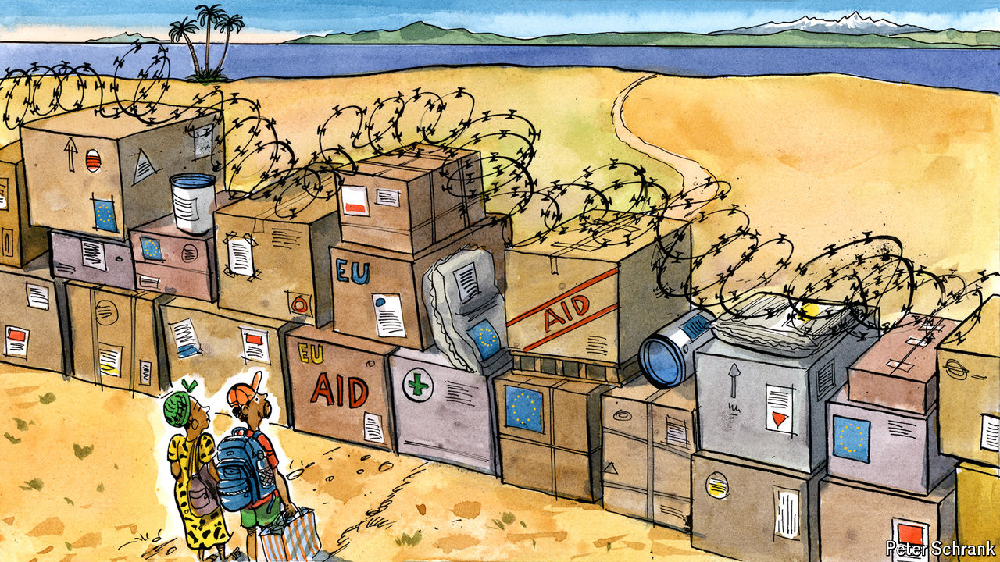

###### Charlemagne

# How Europe’s fear of migrants came to dominate its foreign policy 

##### Trade, aid and visas are increasingly conditional on helping Europe stem migration 

 

> Mar 27th 2024 

Asked whether their past imperial behaviour might entitle former colonies to compensation, Europeans like to change the subject by pointing to their generous overseas-development budgets. The continent is home to some of the world’s biggest foreign-aid programmes; a handful of European Union members even meet the aspiration that rich countries should spend 0.7% of their national income on alleviating global poverty. Anyone whose heart has been warmed by reports of schools being built and irrigation systems installed might care to look at the fine print of exactly who is being helped. The Netherlands has in recent years found a new worthy recipient for its supposed generosity: part of the cost of hosting asylum seekers on Dutch soil is now paid from the foreign ministry’s aid budget. Do-gooders howl in protest at the measure, which in effect depletes development spending. Right-wingers say it matters little if an Afghan being helped is in Herat or The Hague, it’s all going to foreigners anyway.

A schism has long been evident. On the one hand, illegal migration is seen as a problem, and politicians know that “stopping the boats” (or some locally equivalent tough-sounding measure to curb new arrivals) will keep them in office. On the other, Europeans see themselves as a force for good in the world, happily trading and diplomatically allying with countries far and wide. For decades the two worlds were kept separate. Cops and interior-ministry types put up fences to keep migrants out, while diplomats, trade officials and development specialists showered money, vaccines and sweetheart trade deals on the very countries the refugees came from. In the wake of a migration surge in 2015-16 and a recent increase in illegal arrivals, Europe has decided that stopping the boats matters more than being nice to others for its own sake. Foreign policy is being co-opted by the interior-ministry crowd to keep down migrant numbers.

A set of EU laws due to be adopted in April call for a “comprehensive approach” to tackling migration—ie, one that includes putting pressure on foreign governments to ensure fewer of their people pitch up illegally in Europe. In many ways this will formalise a tactic that has become the norm in recent years. On March 17th the EU agreed to provide over €5bn ($5.4bn) in grants and loans to Egypt, the latest country with a Mediterranean coastline to get money for sealing its borders more effectively. A deal in 2016 with Turkey and one with Tunisia last year served as templates; more are in the works. Their aim is clear: to help stem the flow of people to Europe. Those that can help “externalise” the EU’s migrant problem—for example Turkey, which hosts Syrians who might otherwise end up in Germany—can get even more cash.

But countries far beyond Europe’s shores are also being coerced into helping bring down migrant numbers. Every year around 400,000 foreigners are ordered to leave the EU, often having arrived illegally and failed to convince one of its 27 member states they were entitled to refugee status. Less than a quarter of those are deported, often because their home countries—places like Bangladesh, Algeria or Nigeria—balk at taking them back. (Locals in poor countries take pride in having relatives in rich ones who send back remittances even if they work illegally.) The new EU rules foresee faster deportation for arrivals from countries whose citizens are rarely granted refugee status. That requires an effective conveyor belt to deport those deemed to be economic migrants—for which the help of foreign governments is key. Hence the new diplomatic deal: help us, or else.

Under the EU’s new approach, governments refusing to readmit their own citizens can be punished. One sanction is to make it harder for people in those places to get visas for EU countries. Another is to cut development aid, a threat made to the likes of Ethiopia. A decades-old scheme that lets the world’s 60 or so poorest countries export goods to Europe with no or low tariffs—a key poverty-reduction measure—could soon become conditional on those countries doing the EU’s bidding when it comes to refugees. Help us with migration or face import taxes, in other words.

Help me help me help you

Critics say imposing conditions on aid, trade and visas is unconscionable. “Europe is putting its short-term migration priorities ahead of the development needs of some of the world’s poorest countries,” says Nadine Biehler of the German Institute for International and Security Affairs. The big-money deals with the likes of Egypt and Tunisia are also eye-wateringly expensive. They help keep in power strongmen who will slow down their countries’ development. Making aid conditional in this way is a breach of principles that dictate that recipients, not donors, should steer where the money goes. Diplomats grouse that it is hard to convince an African country to help Europe when canvassing for votes against Russia in the UN, for example, while also threatening them. 

The interior-ministry faction who are the main proponents of the new approach have routed the opposition. In a polity where right-wing populists are rising in the polls, migration is a political priority and foreign aid is not. Europe is moving from “an era of naivety to an era of assertiveness”, in the words of Margaritis Schinas, a European commissioner helping to join up foreign and migration policies. Old-school trade, development and diplomatic types feel this is all grubbily transactional, but know they can do little about it beyond grumble to columnists. Pragmatists in the development bureaucracy of the EU well understand that being seen to help reduce migration is a good way to keep scarce funding. They paint a picture of a broader “partnership” between Europe and poor countries, of which migration is only one facet. Plenty of schools and irrigation systems will still get built, in other words—as long as you do what we ask first.■


