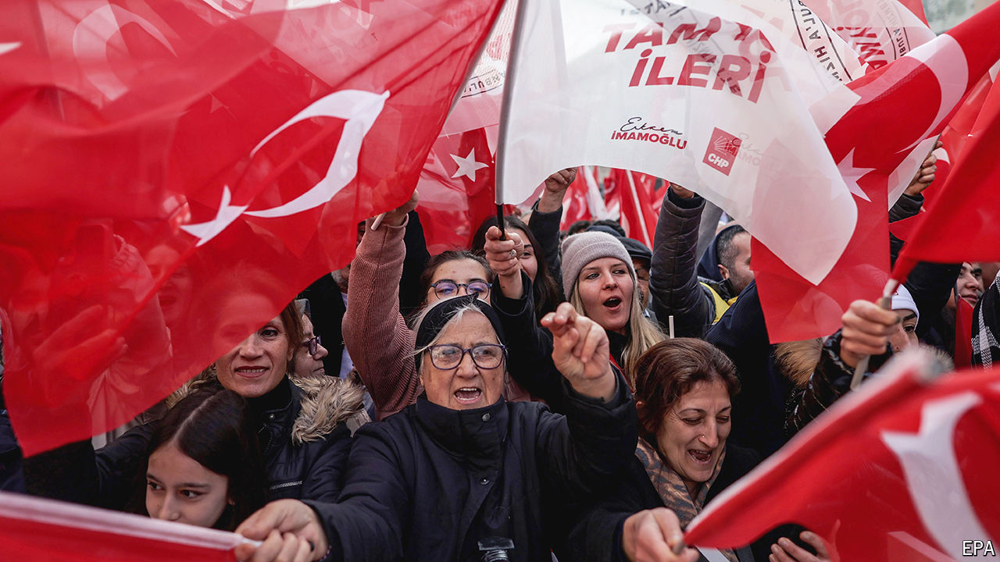

###### Perishable Goods

# Turkey’s opposition hopes for a shake-up in local elections 

##### The Good Party, once the hope of Recep Tayyip Erdogan’s foes, has faded 

 

> Mar 27th 2024 

Things are not good for the Good (or IYI, in Turkish) Party. Two years ago, having broken off from Turkey’s main nationalist bloc, the party had a full head of steam, polling at nearly 20%. The opposition alliance it joined seemed poised to give Recep Tayyip Erdogan, Turkey’s president, and his governing coalition a run for their money. But on the eve of local elections set for March 31st, Good is imploding. Support for the party has slipped to single digits. After a disappointing result in last year’s general elections, its alliance with the Republican People’s Party (CHP) has come apart. Senior party officials and lawmakers are leaving Good in droves.

The local elections for mayors and city councils will almost inevitably see Mr Erdogan’s Justice and Development (AK) party prevail in most parts of the country. But in Istanbul, the motor of Turkey’s $1trn economy, the race may come down to the wire. Neither the Goods nor the Peoples’ Equality and Democracy Party (DEM), the country’s main Kurdish bloc, have a chance of winning the city. But the few percentage points their candidates are bound to receive may cost Ekrem Imamoglu, the incumbent mayor, the election. Mr Imamoglu, of the CHP, is ahead in most polls, but not by much. 

On paper, AK’s candidate in Istanbul is Murat Kurum, a former urban-affairs minister. But the man powering AK’s campaign is Mr Erdogan. Turkey’s leader grew up in Istanbul, served as its mayor in the 1990s, and continued to run the city through his surrogates, even after he became prime minister and then president. His streak ended in 2019, when Mr Imamoglu, backed by a coalition of CHP secularists, IYI nationalists and Kurdish voters, defeated AK’s candidate.

Turkey’s strongman is now determined to take back control of the city and its $16bn budget. One thing standing in his way is the economy. Despite interest-rate increases totalling more than 40 percentage points since last summer, when voters gave him another five years in power, the dip in consumer prices Mr Erdogan hoped to see before the local elections has not yet materialised. Annual inflation recently exceeded 67%. Meanwhile, the central bank’s reserves are again running low, fuelling suspicion that the bank has resumed selling dollars to support the lira. In what is becoming an election-season tradition, coffeehouses in Turkey are thick with chatter about the lows to which the currency will plunge once the vote is out of the way. 

Local elections in Turkey are as much about storm drains, bus service and patronage networks as they are about national politics. For Mr Imamoglu, a second term as mayor would be a stepping stone to taking over the CHP, which is plagued by infighting between factions loyal to its new leader, Ozgur Ozel, and its former one, Kemal Kilicdaroglu. Mr Imamoglu might then run for president in 2028. 

The vote could also change Mr Erdogan’s retirement plans. He recently announced that his current term would be his last, inviting speculation about AK’s next leader. (Top candidates seem to be Hakan Fidan, the foreign minister and former spymaster, and Selcuk Bayraktar, Mr Erdogan’s son-in-law and the face of Turkey’s drone programme.) But Mr Erdogan, who less than two years ago swore he would not increase interest rates as long as he was in power, is not exactly a man of his word. Winning in Istanbul could embolden him to pursue his latest pet project, a new constitution, presumably designed to guarantee him another term. 

The elections may also decide IYI’s fate. The party has been in a tailspin since the spring of 2023, when its leader, Meral Aksener, publicly refused to back Mr Kilicdaroglu in the presidential elections, only to reverse course days later. When Mr Kilicdaroglu lost, she and the Goods withdrew from the opposition alliance and refused to back CHP candidates in the local elections. By then, many voters had lost track of what the party stood for. 

As long as Mrs Aksener is in charge, say her associates, Good will continue to oppose Mr Erdogan. But a weak showing on March 31st may set the stage for a leadership challenge, a schism or both. Some Good politicians remain close to the Nationalist Movement Party (MHP), from which Good is descended, and which forms part of Mr Erdogan’s governing alliance. “Those people can easily shake hands with Erdogan,” says an IYI insider. “They don’t aspire to have popular support, but to have power.” They may soon decide to jump ship. 

The opposition faces a wider problem. “Many voters are convinced they cannot win elections,” says Seda Demiralp, an academic. A win for Mr Imamoglu could re-energise them. But some in Turkey think they will need a more thorough shake-up to mount a challenge to Mr Erdogan or his successor. “The opposition needs to be restructured,” says Bilge Yilmaz, a senior Good member. Many of Mr Erdogan’s opponents are more concerned with rent-seeking at the local level than winning elections at the national one, he complains. “Everyone needs to go.” ■


