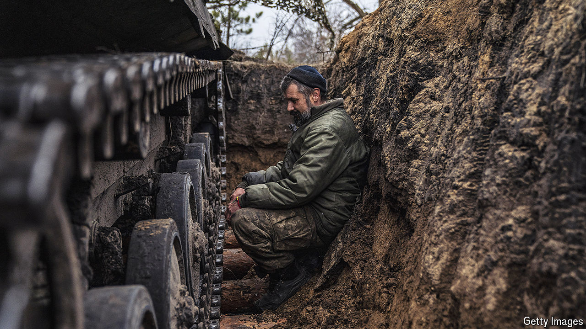
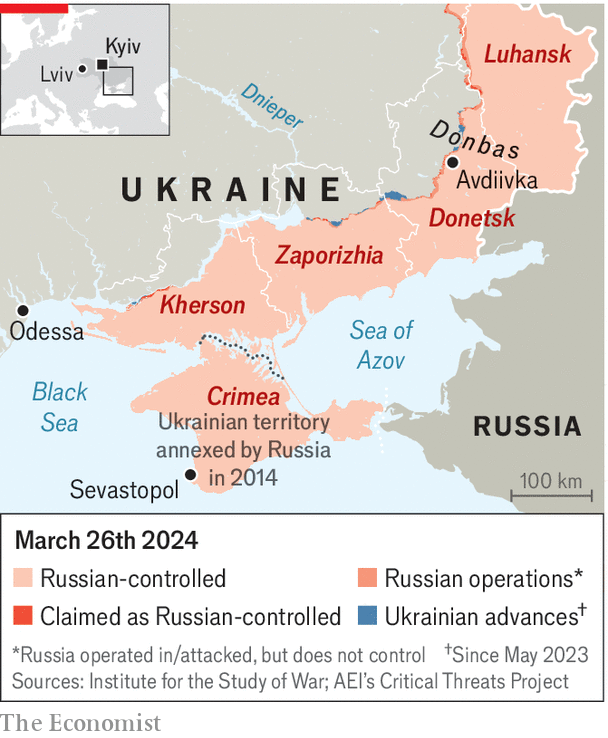

###### Digging in

# Ukraine is in a race against time to fortify its front line 

##### But it is suffering from a shortage of munitions and manpower 

 

> Mar 25th 2024 

EARLIER THIS year, a common view was that the war in Ukraine was . That now seems optimistic. There is an alarming possibility that a big new Russian push in the next few months could punch through Ukraine’s defences and deep into the country.

Since the , a bitterly fought-over coking town in Donetsk province, Russian forces have been pressing hard in eastern Ukraine. Although Russia paid a high price in blood and equipment to take Avdiivka—up to 17,000 of its soldiers may have been killed—its forces are pushing as far west of the town as they can, trying to stop Ukraine from forming stronger defensive lines there. So far, they have only taken some seven to ten kilometres. But a bigger push is expected in the summer.


“The next five to six months could be critical,” says Konrad Muzyka, an analyst at Rochan Consulting and author of the Ukraine Conflict Monitor, a website. The priorities for Ukraine, according to Michael Kofman of the Carnegie Endowment for International Peace, are “manpower, fortifications and ammunition”.

 


Ukraine has performed miracles in pushing back Russia’s Black Sea Fleet and reopening grain exports from Odessa. And it is conducting an air campaign against infrastructure targets in Russia, especially oil refineries, using home-made drones. It is hitting Russia so hard that America has become concerned about the global oil price. But this remains primarily a ground war. 

Ukraine is suffering from acute “shell hunger”, which is why it was forced to withdraw from Avdiivka. By prolific use of drones, it has been able to compensate partially. But drones cannot concentrate fire in the way that artillery can. The blocking of the Biden administration’s $61bn military-support package by pro-Donald Trump Republicans in Congress has had direct consequences. So has the failure of the European Union to come up with more than half of the million shells it had promised to deliver by this month.

Russia is firing at least five shells for every Ukrainian one. Although the Biden administration’s support bill remains hostage to electoral politics, Europe is only belatedly rising to the challenge. With Russia now churning out some 3m artillery shells a year and receiving additional stocks from North Korea and Iran, Europe expects to produce just 1.4m shells a year by the end of 2024, rising to 2m late next year.

The best prospect for helping Ukraine is an initiative that the Czech government has been quietly working on since the war began. The Czechs have scoured the world for supplies of munitions and have now sourced about 800,000 shells. Several countries, including Germany, the Netherlands, Denmark and Canada have stumped up money. If €3bn ($3.3bn) could be scraped together, say the Czechs, they could get their hands on 1.5m shells. Nico Lange, a Ukraine expert and former German defence official, says that small numbers of these shells have started to arrive. They will, he adds, give the troops at the front “breathing space” over the next couple of months. 

Other munitions are also in short supply. Ukraine is running perilously low on air-defence interceptors. On the night of March 21st-22nd, which saw the biggest attack on Ukraine’s energy system since the war began, only 92 of the 151 missiles and drones launched by Russia were intercepted. Since then there have been further attacks on Kyiv and the western city of Lviv. 

Ukraine also urgently needs more ways to hit targets in Crimea and logistics hubs deep behind enemy lines. It has probably used up a large proportion of the Storm Shadow and Scalp cruise missiles that Britain and France donated. They showed their value again on March 24th when two more large Russian landing ships were hit off the occupied port of Sevastopol. Olaf Scholz, Germany’s chancellor, has dug in his heels, refusing to give Ukraine the even more powerful Taurus missile. Ukraine is also running low on tanks and other fighting vehicles, though there is hope that America could send it hundreds of mothballed Bradley fighting vehicles without needing more cash from Congress.

If Ukraine is dependent on its allies to provide it with most of the materiel it needs to fight the war, it must take the blame for being slow to recruit more soldiers. The average age of Ukraine’s troops serving on the front line is 43. Although morale, according to reports, remains generally high, many of them are exhausted and need rotating. 

Russia has little difficulty recruiting contract soldiers: it can pay them amounts that seem extravagant in poor parts of the country. Mr Muzyka reckons there is a steady flow of about 30,000 fresh soldiers to the front each month—enough to sustain for the foreseeable future the “meat attacks” that were used in Avdiivka. In the aftermath of Russia’s sham presidential election, its defence minister, Sergei Shoigu, announced on March 20th the formation of two new armies, which will require an additional 300,000-400,000 soldiers.

Despite political reluctance, it is clear that Ukraine must mobilise on a much wider scale than permitted under current law, which does not allow conscription below the age of 27. In December Ukraine’s then-commander-in-chief, Valery Zaluzhny, wanted to recruit a further 400,000 soldiers. But Mr Zelensky refused to sign a bill that would have lowered the age of enlistment to 25.

The mobilisation bill going through parliament has been subject to thousands of amendments, including requirements that soldiers must be rotated every six months and allowed to leave the army after three years. It may be passed in early April. Training the new recruits will take several months. Meanwhile, the new commander-in-chief, Oleksandr Syrsky, is conducting an audit to see why, with a 900,000-strong army, only 300,000 soldiers have actually seen combat.

Nor does Mr Zelensky have much excuse for the delays in constructing defensive fortifications. The Russians showed over the summer that defenders in this war have the upper hand when operating from well-prepared lines. Only in November did the president announce the start of major construction employing both engineering troops and civilian contractors. An integrated defence system, including anti-tank ditches, “dragon’s teeth” obstacles, minefields, firing points and earthworks to provide protection for infantry, is only now slowly taking shape. For now at least, says Mr Muzyka, a stalemate looks like the best-case scenario for Ukraine. ■

