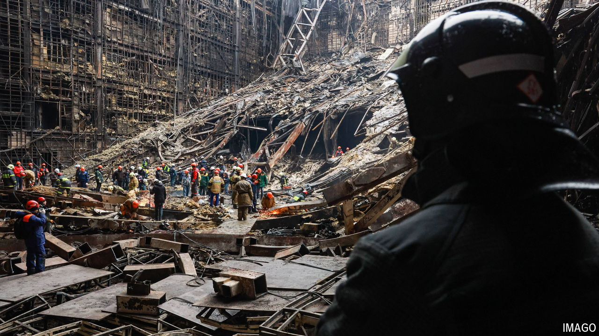

###### The uses of terror

# Vladimir Putin blames an Islamist attack on Ukraine and America 

##### How to use a disastrous security failure to bolster dictatorship 

 

> Mar 27th 2024 

Few Russian leaders apart from Stalin have been as obsessed with their own security, while failing so spectacularly to provide it for their people, as Vladimir Putin. From the bombings of apartment blocks in various cities in 1999, to the terrorist attack on March 22nd at Crocus City Hall, a concert venue in Moscow, his main concern has always been his own grip on power. Predictably, Russia’s president has tried to turn the latest security failure into a justification for his dictatorial rule and for his war against Ukraine, which has already cost hundreds of thousands of lives. 

As  went to press, the death toll had reached 139 people. The terrorists appear to belong to Islamic State Khorasan Province (ISKP), a branch of Islamic State based mainly in Afghanistan but with followers across Central Asia. American officials had alerted Russian counterparts that such an attack was coming. But for Mr Putin, accepting that his American arch-enemy might act out of concern for Russians (or a desire to co-operate against Islamist terrorism) would undermine his paranoid and conspiratorial worldview. So he directed his ire precisely against those who had tried to warn him. 

 “We know that the crime was perpetrated by radical Islamists,” Mr Putin said on March 25th. But, he asked, who gave the orders? “Who benefits from this? This atrocity can only be a link in a whole series of attempts by those who, since 2014, have been at war with our country using the neo-Nazi regime in Kyiv as their instrument.” Alexander Bortnikov, the head of the FSB, Russia’s state security service, quickly echoed his boss, blaming the attack on America, Britain and Ukraine. Many senior officials inside the Kremlin know such allegations are nonsense but are obliged to endorse them, according to a report by Bloomberg. As “retribution”, Russia may escalate missile attacks on Ukraine.

Mr Putin was trying to cover up his own blunder. In early March, under their “duty to warn” policy, American officials shared their intelligence about a planned attack in Moscow by ISKP. On March 7th the FSB said it had killed two Islamist radicals who were planning an attack on a synagogue in the city. Later that day America’s embassy in Moscow said it was “monitoring reports that extremists have imminent plans to target large gatherings in Moscow”, including concerts. On the same day one of the alleged terrorists was photographed inside Crocus City Hall. A cloakroom attendant later said security had been strengthened around that date, and staff were instructed on what to do during a terrorist attack.

Nevertheless, on March 19th Mr Putin blasted the American warnings as “blackmail” intended to “intimidate and destabilise our society”. Three days later gunmen attacked a show by the rock group Piknik, mowing down spectators and setting the building ablaze. Afterwards, when ISKP claimed responsibility, the Kremlin tried to blame it on Ukraine. 

Obviously the attack is a blow to the reputations of Mr Putin and of the security services on which he depends. But Russia’s president knows how to turn such failures to his advantage, using them to justify more war against Ukraine and further repression of his own people. Russian police soon detained four suspects fleeing near Bryansk, some 390km south-west of Moscow. They then began leaking gruesome videos of the men being interrogated and tortured to pro-war Telegram channels. One showed a camouflaged officer pinning down a suspect (identified as Saidakrami Rajabalizoda, a Tajik national), slicing off his ear and shoving it into his mouth. Another displayed a photograph of Shamsidin Fariduni, a second Tajik suspect, with a battery connected to his genitals. 

Maria Sergeyeva, a former official in the Russian president’s office, explained the logic of this public display on her Telegram channel. One purpose, she wrote, is to signal to potential terrorists “that they will be treated not as human beings, but as Satans”. Another and more important one is to give satisfaction to those who feel pain and fury. “Working with dark energies, with the crowd’s hatred is not the most pleasant thing…[But] in a country that has been conducting a special military operation...there is plenty of this energy. And it is better for the state to work with it.”

Generating hatred and cultivating cruelty has been not so much a side-effect as a goal of Mr Putin’s war. His regime rewards those who engage in torture and killing, while punishing those who display mercy. In a country where opposition to the regime is considered an act of extremism or even treason, publicising torture is a signal not just to potential terrorists but to his own security services and elites. 

Dmitry Medvedev, a former prime minister and president who often vents a more extreme version of the official propaganda line, took up the point in a Telegram post on March 25th. “You ask me what to do? Should they [the suspects] be killed? Yes, they must be killed. And it will happen. But much more important is to kill anyone who has been complicit, who helped them and who paid for them. To kill all of them.” Talk of lifting the moratorium on the death penalty which Russia imposed when it was still considering getting closer to Europe is now rife in parliament. This will not enhance Russia’s security or protect its people from Islamic State. But it will make Russians more vulnerable to the terror of their own state. ■


