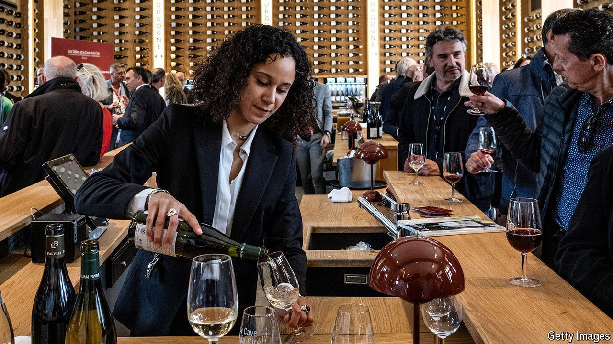

###### French drinking habits

# Why the French are drinking less wine 

##### A younger generation is rejecting old Mediterranean habits 

 

> Mar 27th 2024 

French schools once prized the nutritional value of wine. So commonly was it served to children that in 1956 the government banned wine in school canteens—and even then, only for the under-14s. France was the world’s biggest wine producer last year. A bottle of wine has long been to the French meal what fast driving is to the German motorway: a humdrum habit, national right and personal pleasure. 

No longer. In 2022 roughly 10% of French people drank wine every day, down from half in 1980. Back in 1960 the French drank an average of 116 litres of everyday wine per person. Between 2000 and 2018 that shrank from 28 litres to just 17. A glass of wine, let alone the once-familiar , is an increasingly rare sight at the lunch table. 

What is going on? It is not simply price. A bottle of (rough) Bordeaux can still be found in a French supermarket for under €3 ($3.25). Some village co-operatives sell local produce straight from the vat for €1.90 a litre—less than fresh orange juice. A better explanation is that a beer-drinking trend is challenging Mediterranean habits. The French now tell polls that they prefer beer to wine. Beer, including craft brews, accounts for more than half of all alcohol bought in French supermarkets. Even in southern France, some cafés serve imported Belgian or German beer on tap.

Most important, a health-conscious younger generation is drinking less. A quarter of French 18- to 34-year-olds say they never drink alcohol. Fully 39% of under-35s say that they do not drink wine, next to only 27% of the over-50s.  has entered the national lexicon. No- and low-alcohol drinks are spreading. In an attempt to “speak to Generation Z by adopting its codes”, Pernod Ricard, a drinks giant, runs a marketing campaign with the slogan “” (drink more…water!)—although presumably it means in between downing its spirits too. 

Of course French oenophiles—and importers—keep fine wines flowing. Consumption of high-quality wine remains strong. But the decline of cheaper stuff has wider repercussions for France. Last summer the government allocated €200m to buy superfluous low-end wine that producers could not sell. In some areas farmers are ripping out lesser vines altogether. Less booze may improve health, but not necessarily the mood or landscapes of rural France. ■


