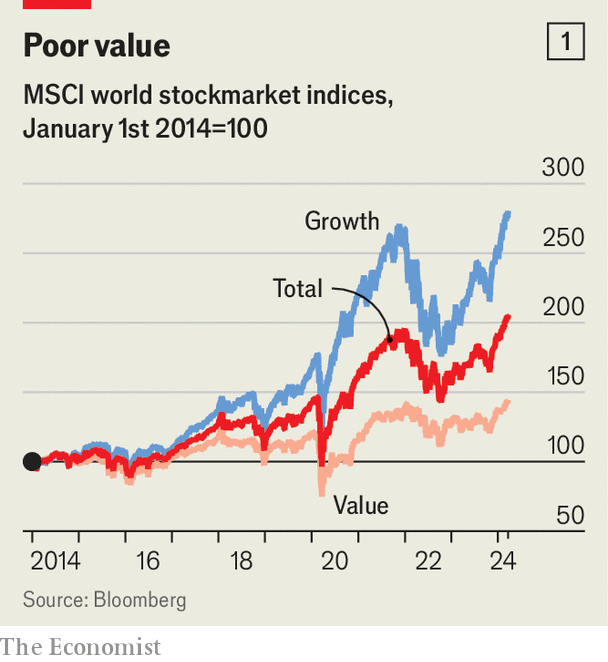
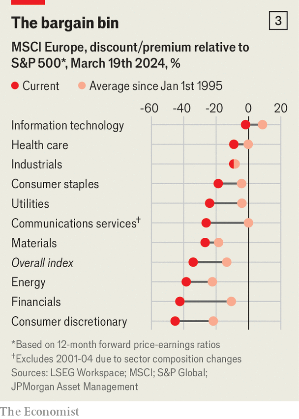

###### Hunting for value

# As markets soar, should investors look beyond America? 

##### The country’s stocks are extremely expensive 

 

> Mar 24th 2024 

EVERY WEEK, a new high. Little wonder a sense of unease is settling over markets. Some 40% of global fund managers think that artificial-intelligence (AI) stocks—a crucial driver of the rally—are already in a bubble, according to Bank of America’s latest monthly survey. Even Wall Street’s most starry-eyed pundits reckon America’s S&amp;P 500 index of leading shares can eke out only minor gains in the remaining nine months of the year. For some, such nervousness portends a crash. But for everyone, it prompts a question: with stock prices having already risen so much, are there any left that offer good value?

 


“Value” stocks are unfashionable, and with good reason. They are defined as shares with prices that are low compared with their underlying assets or earnings (as opposed to “growth” stocks with prices that are high on these measures, yet which promise rapidly rising profits). If that sounds appealing, the returns of recent years have not been. Over the past decade value stocks have performed worse than the broader market and been left in the dust by their growth counterparts (see chart 1). In 2022, as interest rates rose and the prices of speculative assets fell, the pendulum briefly seemed to swing back. But only briefly: the current bull market has again seen value stocks trounced by the rest.

This losing streak has led many to declare value investing dead. Critics say it struggles to account for the intangible assets and research spending that underpin many of today’s most successful firms. Investing tools make it easy to filter companies based on price-to-value ratios, meaning that potential returns from this approach will probably be arbitraged away fast. Firms left looking cheap, in other words, are cheap for a reason.

The worry persists, though, that valuations of stocks leading today’s bull run have become too high for them to offer stellar future returns. A widely watched measure is the cyclically adjusted price-to-earnings (CAPE) ratio devised by Robert Shiller of Yale University, which divides prices by the past decade’s-worth of inflation-adjusted earnings. For America’s S&amp;P 500 index, the CAPE has been higher than it is today only twice: at the peak of the dotcom bubble, and just before the crash of 2022. Even if a crash does not follow, a high CAPE ratio has historically proved to be a strong indicator that poor or even negative long-run real returns lie ahead. 

 


For Victor Haghani of Elm Partners, a fund-management outfit, the response is obvious: look beyond America. In the wider world, valuations are lower (see chart 2). Mr Haghani calculates that, although American stocks attract a much higher aggregate price-to-earnings multiple than those elsewhere, around 40% of their underlying earnings come from overseas. In the rest of the world, some 20% of total earnings derive from America. Put another way, there is a strong degree of crossover in where the profits of the two groups of companies are actually made.

Despite this, the values the market assigns to earnings derived from America and elsewhere are wildly different. Mr Haghani’s number-crunching suggests that, to get from earnings to share prices (for both American and non-American stocks), investors are scaling up those coming from America by a factor of over 40. For earnings coming from the rest of the world the equivalent scaling factor is just ten. Such a disparity makes little sense. It is one thing to suggest American firms deserve a higher valuation because there is something exceptional about their growth potential. But why should earnings originating from America boost a share’s price so much more than those from elsewhere? 

Perhaps the stockmarkets of countries outside America (or, equivalently, the earnings coming from these countries) are simply underpriced in relative terms. This is just the sort of mispricing that markets may eventually correct by raising the valuations assigned for non-American firms, lowering those of American firms, or both. What is more, whereas value investing often involves taking concentrated bets on individual companies or sectors, betting on this repricing allows the risk to be spread across most of the world.

In fact, even the argument that companies outside America merit their current low valuations because they lack dynamism is threadbare. It is frequently couched in terms of the sectoral composition of each market: America’s is brimming with the disruptive tech firms of tomorrow, while Europe’s, for example, is stuffed with stodgy banks and industrial outfits. 

 


But Hugh Gimber of JPMorgan Asset Management pours cold water on the idea that this explains the lower valuations of European firms. His team has split the continent’s companies by sector, analysed the historical multiples by which their earnings have been scaled up to generate their share prices, then compared these with the equivalent multiples for American firms. In most sectors, the European companies’ stocks have suffered from long-run average discounts. Today, though, these discounts are present in every sector—and are much deeper than their long-run averages (see chart 3). Rather than failing to operate in cutting-edge industries, such firms might simply be underpriced.

It is not just in Europe that such potential value trades abound. Mr Gimber points to a range of emerging markets that are well placed to profit from global trends, and where valuations are nowhere near as eye-watering as in America. Examples range from Mexico and Vietnam—benefiting from the “friendshoring” of Western supply chains—to countries riding the AI wave, such as South Korea and Taiwan. Jens Foehrenbach of Man Group, an asset manager, notes that the Tokyo Stock Exchange has set an explicit target, prodding firms to take actions that will raise their shares’ price-to-book ratios (the firm’s market value divided by its net assets) above 1. Some 42% of constituents of Japan’s Topix index have yet to reach this, suggesting a bet for those who think that they will.

A unifying feature of all such markets is that—like any value investment—betting on them involves a leap of faith. The longer America’s stockmarket outperforms the rest, the more it seems like the natural way of things. Maybe companies listed elsewhere look cheaper because they are simply worse. But there are signs that the pricing differentials have grown too large for professional investors to continue tolerating. In March global fund managers told Bank of America’s survey that, month on month, they had rotated more of their equity allocations into European and emerging-market stocks than they had done for years. Any that are underpriced may not remain so for long. ■


