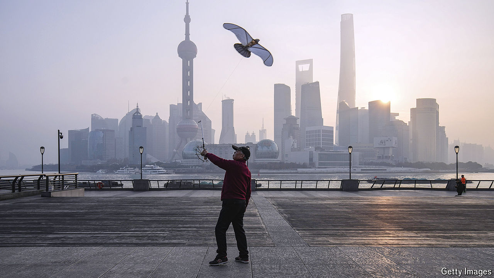

###### Hide and seek

# China’s banks have a bad-debt problem 

##### As is becoming increasingly obvious 

 

> Mar 27th 2024 

Bank of Jiujiang, a mid-tier lender from a southern Chinese river town, imparted some bad news on March 19th. In a rare disclosure, it told investors profits for 2023 might fall by 30%, because of poorly performing loans. This is just the sort of information Chinese banks are normally reluctant to reveal. Indeed, they often go to great lengths to avoid doing so. 

Typically, the subterfuge works as follows: the bank lends to an asset-management company (AMC) that in return purchases its toxic loans. The contracts drawn up between the two parties include stipulations that enable the AMC to avoid the credit risks of the bad loans they are buying. Confidentiality clauses keep these arrangements from being disclosed, sometimes even to courts. 

To regulators it may seem as if banks involved in such transactions are solving their bad-debt problems; in reality, they are concealing them. As Ben Charoenwong and Ruan Tianyue of the National University of Singapore Business School, and Meng Miao of Renmin University, have noted, over time these troubled loans accumulate. For hundreds of banks across the country, they represent a ticking bomb. 

The authorities are now catching on. They have hit financial institutions with a flurry of penalties for improper handling of debts. The National Administration of Financial Regulation (NAFR), a new banking regulator, has handed out more than 20 punishments. In December Citic Bank, a commercial lender, was fined 220m yuan ($30m) for mismanaging bad debt, a record amount. Agricultural Bank of China, a large state lender, received a 27m yuan fine for similar transgressions.

Increased surveillance can in part be attributed to the new watchdog’s increased vigilance. Established last year, the NAFR has stronger enforcement capabilities than its predecessors. Supervision of banks had been divided among several agencies, allowing corruption and producing lapses in oversight, which contributed to the collapse of several banks, starting in 2019. The NAFR now seems to be taking the concealment of bad debts more seriously.

But some of the progress began earlier. A decade ago, instead of declaring the true size of their problems by identifying debts as “non-performing loans”, banks shoved them into other categories of assets, signalling to regulators that there remained a good chance borrowers would repay (in fact, many of the companies had gone bankrupt). In 2017 one of the NAFR’s predecessors began leaning on lenders to be more truthful. The result has been an outpouring of undesirable loans. Bank of Jiujiang’s bad loans, for instance, increased seven-fold between 2015 and late last year.

How much of this surge in activity can be trusted? Recognising and digesting bad debts is difficult. Discovering such lending weakens financial institutions’ balance-sheets since they are forced to use capital to provision for future bad debts, which in turn makes it harder for the government to direct financial support to favoured industries in pursuit of other policy goals. Some revelations will happen legitimately as local governments recapitalise banks, pumping in funds to enable them to continue to write off bad debts. 

Others will happen via AMCs, and thus will only sometimes be legitimate. China created four centrally controlled AMCs decades ago to hoover up bad debts. They are now struggling. One needed a $6.6bn bail-out in 2021. Others are poorly capitalised and as a result buying fewer and fewer bad debts, even as banks crank out more. In 2016 the four state AMCs bought nearly 1trn yuan of about 1.5trn yuan in total non-performing loans. By 2022 their purchases came to less than 500bn yuan, despite bad debts rising to almost 3trn yuan. 

In late January state media reported that three of them would be merged with China’s sovereign wealth fund. They have become distressed financial institutions in their own right and can hardly perform the debt clean-up work for which they were created. That is bad news for Bank of Jiujiang. It is also bad news for hundreds of other similar lenders. ■


