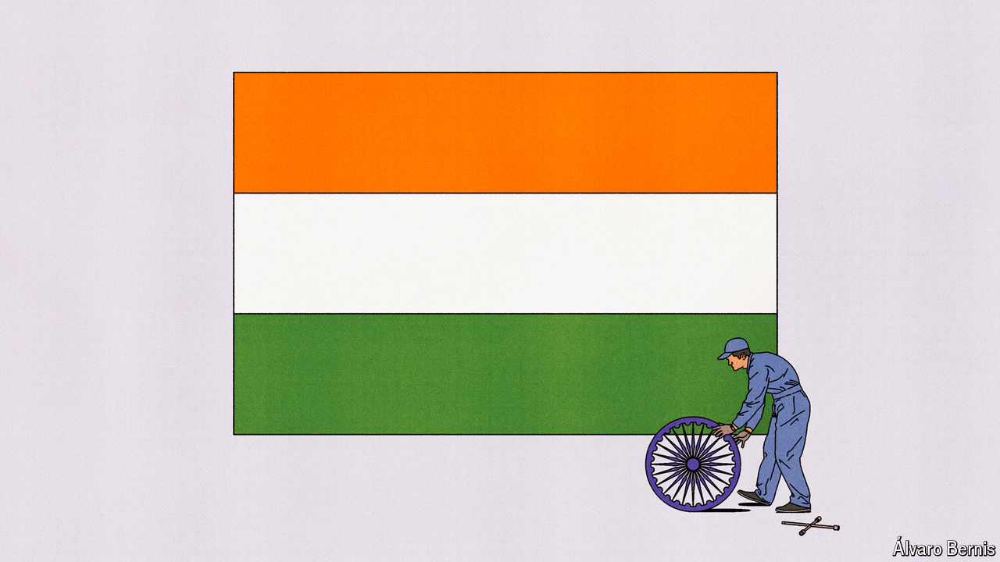

###### Free exchange

# How India could become an Asian tiger 

##### The world’s most selective bureaucracy is struggling to make it happen 

 

> Mar 27th 2024 

Is India achieving its potential? In the year to the third quarter of 2023, the country grew at a blistering rate of 8.4%. Over the next half-decade it is expected to expand at 6.5% a year, which would make it the world’s fastest-growing big economy. So far, so good. The problem, as critics point out, is that China, Japan and South Korea all expanded at 10% or so a year during their periods of rapid growth. Part of the reason for India’s less impressive figures is a slowdown in globalisation. But a new book by Karthik Muralidharan of the University of California, San Diego, called “Accelerating India’s Development”, argues that the crucial barrier to faster development is a lack of “state capacity”.

Mr Muralidharan describes this concept as the “effectiveness” of government. Throwing money at a state lacking capacity is like adding fuel to a car near a breakdown: it won’t get you very far. Currently, the Indian state succeeds when on “mission mode”, achieving clearly defined goals. In April it should pull off the largest democratic exercise in history, as voters pick a prime minister. At the same time, it struggles with mundane, everyday aspects of governance, such as education and health. Three in five rural children in the fifth year of school cannot read at a second-year level—and in the past five years the failure rate has only worsened.

Part of the issue is the precociousness of Indian democracy. The franchise became universal in 1950, when the country was mostly impoverished. Citizens demanded that the state met their basic needs well before it had the money or capacity to do so. India launched its food-security programme in the 1960s, for instance, when it was a fifteenth as rich per person as America was when it launched its own such programme in the 1930s. This set a pattern: the Indian state does a lot, but little well.

In his 800-page tome, Mr Muralidharan lays out fixes. The book is crammed with details about how the Indian system works and could be improved. Three ideas stand out. They concern how the state should manage people, use technology and improve its federal system. And they hold lessons for other governments.

Since 2002, when Mr Muralidharan was a graduate student, he has been conducting surveys on absentee rates. It turns out that teachers skip school perhaps as often as pupils: they are absent 20-30% of the time. The problem is not pay. In 2017 a study by Rohini Pande of Yale University found that across 33 countries, India offered the second-highest wage premium to public-sector employees. Rather, the problem appears to be governance. School supervisory positions have ultra-high vacancy rates of 20-40%. Mr Muralidharan calculates that filling such roles would be ten times more cost-effective than hiring more teachers. 

Such problems reflect a strange approach to civil-service management. About 1m Indians apply each year for about 1,000 slots, making it one of the most selective bureaucracies in history. Yet India has just 16 public employees per 1,000 people, one of the lowest ratios in the world. Indian officials also hop from position to position across various different tiers of government, moving every 15 months on average. As a recent retiree notes, this means that they have far too little time to develop proper expertise in any one area. Therefore problems go unresolved. 

Better data would help. It should not take an academic survey to ascertain rates of teacher absenteeism. Official numbers on educational outcomes paint a far rosier picture than those collected by independent organisations. Schools and low-level bureaucrats have incentives to cheat. As such, Mr Muralidharan suggests digital data collection, audits and stiffer accountability. 

A running theme throughout the book is the need to pay attention to India’s federal structure. The country has 28 hugely diverse states, 15 of which are big enough to be in the top fifth of the world’s countries by population. Historically, Indian politicians have fallen prey to cycles of corruption in which companies bribe leaders in exchange for favours, with leaders then using the money to fund expensive campaigns that involve, in effect, bribing voters. In some states, this cycle is starting to break down. Campaigns promising to get stuff done are precisely what propelled Narendra Modi, India’s prime minister, to fame when he ran the state of Gujarat.

Progress in the “third tier” of government, which is made up of villages, towns and cities, has been less impressive, however. Deng Xiaoping, China’s leader from 1978 to 1989, introduced reforms that rewarded local officials for their economic performance. India could use something similar, especially if states granted their local authorities more resources and power. Of the 18 similar countries looked at by Mr Muralidharan, India was the least decentralised when it came to fiscal affairs. Just 3% of state spending happens at a local level, compared with 51% in China. In 2000 three Indian states—Bihar, Madhya Pradesh and Uttar Pradesh—were split in two. So was Andhra Pradesh in 2014. All four splits have led to faster economic growth.

Go-faster stripes

There is much else in Mr Muralidharan’s book. But changes to personnel, data and federalism would together represent the beginnings of a reform package that could do wonders for India’s governance, and therefore its growth. Indeed, the sheer variation in performance across India’s cities and states demonstrates the potential benefits. Karnataka, a large and reasonably well-run state, is six times richer per person than Bihar, the country’s poorest state—making India one of the world’s most geographically unequal countries. Internal migration is relatively rare, which means that for incomes to grow faster, poor states will have to get their act together. The changes outlined by Mr Muralidharan will be tough to enact, but not impossible. And if some states make the leap, they may inspire others to follow their example. ■


