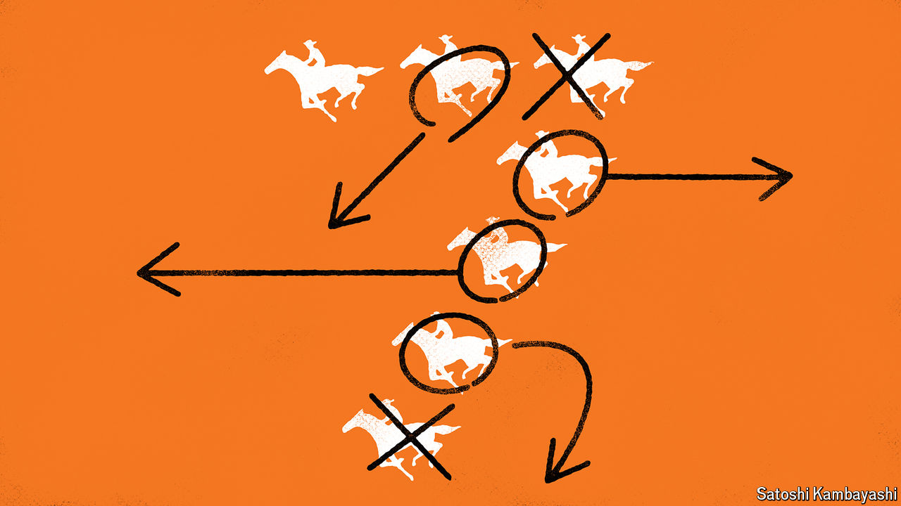
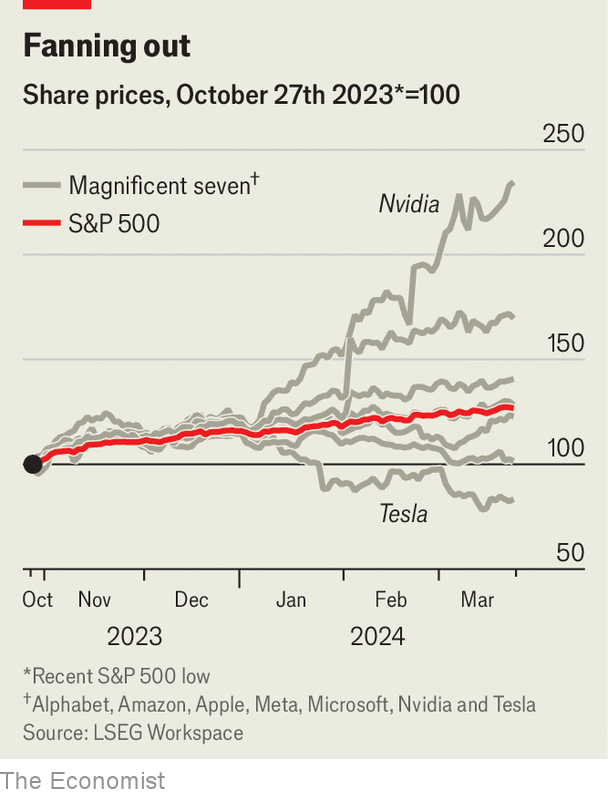

###### Buttonwood

# How the “Magnificent Seven” misleads 

##### Forget the supergroup of stockmarket darlings 

 

> Mar 27th 2024 

All models are wrong, goes the statisticians’ adage, but some are useful. This time last year, plenty of pundits’ models started looking more wrong and less useful. The consensus forecast was a grim spell for economic growth and a dreary one for stock prices—and that was before a clutch of American regional banks buckled. Higher interest rates seemed set to cause pain everywhere. Instead, in the very country where the banking turmoil unfolded, the stockmarket began to soar. By the summer America’s S&amp;P 500 index of leading shares had risen by 28% from a trough hit the previous autumn. Analysts hunted for a new model to explain what was going on, and the popular choice revolved around the “Magnificent Seven”.

The reason was that shares in this group of tech giants—Alphabet, Amazon, Apple, Meta, Microsoft, Nvidia and Tesla—were acting as if they made up a market of their own. By the start of June the S&amp;P 500 had risen by 12% since the beginning of the year, but virtually the entire gain was down to these seven stocks, with the other 493 having collectively moved sideways. By July they were the biggest seven companies in the index. By late October the Magnificent Seven had added $3.4trn (or 50%) to their combined market value since the start of the year, even as the other 493 had lost $1trn (3.8%). Apple was the group’s worst performer but had nevertheless seen its share price rise by 30%.

 


Alas, the band has broken up. One feature of the storming bull run that began on October 27th is that the Magnificent Seven have stopped charging as a pack. As the broader S&amp;P 500 has risen by 26%, three of the group have turned from leaders to laggards: the share prices of Alphabet and Apple have underperformed, while that of Tesla has fallen outright. The remaining four have beaten the index, but by wildly differing amounts. Whereas Microsoft has done only slightly better than the average S&amp;P 500 member, Nvidia’s shares have rocketed by an astonishing 129%. Six of the seven are still the index’s largest stocks, but Tesla has been replaced by Berkshire Hathaway, Warren Buffett’s investment vehicle.

What happened? Last spring the narrative was obvious: the Magnificent Seven would end up as the winners from the artificial-intelligence (AI) gold rush. All were enormous to begin with, which would help them weather any downturn and outspend rivals on research and development. Each had already conquered its respective niche of the tech world, meaning they could probably carry on outsmarting other firms. And their big cash balances stopped rising interest rates from looking too threatening.

In part this seductive story has fallen apart because, like all models, it was oversimplified to begin with. The idea of the Magnificent Seven as “big tech” incarnate—or at least of “big tech” as a homogenous group—was always something of a stretch. Aside from trillion-dollar valuations and hordes of clever employees, a manufacturer of AI chips (Nvidia) does not have an awful lot in common with an online retailer (Amazon) or a purveyor of social networks (Meta). Nor does a software firm born in 1975 (Microsoft) necessarily share the prospects of an electric-vehicle maker established in 2003 (Tesla). In this, the Magnificent Seven concept was not alone. Think of the arbitrariness of the “BRICS” gang of countries (Brazil, Russia, India, China and South Africa), or of the even bigger and more amorphous “emerging markets” group.

Yet the disbanding of the Magnificent Seven signals some broader shifts, too. One is that, as last year’s bank failures fade from memory, investors have become less anxious about the impact of higher interest rates. America’s economy has defied recession forecasts and boomed instead. Firms that are insulated from shocks by big market shares, profit margins and cash buffers have thus lost some of their “safe haven” appeal.

It also shows that, though optimism is surging through markets, not all caution has been thrown to the winds. A year ago generative AI so enthralled investors that tech giants were assumed to be winners by default. Now that automatic benefit of the doubt is being withdrawn. Nvidia has pulled away from the rest of the group as it is transforming hype into stratospheric sales and profits. Apple and Tesla are being punished, in part, for failing to communicate how they will do the same. Investors might be excited about AI but—encouragingly, for those who fear a bubble—they seem willing to be sceptical, too. ■


