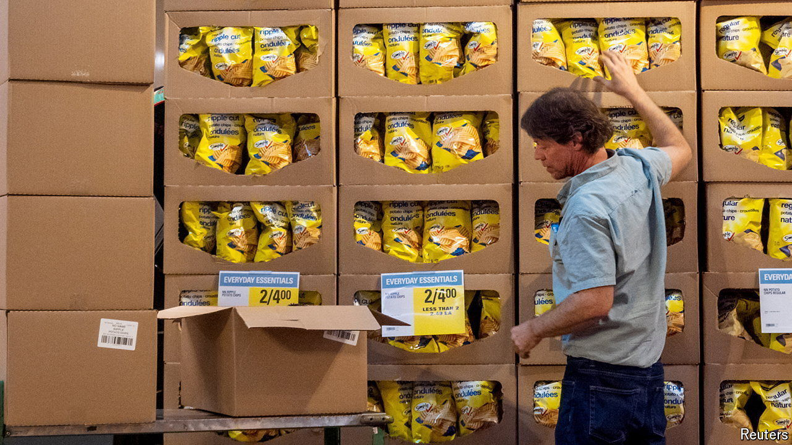

###### Curse of the Anglosphere

# Which country will be last to escape inflation? 

##### A new dividing line in the global fight 

 

> Mar 27th 2024 

In January prices across the rich world rose by 5.7% year on year, down from a peak in late 2022 of 10.7%. This conceals wide variation, however. Some countries have slain the inflation beast. Others are still in the fight of their lives. 

To get a view of the various battlefields, we have updated our measure of “inflation entrenchment” for ten rich countries. The measure comprises five indicators: core inflation, unit labour costs, “inflation dispersion”, inflation expectations and Google-search behaviour. We rank each country on each indicator, then combine the rankings in order to form an overall score. 

The results are better than in November, when we last conducted the exercise. They also reveal a linguistic divide. Countries in the eu and Asia perform well; in the English-speaking world, inflation is taking longer to fade. Australia tops the ranking. Britain and Canada are not far behind. America is doing better, but even there inflation remains entrenched. 

 


A few factors may explain the differences. One is fiscal stimulus during covid-19, which was 40% larger in the Anglosphere than elsewhere. The boost to demand is still visible in “core” inflation data, which strips out items such as energy, and indicates underlying inflationary pressure. British core inflation is close to 5%. 

Our measure of “inflation dispersion” provides similar clues. This measures the share of consumer prices that are rising by more than 2% year on year. Australia tops the rankings here. By contrast, most Japanese prices are rising by less than 2%. 

Immigration could also help explain the divide. The rich world has experienced an immigration boom, with a large share of the new arrivals going to English-speaking countries. Last year Australia, Britain and Canada broke net-migration records. 

The large rise in population has supported demand. In the past year the cost of renting a flat in the Anglosphere has risen by 8%, compared with 5% elsewhere. The effects on labour markets are less clear. America’s unit labour costs, which measure how much firms pay workers to produce a unit of output, are not rising. But Canada’s are growing strongly.

History may also play a role in explaining the Anglosphere’s entrenched inflation. During the 2010s southern Europe and much of rich Asia saw few price rises. Inflation in the Anglosphere was firmer. Owing to these different experiences, people’s current beliefs about future inflation may also differ.

Data coming out of America are worrying. The public believes prices will rise by 5.3% over the next 12 months, more than in any other country in our ranking. Americans also often search on Google for inflation-related topics, suggesting that the cost of living is still on their minds. Across the Anglosphere the threat of continued high inflation—or even a second wave of price rises—has not gone away. ■


