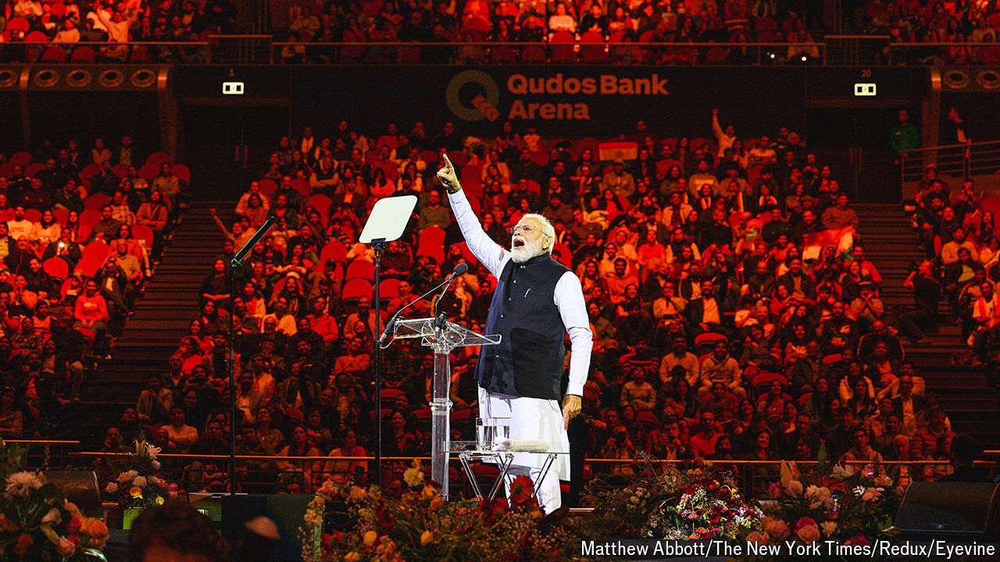
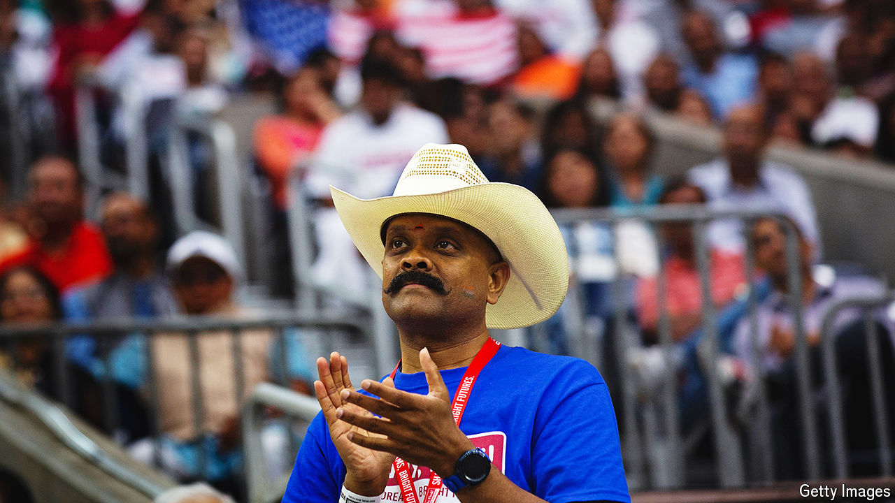

###### Indians and the world

# Narendra Modi’s secret weapon: India’s diaspora 

##### Migrants help campaign for the prime minister at home and lobby for the country abroad 

 

> Mar 27th 2024 

ON A GREY morning in north-west London earlier this month an enthusiastic group gathered outside a community centre to fly the Indian flag—plus another one featuring the lotus flower, symbol of India’s ruling Bharatiya Janata Party (BJP). Some wore saffron scarves, a colour associated with Hinduism. After staging a car rally through the neighbourhood, they reconvened outside a Hindu temple. A British Conservative MP addressed the crowd, praising the government of Narendra Modi. The gathering, organised by the Overseas Friends of the BJP, the party’s diaspora arm, got little attention in the local media. But footage of it soon appeared on the websites of many Indian outlets.

The rally was just one of countless such events run by the overseas branches of India’s parties, as the country’s general election that starts on April 19th beckons. India’s huge diaspora is an increasingly powerful force for mobilising support at home and abroad. Indian politicians court it for its financial and campaigning punch. As in India itself, the BJP has been more systematic and successful than its rivals. If Mr Modi wins a third term, as seems likely, he can partly thank the diaspora.


Indians abroad have long played a disproportionate role in politics at home, going back to India’s fight for independence. Many of the anti-colonial movement’s leading lights, including Jawaharlal Nehru and Mohandas Gandhi, spent years studying in Britain. Trained as lawyers, they used the ideas they had absorbed to argue for freedom back home. Some of the most notable post-independence prime ministers, including Indira Gandhi and Manmohan Singh, also spent long periods abroad.

Since then, India’s diaspora has grown in size and influence. Some 18m Indians who retain their nationality live abroad, according to the UN. That makes them the largest diaspora in the world, followed well behind by Mexicans (11.2m) and Russians (10.8m). If those who have relinquished their Indian passports are included, the number may exceed 32m, according to the Indian government’s estimates. 

Most Indians abroad have been highly successful. In 2023 they sent home nearly $125bn in remittances, equivalent to around 3.4% of India’s GDP, according to World Bank estimates. In America 80% of citizens of Indian origin have college degrees. The median Indian household income there is $150,000, twice America’s national average. People of Indian descent lead Google, the World Bank—and Britain. 

There are still plenty of low- or semi-skilled Indian workers filling menial jobs the host countries’ natives will not or cannot do, especially in the Gulf states. Yet even there the share of white-collar professionals as a proportion of Indians is growing. It now approaches 30%. Especially in English-speaking countries, today’s Indian diaspora has more cash and clout than earlier waves of migrants, who often started out dirt-poor. 

What does this mean for their role in Indian politics? Most Indians who live outside India do not vote in Indian elections, as they can vote only in person in their constituencies back home. That costs too much for most of them in time and money. Only 120,000-odd are registered for this year’s poll, according to India’s election commission, and only a fraction of that modest number are expected to turn up. 

In a country with nearly 1bn registered voters, 18m potential votes dispersed across hundreds of electoral districts would be unlikely to make a difference. Besides, plenty of diaspora Indians remain immune to Mr Modi’s charms. A survey of Indian-Americans in 2020 by the Carnegie Endowment for International Peace, an American think-tank, found that while 48% approved of Mr Modi, 31% disapproved and 22% strongly so. Indeed, the diaspora is much less enthusiastic than Indians in India, 78% of whom are said to approve of him. One reason may be that they read a wider variety of news than their relatives at home, where most media are relentlessly pro-BJP. Moreover, an increasing number of migrants are from south India, where Mr Modi is not so popular. 

At least in Britain, those who have recently migrated for work or education tend to be less politically strident, says Pratik Dattani, who runs Bridge India, a non-partisan diaspora outfit in Britain. For many in the diaspora, Indian politics may not be their main concern, ranking behind worries about jobs, education and daily life. 

The real impact of the diaspora in politics is in funding, campaigning and spreading India’s influence. As overseas Indians have become more prominent in their host societies, many have begun to take more of an interest in politics both in their new countries and back home. So political parties, Indian and foreign, are wooing them more keenly. 

Mr Modi and his BJP are acutely aware of this. Their election manifesto in 2014 called the diaspora “a vast reservoir to articulate the national interests and affairs globally” that would be “harnessed for strengthening Brand India”. The next year the party’s general secretary said the BJP saw the diaspora as India’s voice abroad, “the way the Jewish community looks out for Israel’s interests in the United States”. 

Many Indians abroad have risen to the task. The Overseas Friends of the BJP in America plans to send 3,000 Indian-American activists back to India to put up posters and canvass voters. They say they will make 2.5m calls to people in India to persuade them to vote for Mr Modi. The Indian Overseas Congress, the equivalent outfit representing the opposition Congress party, has similar plans, though its organisers are vague about numbers. India’s opaque electoral-finance system makes it tricky to gauge exactly how much money the diaspora contributes; parties are rarely required to disclose the source of donations. But it is bound to be a lot. 

The code of colour

Diaspora groups have long mixed politics with support for particular communities. But they have become more political and pro-BJP since Mr Modi took over. Play-dates for children or community prayer meetings are likelier to have a saffron tint. Members lobby MPs in Britain or members of Congress in America to back Mr Modi.

Yet most mobilisation of the diaspora happens away from the host countries’ politics. Much of the messaging is on social media, usually in WhatsApp groups. Members hail Mr Modi’s latest infrastructure drive or foreign-policy success. They also promote the BJP’s darker notions, such as “love jihad”, a conspiracy theory that Muslim men are systematically seducing Hindu women in order to convert them. 

One reason for the government’s success in courting the diaspora is that the BJP’s activities abroad are as efficient as its electoral machine at home. Cabinet ministers on foreign trips make a point of meeting diaspora groups, often to raise cash. Hundreds of groups close to the BJP are active in Britain. Such diaspora mobilisation has also picked up in America.

 


Soon after his election Mr Modi starred at a rally for 18,000 fans in New York’s Madison Square Garden. He had previously been barred from America for his alleged part in deadly communal violence in his home state of Gujarat in 2002 (he was cleared of all charges). Many of his trips to countries with many Indians include such events, most recently in Abu Dhabi. Last year he wowed a diaspora crowd in Sydney (pictured).

These events serve two purposes, says Edward Anderson of Northumbria University, author of a recent book on Hindu nationalism in the diaspora. They help tie him to a group he values for its social, cultural and economic weight. And the pictures of crowds cheering him abroad shine his image back home as a feted statesman.

Mr Modi’s emphasis on India’s rising global stature resonates with many overseas Indians, says Mr Dattani. “There is a sense that India is now everywhere and this guy did it,” he says. In Abu Dhabi, where Mr Modi also inaugurated a huge Hindu temple, he was feverishly acclaimed by his fans. “For the past ten years under his rule India has really evolved,” says Ganesh Sarma, a sales executive aged 62. “He works only for the country, not for himself, and our relationship with almost the entire rest of the world is fabulous now.”

Efforts by Congress, by contrast, have fallen flat. Rahul Gandhi, the party’s figurehead, also travels the world to lobby the diaspora. His main concern has been to highlight social problems and Mr Modi’s increasingly authoritarian methods. That resonates with long-standing critics in the diaspora, but turns off most Indians abroad who want to think well of their country, says Mr Dattani. In 2023 Pew, a pollster, found that Indians in America, both citizens and migrants, had overwhelmingly favourable views of their home country. The BJP has used Mr Gandhi’s foreign visits to paint him as disloyal for talking down his country to foreigners. 

The government has also targeted less prominent Indians, chiefly academics and journalists hostile to the BJP. Many hold a special status called “Overseas Citizen of India” that grants rights (such as the ability to live and work in India) to people who have dropped their Indian citizenship and to foreigners married to Indian citizens. (India does not allow dual citizenship.) The BJP weaponises this status by revoking it for those it deems unpatriotic. 

In any event, Mr Modi and his BJP are adept, at home and abroad, at dealing with their foes. And much of India’s burgeoning diaspora is keen to ride along on a seemingly unstoppable bandwagon. ■


