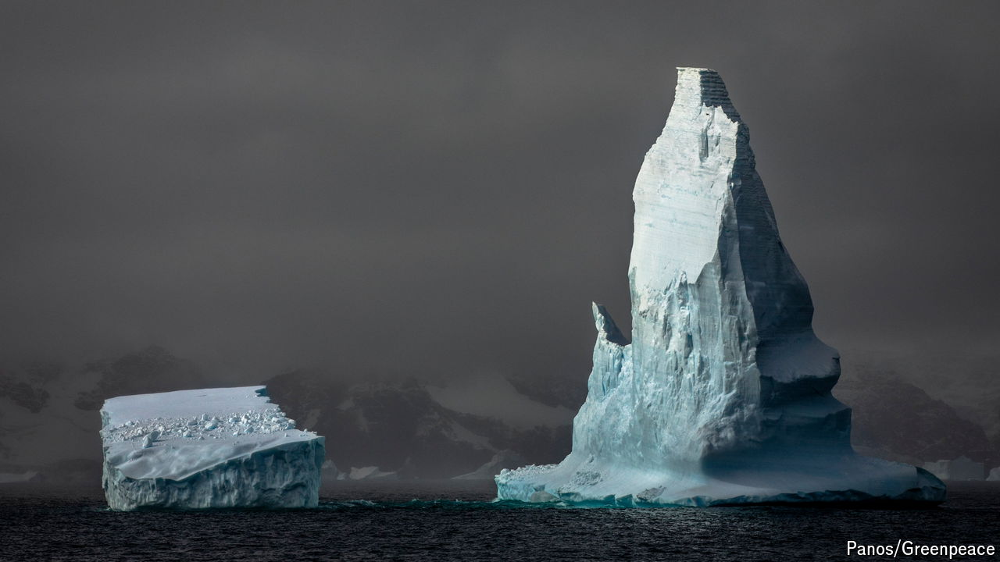

###### It’s not just about the penguins

# Antarctica needs a lot more attention 

##### Melting ice sheets do more than raise sea levels 

 

> Mar 27th 2024 

The Arctic and Antarctic are, fittingly, polar opposites. The first is an ocean surrounded by continents, the second a continent surrounded by an ocean. In the one, communities of indigenous people and settlers; in the other, only transients, there for a season or two. Nuclear-armed powers have faced off across the Arctic since the cold war; the same conflict saw a governance regime of peaceful scientific collaboration created for Antarctica that is more utopian in its conception than any other agreement in the annals of diplomacy. The north has the majesty of polar bears, the south the pathos of penguins. The two are united in facing profound upheaval because of global warming. But compared with the changes affecting the Arctic, those threatening the Antarctic are greatly underappreciated. 

In part that lack of attention is because of Antarctica’s remoteness; the biggest base there, America’s McMurdo, is almost 4,000km from the nearest city (Christchurch, in New Zealand). Visits are for the most part made only by scientists, adventurers and support staff. In part, too, there is seeming stasis.  is not like that in Alaska, where melting permafrost buckles roads and topples buildings; or in Siberia, where the smoke from burning tundra paints the skies and sears the lungs. Indeed, for a long time scientists tended to see Antarctica as relatively stable, at least over the short to medium term. Yes, its ice sheets contain enough water to raise the seas by 60 metres—but any collapse would take centuries. 

That turns out to have been complacent. Earth’s largest refrigerator is, as we describe in this week’s Science and technology pages, showing alarming signs of a big thaw, one which will have consequences for the rest of the planet. Extreme events like the disappearance of an area of sea ice the size of Greenland during last year’s austral winter are a symptom of a quickening underlying instability. Glaciologists are talking of a “regime shift”. Parts of one of the enormous ice sheets that cover 98% of the continent are sliding towards the seas. 

Water shifting from Antarctica’s continental bedrock into the Southern Ocean contributed just 4% to global sea-level rise 20 years ago. Today its share is 12%, and it will rise relentlessly in the decades ahead. This effect has an underappreciated corollary. As Antarctica melts, the gravitational attraction its shrinking ice exerts on the neighbouring seas weakens. That causes sea levels elsewhere to rise even faster. Sea-level rise originating from Antarctica will affect Australia and Oceania, but it will also disproportionately affect North America. 

Melting ice sheets do more than raise sea levels. They also bring shifts in atmospheric circulation that stretch to the equator and beyond, changing weather in the Sahel and Amazonia. And the Southern Ocean is one of the world’s largest carbon sinks, responsible for absorbing 40% of all the climate-changing carbon dioxide that the oceans as a whole suck up every year. If it warms, it will absorb less—an effect that may be aggravated when trillions of tonnes of fresh water come off the great frozen South and alter ocean currents. 

Despite all this, some countries are cutting their budgets for Antarctic research. This flies in the face of reason. The measurement and modelling of ice sheets lags well behind the study of the atmosphere and of ocean currents; if the implications of the worsening situation are to be properly appreciated and planned for, this needs fixing fast.

Debates over what needs doing most urgently, and how best to co-operate to get it done, should be galvanising the 56 countries that are signatories to the Antarctic treaty. They may not be able to protect the Antarctic environment, a duty to which the treaty’s environmental protocol commits them. They can at least increase their efforts to learn what the changes being forced on the empty continent in their charge mean for the rest of the world.■


