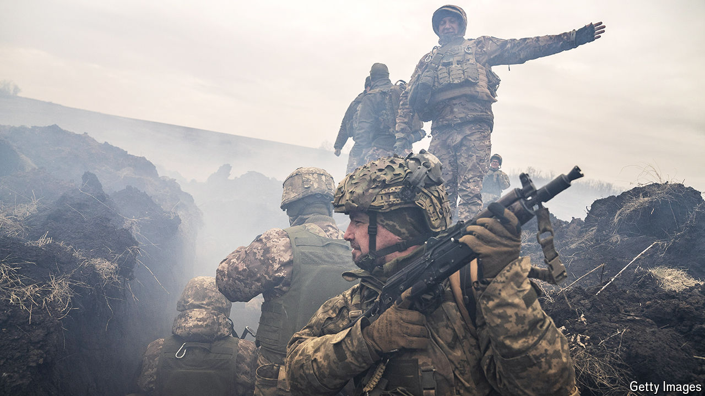

###### War in Ukraine

# Russia is gearing up for a big new push along a long front line 

##### Ukraine must prepare 

 

> Mar 27th 2024 

THE ARRIVAL of spring in Ukraine brings two kinds of respite. Warmer weather means that Russia’s frenzied missile and drone attacks on electrical and gas infrastructure will not be quite so unbearable. And with new warmth comes mud, and a month or so in which military movement grows difficult. That should hinder the wave of Russian attacks along the front line that stretches across eastern and southern Ukraine. But it will not last. As spring turns to summer, the fear is that Russia will mount a big new offensive, as it did last year. And Ukraine’s ability to hold it off this time looks much less sure now than it did then. That is why it urgently needs to mobilise more troops and build more robust front-line defences.

Ukrainians understandably blame the world’s politicians for their plight. Busy with the Middle East, forthcoming elections and their own economic woes, Ukraine’s  are distracted. As we , the decision by Trump-supporting Republicans in Congress to block the Biden administration’s $61bn military package for Ukraine is having an effect at the front line and above Ukraine’s cities. Ukraine’s soldiers are being forced to ration their shells, while Russia outguns them in some places by five to one. More than 150 drones and missiles were launched against Ukraine on just one night last week, but Ukraine is running out of interceptors—especially the ones that can take out the deadliest intruders.


America’s deadlock risks letting Russia break through Ukraine’s inadequate defensive lines. And the Europeans are not doing much better, despite fighting talk from France’s president, Emmanuel Macron—who insists that Russia must be defeated but sends little in the way of hardware to help that happen—or Germany’s lacklustre chancellor, Olaf Scholz, who is refusing to supply powerful Taurus long-range missiles. Europe has failed to meet its target of getting 1m shells to Ukraine by this month, though the Czechs have been scouring the world to make up the shortfall. Money is also a problem; Europe should be helping with that, too. But Poland and France, among others, are trying to block Ukraine’s vital agricultural exports so as to protect their own farmers. 

Yet Ukraine cannot simply blame its allies. It is guilty of mistakes too. One has been its failure on manpower. Russia is gearing up for another wave of mobilisation, with an eye to its next big push. The terrorist attack on a Moscow concert hall on March 22nd may actually make this easier for Vladimir Putin, who is using it to claim that Russia needs to be strong in the face of bloodthirsty enemies. But in Ukraine attempts to raise fresh recruits are still stuck in the coils of the democratic process; more than 1,000 amendments have reportedly been tabled to a bill in Parliament that would give the government more scope to raise the army it needs. Short of cash and fearing unpopularity, President Volodymyr Zelensky has not tried hard enough to get his way. 

Ukraine has also been very late in reinforcing its own defensive positions. In a way, this is understandable. The government still dreams of a new counter-offensive, and dreads the idea that the current front line may harden into something very like a border, one that lops off a fifth of the country and deprives it of most of its sea access. The idea that this line might become the basis for a future peace negotiation is exactly what Mr Zelensky has wanted to avoid. But the dangers are now so great that it is the least bad option. In recent weeks the diggers have started moving, and the dragon’s teeth are being sown. It should have started much earlier. Pray that it is not too late. ■

